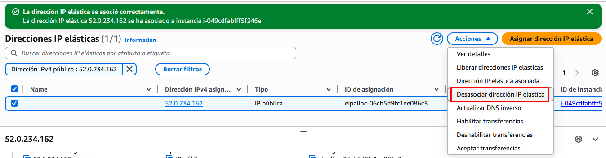

# Creación y asignación de una dirección IP elástica

## Asignación de una IP elástica

1.- Partiendo de una instancia EC2 ya creada, accedemos desde el **Panel de Instancias de EC2** al apartado de **Direcciones IP elásticas** del panel lateral.

---

 

2.- Pulsamos sobre **Asignar dirección elástica**. Dejamos las opciones por defecto y pulsamos **Asignar**.

!!! danger "Comienza la facturación"
    De momento ya tenemos una IP fija reservada y ya comienzan a facturarnos por ella aunque no la hemos asociado a ningún elemento de AWS. 
    
    Las IP Elásticas pueden asociarse a varios recursos de AWS, como por ejemplo **Instancias EC2**, **Interfaces de Red Elásticas**, **NAT Gateway** (por eso son tan caros estos elementos), **Balanceadores de Carga**, y otros menos comunes.

 

3.- El siguiente paso, por tanto, es asociarla a nuestra instancia EC2. La seleccionamos y pulsamos sobre **Dirección IP elástica asociada**

---

4.- Seleccionamos la instancia EC2 a la que la queremos asociar y aceptamos.

 

A partir de este momento ya tenemos una IP fija asociada a nuestra instancia EC2.

---

!!! danger "Peligro"
    Aunque eliminemos la instancia EC2, la dirección IP elástica quedará reservada. Hay que asegurarse siempre de eliminar estos recursos que consumen crédito incluso con el laboratorio apagado.

## Desasociación y liberación de la IP elástica

Cuando ya no deseemos hacer uso de la IP elástica hay que liberarla, es decir, hacerla pública para que esté disponible para el resto de usuarios y dejen de facturarnos a nosotros.

5.- El primer paso será **desasociar la IP elástica** de nuestra instancia EC2. Seleccionamos esa opción del menú acciones.

---
 

6.- Una vez desasociada, ya podremos **liberar la IP elástica**, es decir, hacerla pública y que deje de pertencernos.

---
