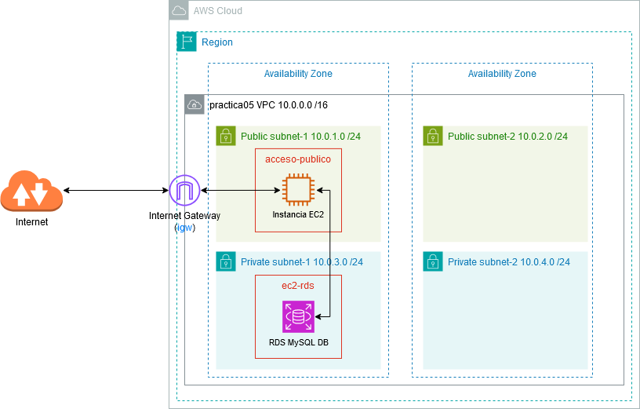

# VPC con Subredes y Base de Datos RDS

## Objetivo General

En esta práctica combinada se integran dos ejercicios relacionados con AWS:

1. **Creación de una VPC con subredes públicas y privadas, incluyendo instancias EC2 y configuración de conectividad.**
2. **Despliegue de una Base de Datos RDS ubicada en subredes privadas, accesible únicamente desde una instancia EC2 en la subred pública.**

El objetivo es tener una visión completa de un entorno típico compuesto por un servidor público que accede a una base de datos privada dentro de una VPC segmentada.

---

# 1. Arquitectura en AWS

La arquitectura resultante será:

- Una **VPC** con bloque CIDR `10.0.0.0/16`.
- Subredes:
  - Dos **públicas**: `10.0.1.0/24` y `10.0.2.0/24`.
  - Dos **privadas**: `10.0.3.0/24` y `10.0.4.0/24`.
- Componentes principales:
  - **Internet Gateway** para salida a Internet desde subredes públicas.
  - **Instancia EC2 pública** accesible desde Internet (puertos 22 y 80).
  - **Instancia RDS MySQL** en subredes privadas sin acceso público.
  - **Tablas de enrutamiento** distintas para subredes públicas y privadas.



---

# 2. Creación de la VPC

## Parámetros configurados

- CIDR: `10.0.0.0/16`
- Dos AZs para permitir el funcionamiento de RDS.
- Subredes:
  - Públicas: `10.0.1.0/24`, `10.0.2.0/24`
  - Privadas: `10.0.3.0/24`, `10.0.4.0/24`
- Internet Gateway asociado a la VPC.
- No se requiere NAT Gateway, dado que RDS no necesita salida a Internet.

---

# 3. Tablas de Enrutamiento

## Subredes públicas

- `10.0.0.0/16` → local
- `0.0.0.0/0` → Internet Gateway

*Permiten que la instancia EC2 pública reciba tráfico desde Internet.*

## Subredes privadas

- `10.0.0.0/16` → local
- Sin rutas de salida a Internet.

*Las instancias privadas no son accesibles desde Internet, mejorando la seguridad.*

---

# 4. Creación de la instancia EC2 pública

- AMI: Ubuntu Server 24.04 LTS
- Tipo: `t2.micro`
- Subred: pública (`subnet-public1`)
- Permitir IP pública
- Grupo de seguridad:
  - SSH (22) abierto desde Internet
  - HTTP (80) para acceder al servidor web
- Datos de usuario para instalar MySQL Client:

```bash
#!/bin/bash
apt update
apt install -y mysql-client-core-8.0 apache2
```

Tras el lanzamiento, conectamos vía SSH para verificar funcionamiento.

---

# 5. Creación del Grupo de Subredes para RDS

Antes de crear la base de datos es necesario definir un **Database Subnet Group**:

- Subredes privadas: `10.0.3.0/24` y `10.0.4.0/24`
- AZs distintas para cumplir requisitos de RDS.

---

# 6. Configuración de la Base de Datos RDS

Parámetros de creación:

- Motor: **MySQL**
- Plantilla: **Entorno de pruebas**
- Nombre de la instancia: `bbddapellido`
- Usuario administrador y contraseña definidos por el alumno
- Sin acceso público
- Database Subnet Group: el creado previamente
- Grupo de seguridad:
  - Permite acceso únicamente desde la instancia EC2

---

# 7. Conexión desde EC2 a la Base de Datos

En la instancia EC2 ejecutamos:

    mysql -h`<endpoint-rds>` -u admin -p

El endpoint se obtiene desde el panel de RDS → pestaña *Conectividad y seguridad*.

---

# 8. Pruebas de Verificación

- Acceso a la instancia EC2 vía SSH.
- Visualización del servidor Apache desde navegador.
- Conexión MySQL desde la EC2 a la RDS.
- Confirmación de que RDS **no es accesible desde Internet**.
- Verificación de rutas y reglas de seguridad.

---

# 9. Entregables
 
!!! success "Captura las pantallas"

    Captura la pantalla en la que se muestre el acceso desde el navegador a la página por defecto servida por el servidor web de la máquina EC2. Que se vea claramente la url con la IP pública de la máquina.

    Captura la pantalla accediendo por ssh a la **máquina ubuntu**.

    Captura la pantalla resumen de la base de datos que muestra el **punto de enlace de la conexión**.

    Captura la pantalla de **establecimiento de conexión** a la base de datos **desde la máquina ubuntu**.

---

# 10. Eliminación de Recursos

1. Elimina instancia RDS.
2. Elimina instancia EC2.
3. Borra la VPC completa y sus componentes asociados (subredes, tablas de enrutamiento, IGW).
