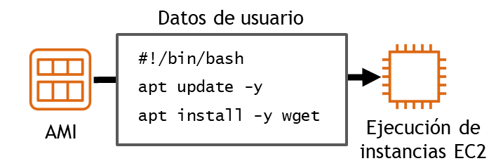
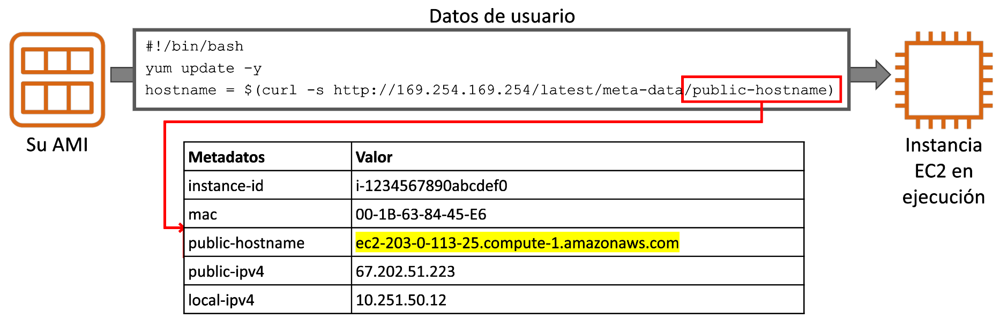

# Tema 2. Capa Informática

## ¿Qué es una Capa Informática?
La capa informática (o de cómputo) de AWS es el nivel de la nube encargado de proporcionar recursos de procesamiento (CPU, memoria y red) que permiten ejecutar aplicaciones, sistemas operativos y servicios. Esta capa ofrece distintos modelos de uso, desde máquinas virtuales hasta entornos sin servidor.

Es decir, son los servicios que sustituyen o complementan a los servidores físicos o máquinas virtuales tradicionales en un centro de datos.

### ¿Qué otros componentes interactúan con la capa informática?

- **Capa de almacenamiento** (S3, EBS, EFS): Proporciona dónde guardar los datos que las aplicaciones procesan.
- **Capa de red** (VPC, Route 53, ELB): Permite la comunicación entre instancias, usuarios y servicios de AWS.
- **Capa de bases de datos** (RDS, DynamoDB, Aurora): Proporciona sistemas gestionados para almacenar, consultar y organizar datos.
- **Capa de seguridad e identidad** (IAM, Security Groups, NACLs): Garantiza que solo los usuarios o servicios autorizados accedan a los recursos de cómputo.
- **Capa de monitorización y gestión** (CloudWatch, CloudTrail): Supervisa el estado y el rendimiento de los recursos informáticos.

## Servicios de cómputo en AWS.
Cuando hablamos de capa informática en AWS pensamos rápidamente en la posibilidad de crear máquinas virtuales en la nube. Este popular servicio es el conocido como **EC2**, pero no es el único servicio que ofrece AWS relacionado con la capa de cómputo.

AWS ofrece varias opciones de informática para satisfacer diferentes necesidades. Las opciones clave de informática de tiempo de ejecución se pueden agrupar en cuatro categorías de modelos informáticos en la nube: 

- **Máquinas virtuales** (VM)
- **Contenedores**
- **Plataforma como servicio** (PaaS)
- **Sin servidor** (Serverless)


En este tema nos vamos a centrar en el servicio **EC2**.

## Amazon EC2
**Amazon Elastic Compute Cloud** ([Amazon EC2](https://docs.aws.amazon.com/ec2/)) proporciona máquinas virtuales en las que podemos alojar el mismo tipo de aplicaciones que podríamos ejecutar en un servidor en nuestras oficinas (servidores web, de aplicaciones, de correo, de bases de datos, multimedia, ...), ofreciendo capacidad de cómputo segura y de tamaño ajustable en la nube.

Amazon EC2 proporciona máquinas virtuales y se puede considerar una forma de infraestructura como servicio (IaaS). Podemos elegir el sistema operativo, así como el tamaño y las capacidades de los recursos de los servidores que lancemos, pero los servicios de IaaS nos obligan a estar a cargo de muchas de las responsabilidades de la administración del servidor tales como actualizaciones del sistema operativo, copias de seguridad, instalación y actualización de aplicaciones y servicios, etc.


La computación elástica (*Elastic Compute*) se refiere a la capacidad para aumentar o reducir fácilmente la cantidad de servidores que ejecutan una aplicación de manera automática, así como para aumentar o reducir la capacidad de procesamiento (CPU), memoria RAM o almacenamiento de los servidores existentes.

Cuando hablemos de una máquina virtual lanzada en Amazon EC2 nos referiremos a ella como una **instancia EC2**.

### Parámetros de configuración de una instancia EC2
Cuando creemos una instancia EC2 deberemos especificarle algunos parámetros necesarios para su configuración y su seguridad. Algunos de ellos los vamos a ver en este tema y otros los iremos desarrollando en temas siguientes.

Entre estos parámetros necesarios habrá que indicarle a la consola que la instancia debe tener un **tamaño** de procesador y memoria, un **sistema de almacenamiento** o disco duro virtual, con un sistema operativo basado en una **imagen de máquina** que se creará con unos **datos de usuario**; además deberá estar conectada en una **red privada virtual** de AWS y necesitaremos un **par de claves** pública/privada para conectarnos a la máquina.


#### AMIs

Una **AMI (Amazon Machine Image)** es una plantilla preconfigurada que contiene la información necesaria para crear una máquina virtual (instancia) en Amazon EC2.

Podría decirse que es como una “foto” de un servidor que sirve de modelo para lanzar nuevas instancias en AWS. A partir de esa imagen se pueden crear tantas máquinas virtuales como se necesiten, todas con la misma configuración inicial.

Una AMI incluye:

- El sistema operativo (Linux, Windows, etc.).
- Opcionalmente, aplicaciones o configuraciones adicionales.
- Permisos de acceso (quién puede usarla).
- Información sobre el tipo de almacenamiento que utilizará.

Podemos encontrarnos varios tipos de AMI:

- **De AWS:** proporcionadas y mantenidas por Amazon (ej. Amazon Linux, Ubuntu, Windows Server).
- **De la comunidad:** compartidas por otros usuarios.
- **Privadas/personalizadas:** creadas por la propia organización o usuario con sus programas y configuraciones.
- **Del Marketplace**: publicadas por proveedores de software (ej. imágenes con Oracle, SAP, etc.).


#### Tipo de instancias
Un **tipo de instancia EC2** define una configuración de características de rendimiento de **CPU**, **memoria**, **almacenamiento** y **red** que proporcionan un nivel determinado de rendimiento informático. Será lo equivalente a decir el tamaño de la instancia ajustando los tamaños de dichas características de la máquina virtual.

La nomenclatura del tipo de instancia nos determina la familia, la generación y el tamaño.


Para el tipo de instancia `m5d.xlarge` la letra *m* indica el nombre de la familia, al cual le sigue un número, en este caso el *5*. 

Este número indica la generación de ese tipo de familia. Por lo tanto, una instancia *m5* es la quinta generación de la familia *m*. En general, los tipos de instancias que son de una generación más alta son más potentes y ofrecen un mejor relación calidad-precio.
 
La parte siguiente del nombre corresponde a la capacidad de la instancia. Cuando se comparan las capacidades, es importante tener en cuenta la parte del coeficiente de la categoría de capacidad.
 
Por ejemplo, una instancia `m5.2xlarge` tiene el doble de vCPU y memoria que una instancia `m5.xlarge` que tiene, a su vez, el doble de vCPU y memoria que una instancia `m5.large`.
 
!!! note "Nota"
    Además de tener en cuenta las necesidades de CPU, RAM y almacenamiento de las cargas de trabajo, también es importante tener en cuenta los **requisitos del ancho de banda de la red**, que también está vinculada al tamaño de la instancia de EC2. Si ejecutamos trabajos que hacen un uso intensivo de la red, es posible que debamos aumentar las especificaciones de las instancias para satisfacer nuestras necesidades.

    Cada tipo de instancia proporciona un nivel de rendimiento de red documentado. Por ejemplo, una instancia `a1.medium` brinda hasta 10 Gb/s, pero una instancia `p3dn.24xlarge` proporciona hasta 100 Gb/s.

Las familias de las instancias se agrupan según su proósitoy características de hardware como se resume la siguiente tabla:

| Familia     | Optimizado para               | Ejemplos                                                             |
| ----------- | ----------------------------- | -------------------------------------------------------------------- |
| t, m        | Uso general                   | Web, apps ligeras, desarrollo, pruebas                               |
| c           | CPU intensiva                 | Análisis, servicios web, juegos multijugador, codificación de vídeos |
| r, x        | RAM intensiva                 | Bases de datos, caché en memoria, análisis de Big Data               |
| i, d        | Disco Duro rápido             | Bases de datos NoSQL, Big Data, Almacenamiento de Datos              |
| p, g, f     | Computación acelerada         | HPC, Machine Learning e IA, gráficos                                 |

#### Par de Claves
Amazon EC2 utiliza la criptografía de clave pública para cifrar y descifrar la información de inicio de sesión. La tecnología utiliza una clave pública para cifrar un dato y luego el destinatario usa la clave privada para descifrar los datos. El conjunto de clave pública y clave privada se denomina **par de claves**. 

Esta criptografía de clave pública nos permite acceder de forma segura a nuestras instancias mediante una clave privada en lugar de una contraseña, de hecho EC2 deshabilita en las máquinas Linux el acceso por contraseña mediante SSH, obligándonos a conectarnos mediante este par de claves.

Cuando lanzamos una instancia es neccesario especificar un par de claves. Podemos especificar un par de claves existente o uno nuevo que se cree durante el lanzamiento. Si creamos un nuevo par de claves, debemos descargarlo y guardarlo en un lugar seguro. Esta oportunidad es la única posibilidad de guardar el archivo de clave privada. La clave pública la almacena AWS dentro de la instancia, mientras que la **clave privada la almacenamos nosotros**.

!!! warning "Atención"
    **Si perdemos las claves, tendremos que destruir la instancia y volver a crearla.**

Para conectarnos a una instancia de Windows, utilizaremos la clave privada a fin de obtener la contraseña de administrador y, a continuación, iniciar sesión en el escritorio de Windows de la instancia de EC2 mediante el Protocolo de escritorio remoto (RDP). Para establecer una conexión SSH desde una máquina Windows a una instancia de EC2, podemos utilizar una herramienta como PuTTY, que requerirá la misma clave privada.

Con las instancias de Linux, en el momento de arranque, se coloca el contenido de la clave pública en la instancia. Se crea una entrada en `~/.ssh/authorized_keys`. Para iniciar sesión en nuestra instancia de Linux (por ejemplo, mediante SSH), debemos proporcionar la clave privada cuando establezcamos la conexión. El siguiente ejemplo muestra cómo hacer una conexión por ssh a la máquina remota ubicada en 3.83.80.53 utilizando la clave privada descargada en el fichero `labuser.pem`:

```
ssh -i labsuser.pem ec2-user@3.83.80.52
```

!!! note "Claves en AWS Academy"
    Nuestro usuario del laboratorio tiene creado por defecto un par de claves que se conocen como `vockey`. Esta claves se pueden descargar desde la opción *AWS Details* del laboratorio de Learner Lab. Para poder conectarnos es necesario además dar permisos para que sólo nuestro usuario pueda utilizar la clave: `chmod 400 labuser.pem`


#### Configuración de la red
Un paso necesario para la creación de una instrancia EC2 es especificar la ubicación de red en la que se implementará, teniendo en cuenta la región donde nos encontramos antes de lanzar la instancia. Hay que elegire la VPC (la red) y la subred dentro de la misma, ya sea de las que tenemos creadas o pudiendo crear los recursos en este paso.

Además, cuando se lanza una instancia en una VPC predeterminada, AWS le asigna una dirección IP pública de forma predeterminada. En caso contrario, si la VPC no es la predeterminada, AWS no asignará una dirección IP pública, a no ser que lo indiquemos de forma explícita.

A la creación y configuración de la red le dedicaremos un tema entero.

#### Almacenamiento
Al lanzar la instancia EC2 configuraremos las opciones de almacenamiento. Se puede definir el tamaño del volumen raíz en el que está instalado el sistema operativo invitado, o incluso añadir volúmenes de almacenamiento adicionales.

Algunas AMI están configuradas para lanzar más de un volumen de almacenamiento de forma predeterminada y, de esa manera, proporcionar almacenamiento independiente del volumen raíz. Para cada volumen que tenga la instancia, podemos indicar el tamaño de los discos, los tipos de volumen, si el almacenamiento se conservará en el caso de terminación de la instancia y si se debe utilizar el cifrado.

- Configurar el volumen raíz.
    - Dónde está instalado el sistema operativo invitado.
- Adjuntar volúmenes de almacenamiento adicionales (opcional).
    - Es posible que la AMI ya incluya más de un volumen.
- Para cada volumen, especificaremos lo siguiente:
    - Tamaño del disco (en GB).
    - El tipo de volumen
        - Hay disponibles diferentes tipos de unidades de estado sólido (SSD) y unidades de disco duro (HDD).
    - Si el volumen se eliminará al finalizar la instancia.
    - Si se debe utilizar el cifrado.

Al almacenamiento también le dedicaremos un tema entero.

#### Datos de usuario
Al crear las instancias de EC2, tenemos la opción de pasar datos de usuario a la instancia. Los datos de usuario pueden automatizar la finalización de las instalaciones y configuraciones en el lanzamiento de la instancia. Por ejemplo, un script de datos de usuario podría aplicar parches y actualizar el sistema operativo de la instancia, buscar e instalar claves de licencia de software, o instalar software adicional. 



En el **script de datos de usuario** de ejemplo, verá un script de shell Linux Bash de tres líneas sencillo. La primera línea indica que el script debe ser ejecutado por el shell de Bash. La segunda línea invoca la utilidad `apt update` para actualizar los repositorios de una distribución Ubuntu, por ejemplo. La tercera línea del script indica que se debe instalar la utilidad Wget para descargar archivos de la Web.

En una instancia de Windows, el script de datos de usuario debe escribirse en un formato compatible con una ventana del símbolo del sistema (comandos por lotes) o con Windows PowerShell.

!!! Note "Nota"
    El script sólo se ejecuta la primera vez que se inicia la instancia.

Cuando se lanza una instancia se crean una serie de metadatos a los que se puede acceder desde la misma instancia mediante la url `http://169.254.169.254/latest/meta-data/​` y que a su vez podemos acceder desde el script de datos de usuario.



## Costos de las instancias EC2

Np todas las máquinas EC2 cuestan lo mismo. Evidentemente las más grandes cuestan más, pero además existen una serie de factores que influirán en el costo de nuestra máquina EC2:

   - **Tipo de instancia** (más CPU/memoria ⇒ más caro).
   - **Región** en la que se lanza (cada región tiene precios distintos).
   - **Tiempo de uso** (horas/minutos encendida).
   - **Almacenamiento asociado** (EBS, snapshots).
   - **Tráfico de red** (salida de datos hacia Internet suele ser de pago).

El costo habitual de las máquinas EC2 viene determinado por el uso que hagamos de ellas. Mientras la máquina está apagada no se nos factura el costo asociado a la computación (pero ojo, sí otros costos como almacenamiento). Este pago por uso se conoce como pago **bajo demanda**. Normalmente cuando iniciemos una instancia usaremos este tipo de pago (el crédito concedido por AWS Academy es en esa modalidad), pero conviene conocer el resto de formas que ofrecen diferentes facturaciones:

   - **Pago por uso (On-Demand):** se paga por hora o por segundo de uso, sin compromiso. Es la modalidad de pago por defecto.
   - **Instancias reservadas:** precio más bajo a cambio de un compromiso de 1 o 3 años.
   - **Instancias spot:** muy baratas, pero pueden ser interrumpidas por AWS si necesita los recursos.
   - **Savings Plans:** descuentos a cambio de comprometerse a un nivel de gasto mensual.

### Precauciones a tener en cuenta

* **Apagar las instancias cuando no se usan:** aunque estén inactivas, si están “running” generan costos.
* **Revisar el almacenamiento EBS:** incluso si se apaga la instancia, los discos EBS asociados siguen cobrando.
* **Controlar el tamaño de las instancias:** usar solo la potencia que realmente se necesita.
* **Monitorizar el tráfico de red:** grandes transferencias de datos a Internet incrementan la factura.
* **Usar la capa gratuita (Free Tier):** ofrece 750 horas/mes de una instancia t2.micro o t3.micro durante 12 meses, pero solo en determinadas condiciones.
* **Configurar alarmas en AWS Budgets o CloudWatch:** para evitar gastos inesperados.

!!! warning "Atención"
    EC2 es flexible pero puede ser caro si no se controla. Lo importante es elegir el modelo de facturación adecuado y vigilar los recursos que siguen generando gasto aunque no se usen. El costo de EC2 depende del tipo de instancia, el tiempo de uso, el almacenamiento y la red. Para evitar sorpresas en la factura, hay que **apagar instancias cuando no se usan, vigilar discos y transferencias, y aprovechar la capa gratuita**.