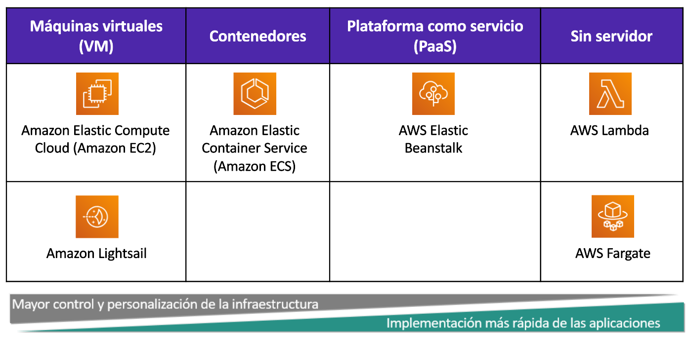
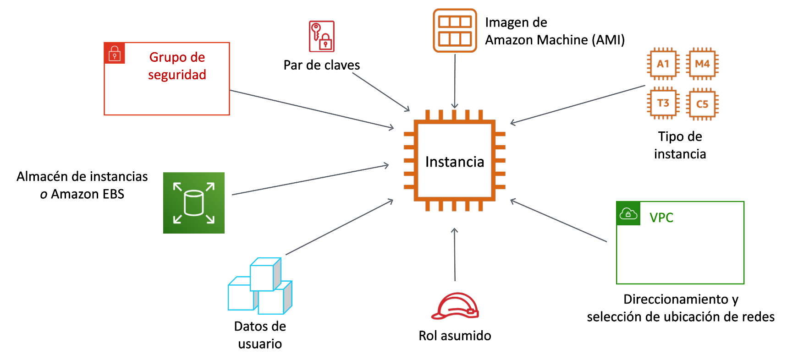
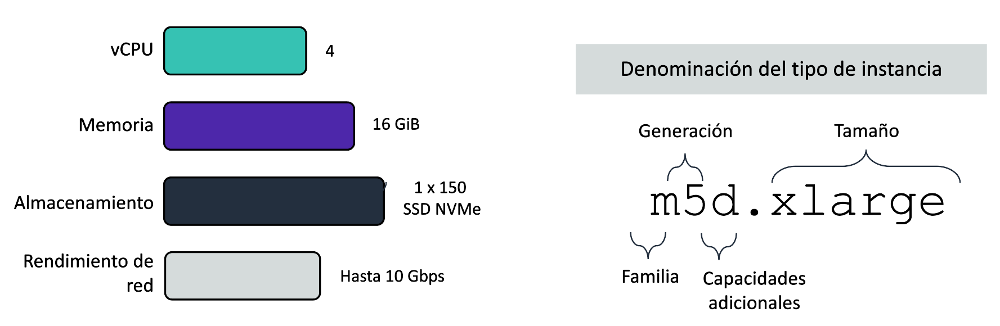

# Tema 2. Capa Informática

## ¿Qué es una Capa Informática?
La capa informática (o de cómputo) de AWS es el nivel de la nube encargado de proporcionar recursos de procesamiento (CPU, memoria y red) que permiten ejecutar aplicaciones, sistemas operativos y servicios. Esta capa ofrece distintos modelos de uso, desde máquinas virtuales hasta entornos sin servidor.

Es decir, son los servicios que sustituyen o complementan a los servidores físicos o máquinas virtuales tradicionales en un centro de datos.

### ¿Qué otros componentes interactúan con la capa informática?

- **Capa de almacenamiento** (S3, EBS, EFS): Proporciona dónde guardar los datos que las aplicaciones procesan.
- **Capa de red** (VPC, Route 53, ELB): Permite la comunicación entre instancias, usuarios y servicios de AWS.
- **Capa de bases de datos** (RDS, DynamoDB, Aurora): Proporciona sistemas gestionados para almacenar, consultar y organizar datos.
- **Capa de seguridad e identidad** (IAM, Security Groups, NACLs): Garantiza que solo los usuarios o servicios autorizados accedan a los recursos de cómputo.
- **Capa de monitorización y gestión** (CloudWatch, CloudTrail): Supervisa el estado y el rendimiento de los recursos informáticos.

## Servicios de cómputo en AWS.
Cuando hablamos de capa informática en AWS pensamos rápidamente en la posibilidad de crear máquinas virtuales en la nube. Este popular servicio es el conocido como **EC2**, pero no es el único servicio que ofrece AWS relacionado con la capa de cómputo.

AWS ofrece varias opciones de informática para satisfacer diferentes necesidades. Las opciones clave de informática de tiempo de ejecución se pueden agrupar en cuatro categorías de modelos informáticos en la nube: 

- **Máquinas virtuales** (VM)
- **Contenedores**
- **Plataforma como servicio** (PaaS)
- **Sin servidor** (Serverless)

En este tema nos vamos a centrar en el servicio **EC2**.

## Amazon EC2
**Amazon Elastic Compute Cloud** ([Amazon EC2](https://docs.aws.amazon.com/ec2/)) proporciona máquinas virtuales en las que podemos alojar el mismo tipo de aplicaciones que podríamos ejecutar en un servidor en nuestras oficinas (servidores web, de aplicaciones, de correo, de bases de datos, multimedia, ...), ofreciendo capacidad de cómputo segura y de tamaño ajustable en la nube.

Amazon EC2 proporciona máquinas virtuales y se puede considerar una forma de infraestructura como servicio (IaaS). Podemos elegir el sistema operativo, así como el tamaño y las capacidades de los recursos de los servidores que lancemos, pero los servicios de IaaS nos obligan a estar a cargo de muchas de las responsabilidades de la administración del servidor tales como actualizaciones del sistema operativo, copias de seguridad, instalación y actualización de aplicaciones y servicios, etc.

La computación elástica (*Elastic Compute*) se refiere a la capacidad para aumentar o reducir fácilmente la cantidad de servidores que ejecutan una aplicación de manera automática, así como para aumentar o reducir la capacidad de procesamiento (CPU), memoria RAM o almacenamiento de los servidores existentes.

Cuando hablemos de una máquina virtual lanzada en Amazon EC2 nos referiremos a ella como una **instancia EC2**.

### Parámetros de configuración de una instancia EC2
Cuando creemos una instancia EC2 deberemos especificarle algunos parámetros necesarios para su configuración y su seguridad. Algunos de ellos los vamos a ver en este tema y otros los iremos desarrollando en temas siguientes.

Entre estos parámetros necesarios habrá que indicarle a la consola que la instancia debe tener un **tamaño** de procesador y memoria, un **sistema de almacenamiento** o disco duro virtual, con un sistema operativo basado en una **imagen de máquina** que se creará con unos **datos de usuario**; además deberá estar conectada en una **red privada virtual** de AWS y necesitaremos un **par de claves** pública/privada para conectarnos a la máquina.

#### AMIs

Una **AMI (Amazon Machine Image)** es una plantilla preconfigurada que contiene la información necesaria para crear una máquina virtual (instancia) en Amazon EC2.

Podría decirse que es como una “foto” de un servidor que sirve de modelo para lanzar nuevas instancias en AWS. A partir de esa imagen se pueden crear tantas máquinas virtuales como se necesiten, todas con la misma configuración inicial.

Una AMI incluye:

- El sistema operativo (Linux, Windows, etc.).
- Opcionalmente, aplicaciones o configuraciones adicionales.
- Permisos de acceso (quién puede usarla).
- Información sobre el tipo de almacenamiento que utilizará.

Podemos encontrarnos varios tipos de AMI:

- **De AWS:** proporcionadas y mantenidas por Amazon (ej. Amazon Linux, Ubuntu, Windows Server).
- **De la comunidad:** compartidas por otros usuarios.
- **Privadas/personalizadas:** creadas por la propia organización o usuario con sus programas y configuraciones.
- **Del Marketplace**: publicadas por proveedores de software (ej. imágenes con Oracle, SAP, etc.).

#### Tipo de instancias
Un **tipo de instancia EC2** define una configuración de características de rendimiento de **CPU**, **memoria**, **almacenamiento** y **red** que proporcionan un nivel determinado de rendimiento informático. Será lo equivalente a decir el tamaño de la instancia ajustando los tamaños de dichas características de la máquina virtual.

La nomenclatura del tipo de instancia nos determina la familia, la generación y el tamaño.

Para el tipo de instancia `m5d.xlarge` la letra *m* indica el nombre de la familia, al cual le sigue un número, en este caso el *5*. 

Este número indica la generación de ese tipo de familia. Por lo tanto, una instancia *m5* es la quinta generación de la familia *m*. En general, los tipos de instancias que son de una generación más alta son más potentes y ofrecen un mejor relación calidad-precio.
 
La parte siguiente del nombre corresponde a la capacidad de la instancia. Cuando se comparan las capacidades, es importante tener en cuenta la parte del coeficiente de la categoría de capacidad.
 
Por ejemplo, una instancia `m5.2xlarge` tiene el doble de vCPU y memoria que una instancia `m5.xlarge` que tiene, a su vez, el doble de vCPU y memoria que una instancia `m5.large`.
 
!!! note "Nota"
    Además de tener en cuenta las necesidades de CPU, RAM y almacenamiento de las cargas de trabajo, también es importante tener en cuenta los **requisitos del ancho de banda de la red**, que también está vinculada al tamaño de la instancia de EC2. Si ejecutamos trabajos que hacen un uso intensivo de la red, es posible que debamos aumentar las especificaciones de las instancias para satisfacer nuestras necesidades.

    Cada tipo de instancia proporciona un nivel de rendimiento de red documentado. Por ejemplo, una instancia `a1.medium` brinda hasta 10 Gb/s, pero una instancia `p3dn.24xlarge` proporciona hasta 100 Gb/s.

Las familias de las instancias se agrupan según su proósitoy características de hardware como se resume la siguiente tabla:

| Familia     | Optimizado para               | Ejemplos                                                             |
| ----------- | ----------------------------- | -------------------------------------------------------------------- |
| t, m        | Uso general                   | Web, apps ligeras, desarrollo, pruebas                               |
| c           | CPU intensiva                 | Análisis, servicios web, juegos multijugador, codificación de vídeos |
| r, x        | RAM intensiva                 | Bases de datos, caché en memoria, análisis de Big Data               |
| i, d        | Disco Duro rápido             | Bases de datos NoSQL, Big Data, Almacenamiento de Datos              |
| p, g, f     | Computación acelerada         | HPC, Machine Learning e IA, gráficos                                 |

#### Par de Claves

#### Configuración de la red

#### Almacenamiento

#### Datos de usuario

## Precauciones sobre los costos

Práctica:
-Creación MVs Consola AWS
-Creación MVs CLI
-Creación de par de claves
-Acceso por SSH

¿Costos?
