# Creación de una VPC

Una VPC es una red virtual aislada desde un punto de vista lógico, a la que asignamos un direccionamiento de red, y que podemos subdividir en subredes, como se hace en una infraestructura tradicional. La diferencia es que en este caso todo lo definimos por software, ya sea desde la consola de AWS, desde la terminal con comandos de CLI, o utlizando algún lenguaje de programación soportado por el SDK de AWS.

AWS tiene regiones en diferentes paises, y cada región tiene varias zonas de disponibilidad que están separadas físicamente unas de otras (unos 100 km como mucho). Cada zona de disponibilidad a su vez tiene varios datacenters.
Una VPC se define a nivel de región, y puede abarcar una o más zonas de disponibilidad. Así, podemos crear subredes en varias de estas zonas y desplegar nuestros recursos de manera que sean altamente disponibles.

En el ejemplo siguiente se muestra  una VPC dentro de una región con tres zonas de disponibilidad. En cada una de ellas hay definida una subred, en las que se pueden lanzar instancias EC2 de manera que podamos tener un servicio replicado (o diferentes servicios) en diferentes zonas geográficas:

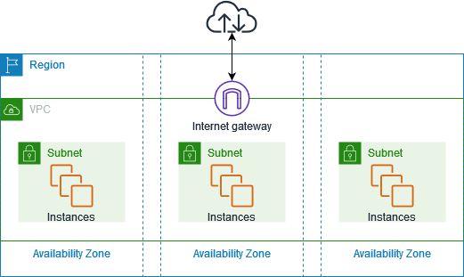

Existen diferentes formas para crear una VPC y sus elementos, que veremos a continuación.

## Objetivo de la práctica 1

En esta práctica vamos a realizar la creación simultánea de los elementos de red desde la consola de AWS.

El ejemplo guiado para crear la red que te muestro a continuación está realizado con:

* dirección de red 172.16.0.0/16
* subred 172.16.0.0/20.

Tu deberás adecuar las direcciones según se pide a continuación

## Práctica a Realizar

Vamos a crear una VPC

* red 192.168.0.0/16
* subred 192.168.5.0/24

Crea una VPC	con una subred pública (sr1)

Crea una ec2 con un grupo de seguridad por defecto, de manera que se despliegue en la subred sr1, y selecciona la opción de Asignar automáticamente la IP pública.

Crea una segunda ec2, asignándole el grupo de seguridad anterior, desplegándola también en la subred sr1.

Accede por ssh a las instancias y comprueba sus	direcciones ip	privadas.

Entrega captura de pantalla resultado de hacer un "ip a" una vez estás conectado por ssh en cada una de las instancias

### Creación simultánea de los elementos de red desde la consola de AWS

Ahora que ya hemos comprobado que podemos utilizar instancias dentro del espacio de Amazon, el siguiente paso es crear un ’trozo’ de nube y ser conscientes del direccionamiento que podemos emplear dentro del espacio que AWS nos da. Podemos acceder al servicio VPC buscándolo en la barra superior de la consola de AWS, una vez hemos arrancado el Learner Lab y accedido a la consola:

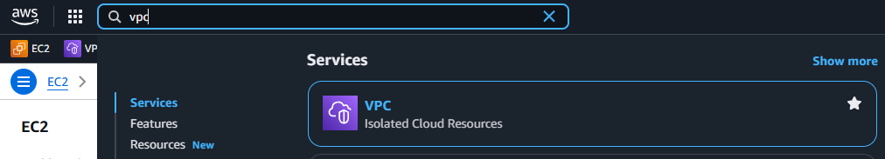

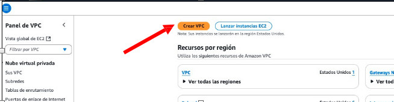

Lo primero será utilizar la creación de subredes en el mismo momento que se crea una VPC (opción VPC y más). Seleccionaremos el servicio VPC, con  direccionamiento 172.16.0.0/16, y dentro de la VPC  crearemos  una  única subred pública con direccionamiento 172.16.0.0/20:

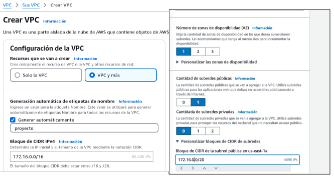

En este caso estamos utilizando una única zona de disponibilidad con una subred pública, concretamente la zona con nombre us-east-1a en la región del Norte de Virginia (us-east-1):

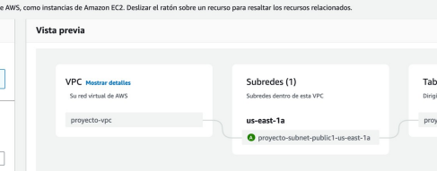

En este punto no vamos a seleccionar Gateways NAT ni puntos de enlace de la VPC, que son conceptos que veremos más adelante.

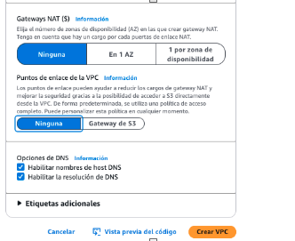

 Una vez pulsemos sobre el botón de Crear VPC, podremos ir viendo los elementos que se van creando, en función de las opciones que se elijan:

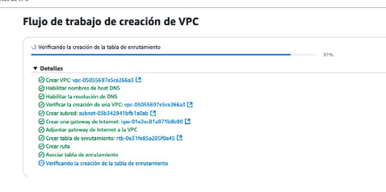

Una vez creada la VPC, es interesante seleccionar la pestaña de Mapa de recursos que nos permite comprobar de una manera visual los elementos creados y cómo se relacionan entre ellos:

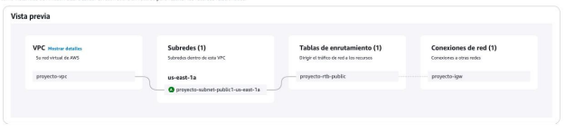

En el menú lateral izquierdo del Panel de VPC, tenemos diferentes opciones para trabajar con los diferentes  elementos que pueden estar presentes en una VPC. Podemos mostrar información sobre los elementos creados:

La VPC  :

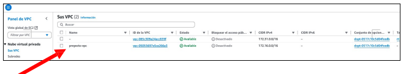

La subred :

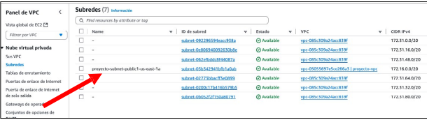

Es importante fijarnos en el identificador que se genera para cada recurso, porque muchas veces creamos elementos y les perdemos la trazabilidad. Además, para utilizar la CLI (Command Line Interface), necesitaremos el identificador de cada servicio. Una vez creada la arquitectura  básica de red, si queremos lanzar una instancia EC2 en ella, habrá que editar la configuración de red y seleccionar la VPC y la subred recién creadas en el momento de su lanzamiento:

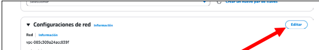

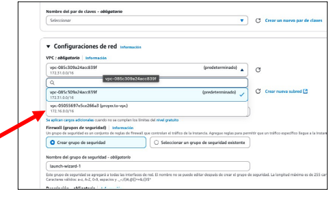

Con todo esto la arquitectura finalmente creada es la que se muestra a continuación:

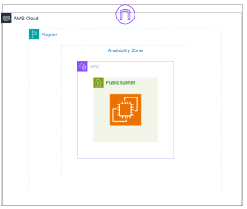
