## Objetivo de la práctica 2

En esta práctica vamos a realizar la creación independiente de los elementos de red desde la consola de AWS, el resultado será el mismo que en la práctica anterior pero se trata de que entiendas qué papel juegan cada uno de los siguientes conceptos en la VPC

* Red
* Subred

* Zona de disponibilidad
* Dirección IP Pública

* Nombre de host DNS
* Gateway de internet IGW

* Tabla de enrutamiento

## Práctica a Realizar

Vamos a crear una VPC con las siguientes direcciones

* red 192.168.0.0/16
* subred 192.168.0.0/24

!!! success "Captura las pantallas"
    Esta tarea la documentarás paso a paso, para comprobar que el resultado es el esperado al final entregarás el resultado de acceder por ssh a las instancias y comprobar su dirección privada.

## Creación independiente de los elementos de red desde la consola de AWS

En la práctica anterior hemos creado una VPC completa (utilizando la ayuda para la configuración que nos ofrece AWS) porque ya conocíamos de antemano todos los elementos que necesitábamos. Pero puede darse el caso de que tengamos que crear los  elementos por separado. De eso trata esta alternativa, para  lo  que seleccionaremos la opción ‘Solo la VPC’ al crearla:

Lo primero es crear una VPC con su direccionamiento (por ejemplo, 192.168.0.0/16):

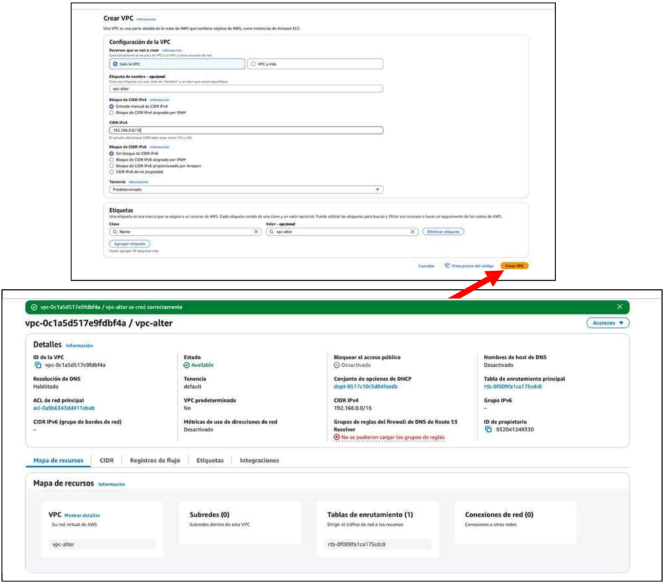

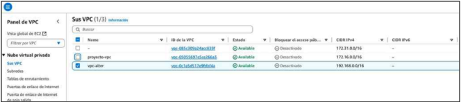

A continuación, una vez creada la VPC, desde la opción de Subredes, crearemos la subred  asociándola a la VPC que acabamos de crear y dándole un nombre y un rango de direcciones IPv4, que debe estar dentro del rango de la VPC. Por ejemplo, podemos asignar el rango 192.168.0.0/24:

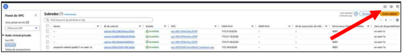

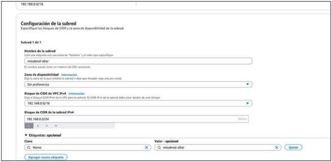

En este caso no hemos asignado una zona de disponibilidad, con lo que la subred se puede crear en cualquiera de las seis zonas de disponibilidad que hay en la región del Norte de Virginia (us-east-1).

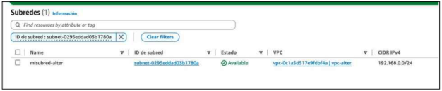

El  siguiente  paso  es  lanzar  un  EC2  y  comprobar  si  funciona  la  arquitectura  que hemos hecho. Para ello, al crear la instancia, seleccionaremos la VPC y subred que hemos creado. Es importante habilitar la asignación de una IP pública (AWS solo asigna automáticamente direcciones IP públicas en la VPC por defecto, pero no en las creadas por nosotros).

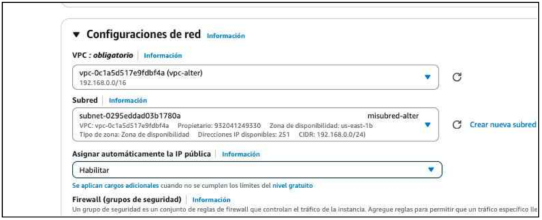

Una vez creado, nos daremos cuenta de que SÍ que se asigna una ip pública pero NO un nombre de host DNS. El problema reside en que en la VPC NO hemos habilitado  esta resolución.  Para  solucionarlo,  iremos  al  menú  de  VPC  y seleccionaremos la VPC:

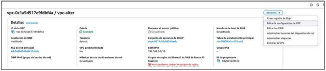

Y editaremos la configuración para habilitar la opción “nombres de host DNS”.

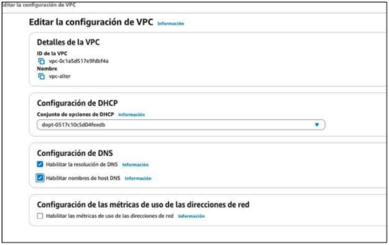

Ahora cuando volvamos a comprobar las propiedades de la EC2 creada, podremos ver que ya le ha asignado un nombre de host DNS a través del cual podremos acceder por ssh (también lo podríamos hacer utilizando la ip pública).

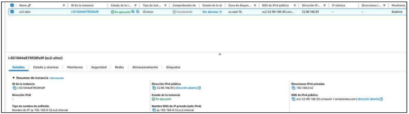

Cuando intentemos acceder por ssh, nos daremos cuenta de que NO es posible hacerlo, ya que a nuestra VPC le falta un elemento/servicio que permita a todo lo que haya dentro poder configurarse para poder conectarse con el exterior y viceversa. El elemento que nos falta es el gateway de Internet (Internet Gateway o puerta de enlace de Internet - IGW). Podemos  crear  este  elemento dede la opción  ‘Puerta  de  enlace  de  Internet’ que encontraremos en el menú lateral izquierdo del panel del servicio VPC:

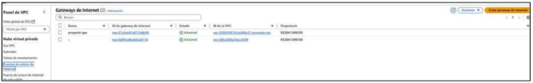

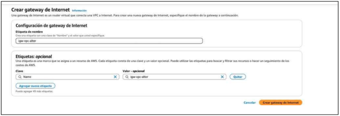

Si visualizamos el listado de los IGWs que hay creados, veremos que el estado del nuevo IGW aparece como “detached”, así que tendremos que asignárselo a la VPC deseada:

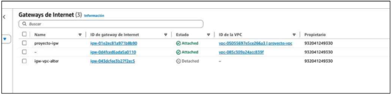

Entonces en las acciones del IGW, le daremos a conectar a VPC:

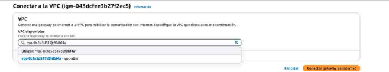

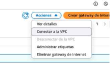

¡Pero seguimos sin poder conectarnos!

Falta configurar un elemento encargado de gestionar el tráfico dentro de la VPC: la tabla de enrutamiento.  Al  crear  una  VPC,  se  crea  un  tabla  de  enrutamiento  por defecto, y tenemos que asociarle la subred creada para poder crear rutas para esa subred, desde la opción correspondiente del panel de VPC (puedes localizar la subred entre las distintas que puedan haber observando la VPC a la que pertenece):

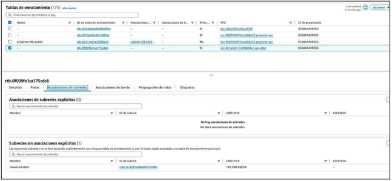

Asociaremos la subred explícitamente,  aunque si no lo hacemos, la subred se asocia con la tabla de enrutamiento por defecto de la VPC.

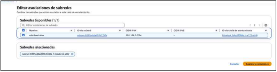

Podemos volver a comprobar si nos podemos conectar, y seguimos SIN CONEXIÓN. Lo único que nos falta es modificar las rutas de la tabla de enrutamiento asociada a la subred. Si nos fijamos en las rutas que hay (seleccionando la subred, pestaña ‘Tabla de enrutamiento’), sólo se está enrutando la red de la VPC en local, es  decir  las subredes que tenga a su alcance (192.168.0.0/16). Sólo hay que añadir una ruta e indicar  que  todo lo que vaya a 0.0.0.0 salga por el Internet Gateway que hemos creado y asociado a nuestra VPC. Para ello seleccionamos la tabla de enrutamiento, editamos las rutas, y seleccionamos la opción ‘Agregar ruta’:

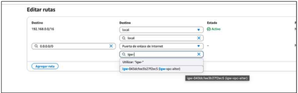

Una vez añadida, comprobamos que aparece la nueva ruta en la lista de rutas de la tabla de enrutamiento:

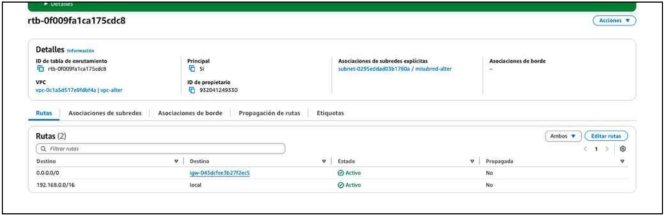

Una vez hecho esto, ahora sí que podremos conectarnos por ssh a cualquier instancia EC2 lanzada en la subred que hemos creado (siempre que la EC2 tenga asignada una dirección IP pública, y de que el grupo de seguridad asociado, concepto del que hablaremos más adelante, permita tráfico entrante al puerto de ssh).

