## Objetivo de la práctica 3

En esta tarea aprenderemos a crear subredes privadas y a configurar diferentes recursos de red de manera que se pueda acceder a Internet desde una instancia desplegada en una subred privada. También trataremos diferentes aspectos de seguridad para controlar el tráfico de red, tanto a nivel de instancias como a nivel  de  subred.  En  concreto, utilizaremos  los  siguientes  servicios  y  recursos  relacionados  con  la  parte  de  redes de AWS:

1. VPC
2. Subredes públicas y privadas
3. Tablas de enrutamiento y rutas
4. Gateway de Internet
5. Gateway NAT
6. Grupos de seguridad
7. ACL de red

El escenario propuesto que vamos a desarrollar consistirá en una VPC con una subred pública y una subred privada, la cual sólo tendrá acceso al exterior pasando primero por la subred pública, y se lanzará una instancia EC2 en cada subred. Para que la instancia desplegada en la subred privada tenga acceso a Internet, se utilizará un Gateway NAT, que  es  un  recurso  de  red  que  podemos  desplegar  en  una  subred  pública  que  tenga conexión a un Gateway de Internet, de manera que permita la salida a Internet desde los recursos desplegados en subredes privadas, sin más que redirigir de manera apropiada el tráfico de red mediante rutas.

Los rangos utilizados para la VPC y subredes de la práctica guiada que tienes a continuación son:

- Direccionamiento VPC: 172.16.0.0/16
- Direccionamiento subred pública: 172.16.0.0/20
- Direccionamiento subred privada: 172.16.64.0/20

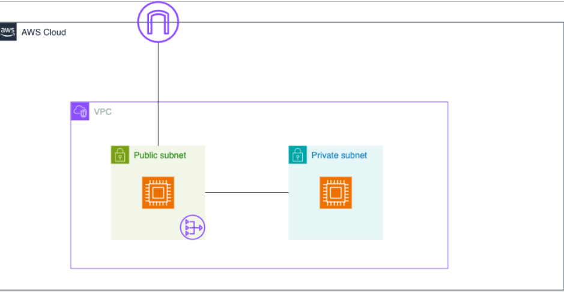

Aunque es posible desplegar todos los recursos de red al crear la VPC, vamos a crear únicamente la VPC, la subred pública, el Gateway de Internet y las tablas de rutas por defecto. Para ello se utilizará la consola gráfica de AWS. Después, añadiremos uno a uno los recursos de la parte privada.

El objetivo inicial entonces en cuanto a la parte de red, es tener una VPC, una subred pública, un Gateway de Internet (IGW) y una tabla de enrutamiento, que vamos creando desde la opción de creación de VPC como ya se vio

##### Qué tienes que hacer en esta tarea
- La tarea consiste en realizar un despliegue de una típica **arquitectura de dos capas**, donde en la parte pública tendremos un servidor web, y en la privada un servidor de base de datos:
- Crea  una  VPC  con  dos  subredes,  una  pública  y  otra  privada, puedes poner el mismo direccionamiento de red que tienes en esta tarea guiada o puedes escoger otro. Para que desde la subred privada se pueda acceder al exterior deberás utilizar un NAT Gateway.
- En la subred pública, lanza una instancia EC2 e instala un servidor web Apache, que será accesible desde cualquier equipo externo a la VPC por el puerto 80, utilizando tanto su nombre DNS como su dirección IP pública.
- En la subred privada, lanza otra instancia EC2 e instala un servicio de MySQL. Para acceder a esta instancia, tendrás que acceder primero a la instancia pública (utiliza para ello el agente ssh).
- Los grupos de seguridad asociados a las instancias deben permitir sólo el tráfico de entrada  necesario, utilizando una regla encadenada en el caso del grupo de seguridad asociado a la instancia de base de datos,  de  manera  que  sólo  acepte  tráfico  entrante  del protocolo adecuado desde la instancia del servidor web.
- Conéctate con ssh a la instancia de la subred pública, y realiza una prueba de conexión al servidor de base de datos, utilizando para ello la aplicación cliente mysql (que tendrás que instalar previamente).

!!! success "Para entregar"  
    - Adjunta   a  la  tarea   un   documento  pdf   con   las   siguientes  capturas:  mapa  de  la  VPC, configuración  de  las reglas de entrada  de los grupos de seguridad de las dos instancias, conexión al servidor Apache desde un navegador, y conexión al servicio de base de datos desde la instancia del servidor web.

  **Nota: No es necesario utilizar ACLs de red en esta tarea, el tráfico de red se controlará únicamente con los grupos de seguridad asociados a las instancias, y por el hecho de que el servidor de base de datos residirá en una subred privada.**

##### Veamos ahora el ejemplo de cómo hacer esto

#### VPC con su direccionamiento:

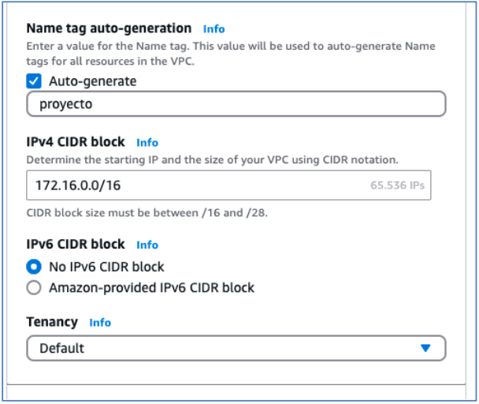

Y ahora el direccionamiento de la subred pública (la subred privada la crearemos más adelante):

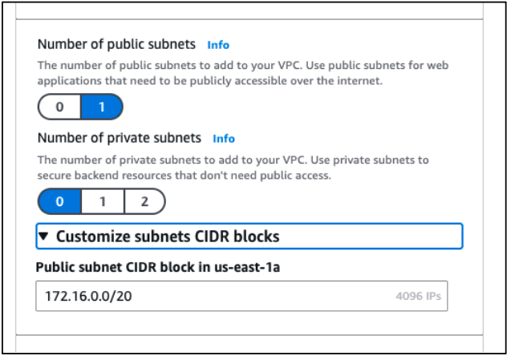

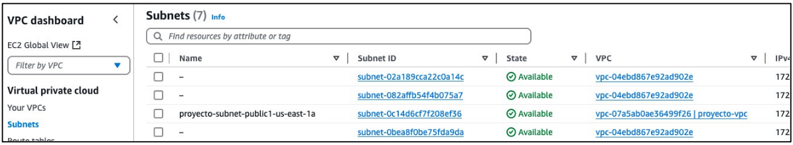

Partiendo de aquí, el siguiente objetivo es crear otra subred (que será la subred privada), utilizando la opción Subredes del Panel de VPC:

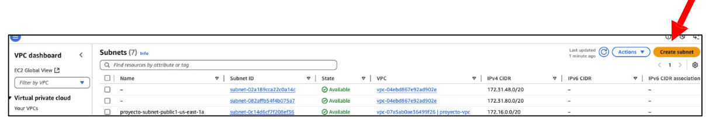

Subred privada (hay que elegir la VPC que acabamos de crear):

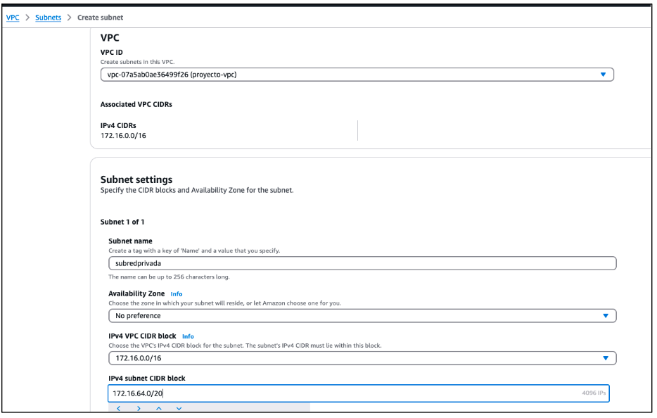

Como se puede comprobar, realmente en ningún momento estamos indicando que la subred sea privada. Simplemente creamos subredes, y serán las tablas de enrutamiento las que decidan si la subred es pública o privada, dependiendo de si ésta puede alcanzar o no un elemento de red que permita la comunicación con el exterior.

A continuación, lanzaremos una instancia EC2 en la subred pública y otra en la subred privada. Las instancias pueden ser por ejemplo Amazon Linux o Ubuntu, tamaño t3.micro, con creación de grupo de seguridad por defecto y clave privada ‘vockey’. En las opciones para lanzar las instancias, hay que editar la configuración de red y seleccionar la VPC y subred  en  la  queremos  lanzarla.  También  seleccionaremos  la  opción  para  asignar automáticamente una IP pública.

En la imagen siguiente se muestra la configuración para el caso de la instancia EC2 pública, para la privada habría que cambiar sólo la subred:

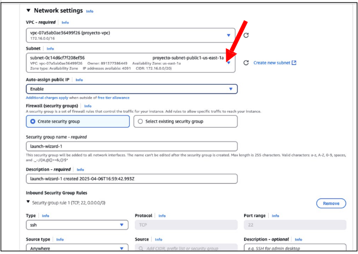

Si  intentamos  conectarnos  por  ssh  a  la  instancia  desplegada  en  la  subred  privada utilizando su dirección ip pública, comprobaremos que no es posible el acceso. La subred privada no está asociada de ninguna manera con la subred con el Internet Gateway para poder enrutar el tráfico al exterior.

Si comprobamos la tabla de enrutamiento asociada a la VPC (desde el panel de VPC, opción Tablas de enrutamiento), podremos ver en la pestaña de asociaciones de subred, que únicamente tenemos la subred pública asociada a la tabla de enrutamiento:

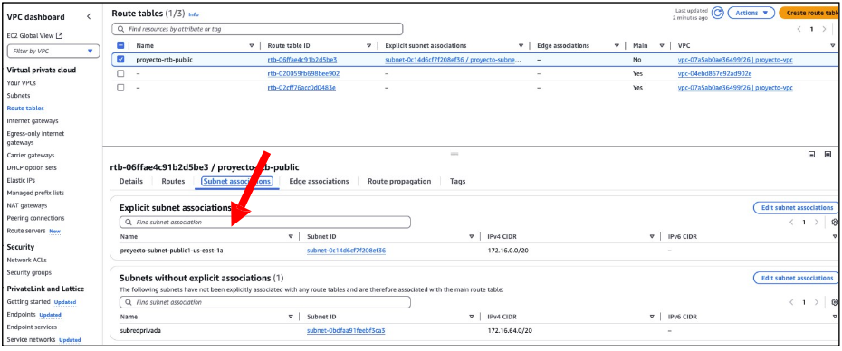

La subred privada aparece en la pestaña “Subredes sin asociaciones explícitas”, lo que quiere decir que está preparada para ser añadida a la tabla de enrutamiento, pero aún no lo hemos hecho.

Básicamente lo que pretendemos es hacer que la subred privada salga al exterior a través de la subred pública. Para ello, cada subred tiene su propia tabla de enrutamiento, y en el caso de la subred pública existe una ruta hacia el Gateway de Internet para poder salir al exterior:

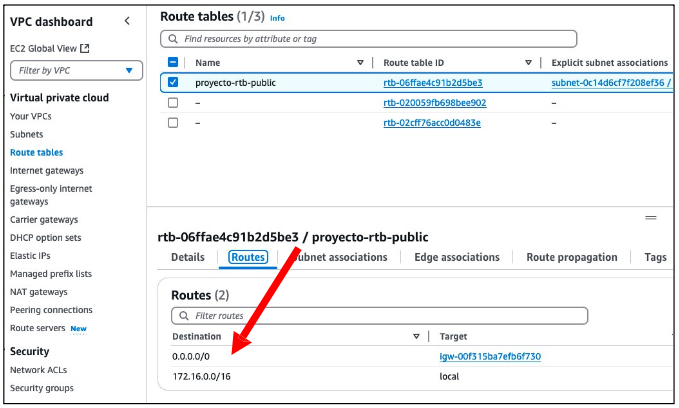

En este punto podríamos conectarnos por ssh a la instancia de la red pública y hacer ping a www.google.es y debería funcionar:

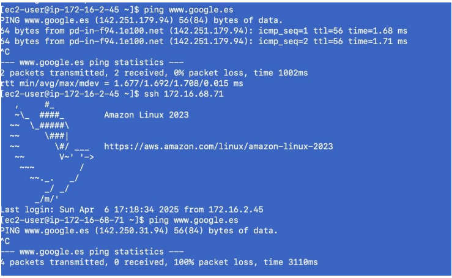

También podemos conectarnos por ssh desde la instancia en la subred pública a la instancia de la subred privada y probar el mismo comando ping, que obviamente no funcionará todavía. En el siguiente punto veremos cómo hacer esta conexión ssh a la instancia EC2 de la subred privada, ‘saltando’ desde la instancia pública.

#### Conexión SSH a las instancias pública y privada

A continuación, veremos cómo hacer la conexión ssh a las instancias EC2 utilizando la misma clave privada,  sin  necesidad  de  copiar  la  clave  privada  (labsuser.pem)  a  la instancia  pública  (también  se  podría  hacer usando diferentes credenciales de acceso, pero aprovecharemos que las dos instancias se han creado con la misma clave ‘vockey’). Para ello utilizaremos el reenvío de agente SSH, que permitirá conectarnos desde un host bastión en una subred pública a la instancia privada.

Seguiremos los pasos indicados  para  equipos  Linux.  En sistemas Windows,  se puede utilizar el programa PuTTY (puedes consultar este  artículo  donde se detalla cómo realizar la conexión a una EC2 con Linux desde un host bastión).  En primer lugar, comprobamos que las claves privadas tienen los permisos adecuados. Luego, desde el terminal ejecutaremos los siguientes comandos:

Ejecutamos ssh-agent en segundo plano:

``eval $(ssh-agent)``

Cargamos en memoria la clave privada de la instancia:

``ssh-add labsuser.pem``

Podemos ver las claves añadidas al agente ssh mediante el comando:

``ssh-add -l``

Nos conectamos en primer lugar a la instancia de la subred pública. Con la opción **-A**, las claves se mantienen en memoria, y no es necesario utilizar la opción -i para indicar la clave (utiliza el nombre de usuario

adecuado según la AMI de la instancia):

``ssh -A ec2-user@dirección-ip-pública``

Una vez conectados a la instancia pública, desde ella nos conectamos a la instancia de la subred privada utilizando su dirección IP privada:

``ssh ec2-user@direccion-ip-privada``

Una vez hemos logrado tener acceso a la instancia de la subred privada, si intentamos hacer  por  ejemplo un  ping  a www.google.es,  comprobaremos que  no  funciona. Hasta ahora lo que hemos logrado hacer es llegar hasta la instancia, pero, ¿y si la instancia necesita actualizarse o tener acceso a Internet por cualquier motivo? Para esta casuística podemos  utilizar  el  servicio  **NAT  Gateway** ,  que  es  un  servicio  que  permite  que  las instancias de una subred privada puedan conectarse a servicios fuera de la VPC, pero los servicios externos no pueden iniciar una conexión con esas instancias.

#### Creación de un NAT Gateway y modificación de la tabla de rutas de la subred privada

Lo primero que haremos será crear un NAT Gateway desde la opción correspondiente del panel de VPC:

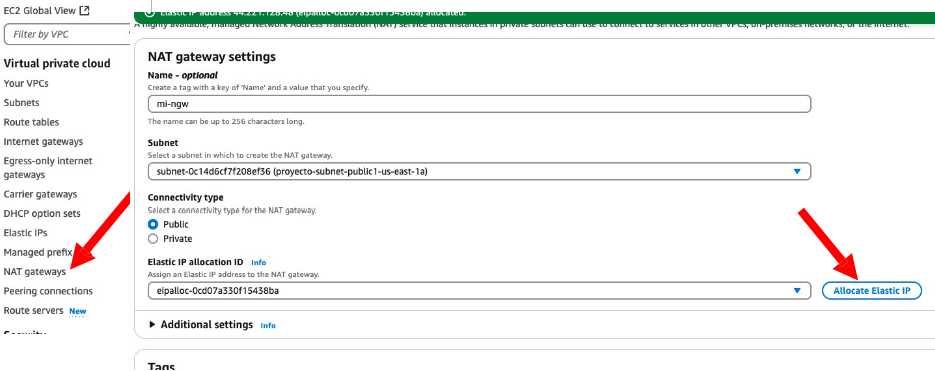

Aquí aparece por primera vez el concepto de **ip elástica**. Una ip elástica es una dirección ip pública estática, que vamos a poder reutilizar en otros servicios.  Es decir, si hubiera un servicio que necesitase de una dirección ip pública, o bien podemos utilizar las que AWS asigna por defecto de forma dinámica, o si ya necesitamos una dirección estática que no cambie (para un servidor web, por ejemplo) se podría reutilizar la ip elástica creada. Por supuesto,  reservar  direcciones  ip  de  esta  forma  conlleva  un  gasto  asociado, independientemente de que estén o no asignadas a recursos. En las cuentas de AWS se
pueden utilizar hasta 5 direcciones elásticas por región, aunque se puede solicitar el aumento de este límite.

El servicio NAT Gateway necesita tener asignado una dirección ip elástica, por eso hay que pinchar en la opción de asignar ip elástica. La creación de este elemento de red lleva un rato, y habrá que esperar a que esté en estado “available”. En este caso el NAT Gateway lo vamos a crear en la subred pública (ya veremos más adelante el motivo).

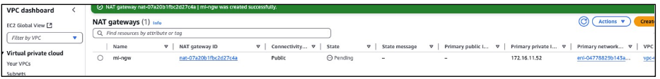

Cabe destacar que el servicio NAT Gateway, al tener una ip elástica asociada, supondrá un coste adicional incluso cuando apaguemos el laboratorio. Lo mismo pasa con otros servicios  de  AWS  (cuando  paramos el laboratorio, las instancias EC2 se detienen y dejamos de pagar por el uso de CPU, pero seguimos pagando por el almacenamiento asignado a su disco de sistema).

A continuación, vamos a configurar la subred privada para que tenga conexión al exterior. Para ello, primero  vamos  a  crear  una  tabla  de  enrutamiento que  podemos  llamar  ‘rt- privada’, y después le asociaremos la subred:

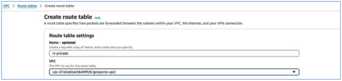

Cuando se cree la tabla de enrutamiento, le asociaremos la subred privada desde la pestaña “Asociaciones de subredes”, haciendo clic en “Editar asociaciones de subredes”:

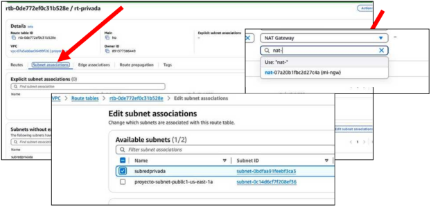

Después, accediendo desde la pestaña ‘Rutas’ de la tabla de enrutamiento, añadiremos una ruta para redirigir el tráfico que vaya a Internet hacia el NAT Gateway que hemos creado, y éste ya se encargará de dar salida hacia Internet:

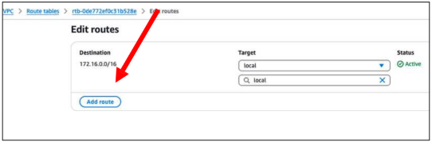

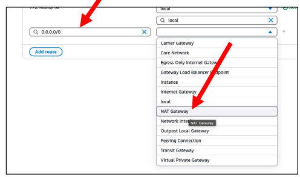

Ahora podremos hacer dos comprobaciones:

- Seguimos sin poder conectarnos por ssh directamente a la ip pública de la instancia privada desde una máquina local:

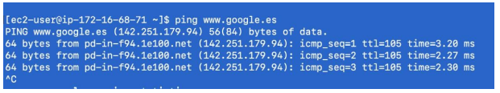

- Si hacemos ping desde la EC2 de la subred privada al exterior, SÍ que obtendremos respuesta:

#### NACL (Network Access Control List)

Una NACL es un componente de seguridad que actúa como un firewall, permitiendo o denegando el tráfico entrante o saliente a nivel de subred dentro de una VPC. Hasta ahora hemos estado trabajando con los grupos de seguridad, que son básicamente son firewalls  con  estado  que  podemos  asignar  a  diferentes  recursos en AWS, como una instancia EC2. Con los grupos de seguridad, cuando se establece una conexión entrante, se puede devolver una respuesta sin que sea necesario habilitar una regla de salida que lo permita explícitamente. Sin embargo, AWS ofrece otro nivel de seguridad, que son las NACL o ACL de red.

A diferencia de las reglas asociadas a un grupo de seguridad, las reglas de NACL son sin estado. Por ejemplo, si queremos que una instancia responda a un ping, añadimos en su grupo de seguridad asociado una regla que permita el tráfico entrante ICMP. Cuando se realiza el ping, la entrada se permite e implícitamente se permite la salida por cualquier puerto, ya que es una conexión establecida. Sin embargo, en el caso de las NACL, este permiso implícito NO es dado, hay que configurar tanto las reglas de entrada como las de salida.

#### Escenario de prueba

Vamos a comprobar que los grupos de seguridad son capaces de guardar el estado y las ACLs de red no. Para ello, montaremos en una VPC una subred pública y lanzaremos una instancia EC2 en dicha subred. Permitiremos la entrada del ping mediante una NACL definida en la subred pero NO la salida, para comprobar que el ping NO sale, y luego más tarde lo permitiremos.

Antes de continuar, es recomendable eliminar todo lo que hemos hecho anteriormente para no confundirnos y tener los siguientes conceptos claros. Si no queremos eliminar los recursos individualmente, se puede realizar un reset del laboratorio para eliminar todos los recursos, pero dejará éste inaccesible durante un rato.

El escenario de prueba es básico, con una VPC con una sola subred pública que enrutará el tráfico externo mediante un Gateway de Internet:

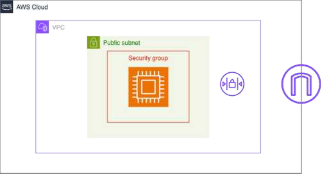

#### Creación de la VPC e instancia EC2

Lo primero es crear la VPC junto con la subred. Nos podemos guiar con las siguientes capturas:

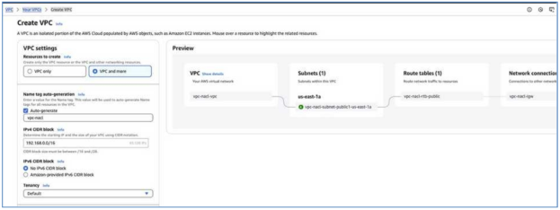

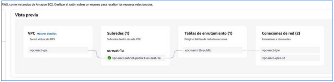Una vez creada la infraestructura de red, pasaremos a lanzar la instancia dentro de la subred en la VPC recién creada:

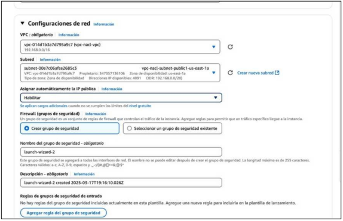

Una vez la instancia esté en ejecución, podemos probar que podemos acceder por ssh, y a continuación salir y probar a hacer un ping desde nuestra máquina local a la instancia:

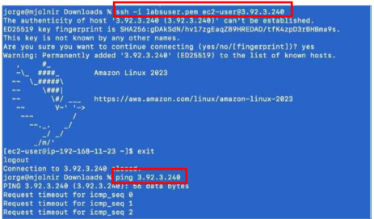

A continuación, modificaremos el grupo de seguridad asociado a la instancia para permitir tráfico ICMP entrante desde cualquier sitio, y comprobar que el ping funciona. Una vez hecha esta comprobación, añadiremos una capa adicional de seguridad a nivel de subred con reglas ACL.

Hay  que  tener  en  cuenta  que  en  los  grupos  de  seguridad,  por  defecto  todo  el  tráfico entrante se deniega, y se permite todo el de salida. Por lo tanto, daremos permiso al protocolo ICMP en una regla de entrada y salida del ping y luego denegaremos la salida del ping y ver como ya no responde.

El  grupo de  seguridad  asociado  a  la  instancia  EC2  configurado para  permitir el  ping tendría un aspecto como el siguiente:

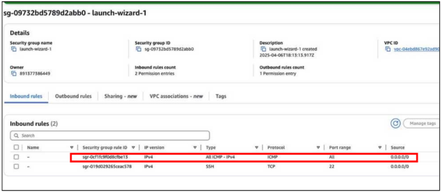

Observamos en las reglas de salida que todo el tráfico está permitido:

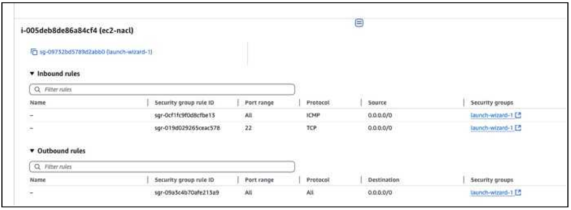

En este punto, podemos probar de nuevo el ping de la máquina local a la EC2, y veremos que funciona.

Para comprobar que los grupos de seguridad ‘recuerdan’ las peticiones entrantes, vamos a eliminar la regla que permite toda la salida de todo el tráfico. Para ello, editamos las reglas de salida del grupo de seguridad:

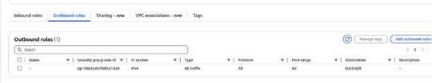

Una vez eliminada la regla, comprobamos que no hay reglas de salida:

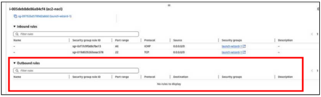

Si volvemos a probar el ping, comprobaremos que sigue funcionando incluso, después de eliminar la regla de tráfico de salida. Las ACL de red nos van a permitir tener un mayor control sobre el tráfico entrante y saliente a una subred, a cambio de una mayor sobrecarga en las tareas de administración.

#### Creación de una ACL de red (NACL)

En el momento de la creación de la VPC, la subred, y la tabla de rutas correspondiente, también se ha creado una ACL de red predeterminada asociada a nuestra subred, aunque es posible crear más ACLs desde el panel de VPC, opción ACL de red. Podemos observar la ACL de red por defecto asociada a nuestra subred:

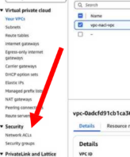

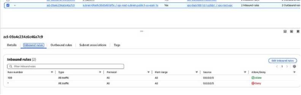

Cada subred de una VPC debe estar asociada a una ACL de red. Si no asociamos una subred de forma explícita a una ACL de red, la subred se asociará de manera automática a la ACL de red predeterminada, que por defecto permite todo el tráfico  de  entrada y salida de la subred. Se puede crear una ACL de red personalizada y asociarla a una subred para permitir o denegar el tráfico entrante o saliente específico a nivel de subred. Además, es posible asociar una ACL de red con varias subredes, pero una subred sólo puede asociarse a una ACL de red a la vez. Al asociar una ACL de red a una subred, se quita la asociación anterior.

A continuación crearemos el NACL en la VPC con la que estamos trabajando y le asociaremos la subred, lo que eliminará la asociación con la NACL predeterminada:

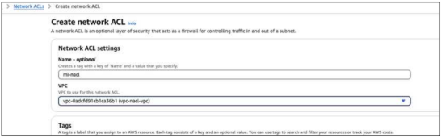

Y comprobamos que tiene asociada la subred pública desde la pestaña “Asociaciones de subredes”:

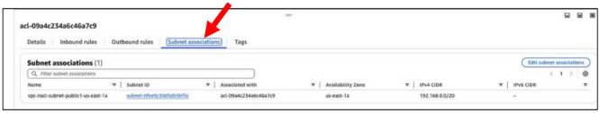

Si observamos las reglas de entrada y salida de la NACL recién creada, comprobaremos que por defecto se deniega todo el tráfico de entrada y salida a la subred:

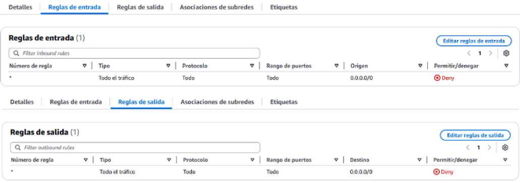

Podemos añadir y eliminar reglas de entrada y salida. Las reglas se evalúan comenzando por la regla de número más bajo. En cuanto una regla coincide con el tráfico, esta se aplica  independientemente  de  cualquier  regla  con  un  número  mayor  que  pueda contradecirla.

Desde el menú ACL de red, vamos a modificar las reglas de entrada y salida y realizar las siguientes pruebas:

- Añadir regla de entrada ICMP. Desde la regla NACL, en la pestaña Reglas de Entrada, Editamos las reglas de entrada:

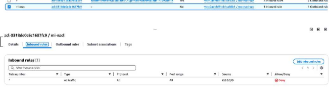

  Añadimos una nueva regla de entrada, con número 100 (se recomiendan incrementos de 10 o 100), permitiendo el tráfico ICMP desde cualquier origen:

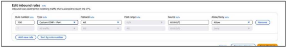

Y ahora ya nos aparece la nueva regla:

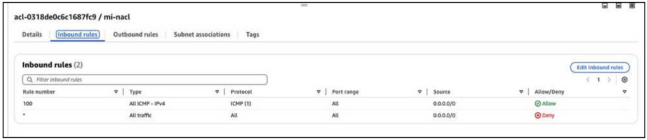

Como  hemos  comentado  anteriormente,  las  reglas  se  evalúan  con  una  prioridad ascendente, y en cuanto se satisface, ya no se comprueban las de menor prioridad.

Comprobamos que el ping NO funciona:

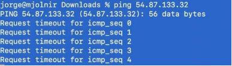

- Ahora añadiremos la regla de salida ICMP en la correspondiente regla de salida NACL, para después comprobar que el ping SI funciona:

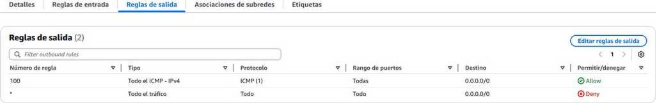

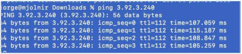

#### Reglas encadenadas en grupos de seguridad

Las reglas que regulan el tráfico de red en los grupos de seguridad se pueden encadenar, de manera que podemos restringir el tráfico permitiéndolo únicamente cuando proviene de un grupo de seguridad determinado.

Para probar este concepto, lo que vamos a hacer es crear un nuevo grupo de seguridad (con el nombre ‘gs-encadenado’, por ejemplo) y añadir una nueva regla de entrada que permitirá el tráfico ICMP, asignándole como origen el grupo de seguridad que tiene asociado la instancia que tenemos lanzada:

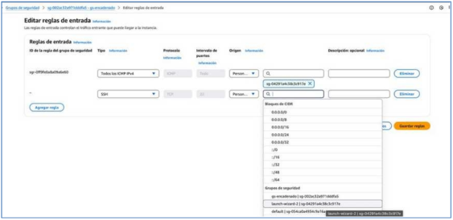

A continuación, lanzamos una nueva instancia EC2 en la misma subred que la primera, y le  asignamos el nuevo grupo de seguridad ‘encadenado’, en lugar de crear un nuevo grupo de seguridad:

Y cuando queramos por ejemplo hacer un ping desde la máquina local, veremos que no lo permite:

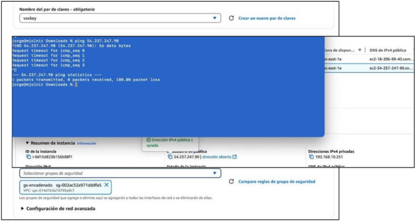

Sin embargo, si nos conectamos a la primera instancia por ssh y hacemos un ping a la dirección IP privada de la segunda instancia, comprobaremos que sí hay respuesta al ping:

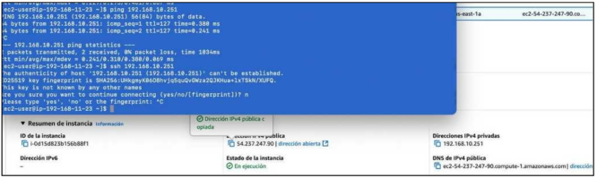

En definitiva, combinando reglas encadenadas de grupos de seguridad y NACLs, es posible controlar de manera exhaustiva todo el tráfico que entra y sale en nuestra VPC y los recursos desplegados en ella.

