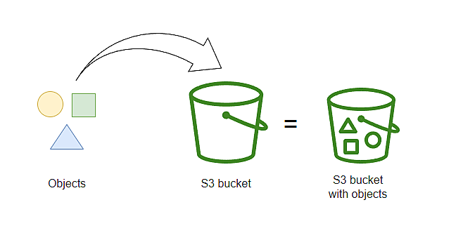
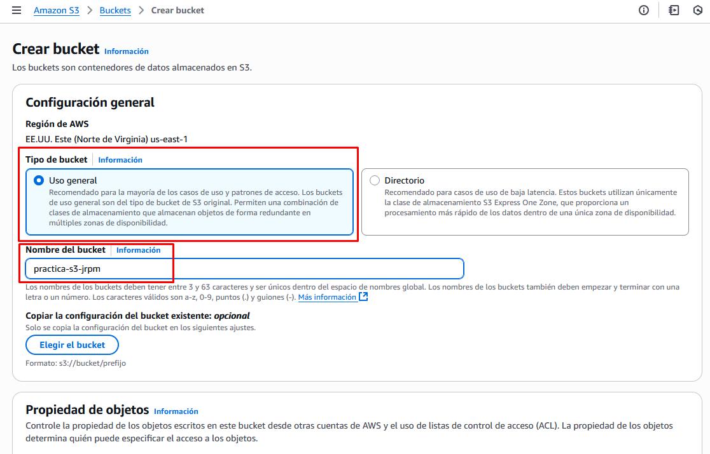
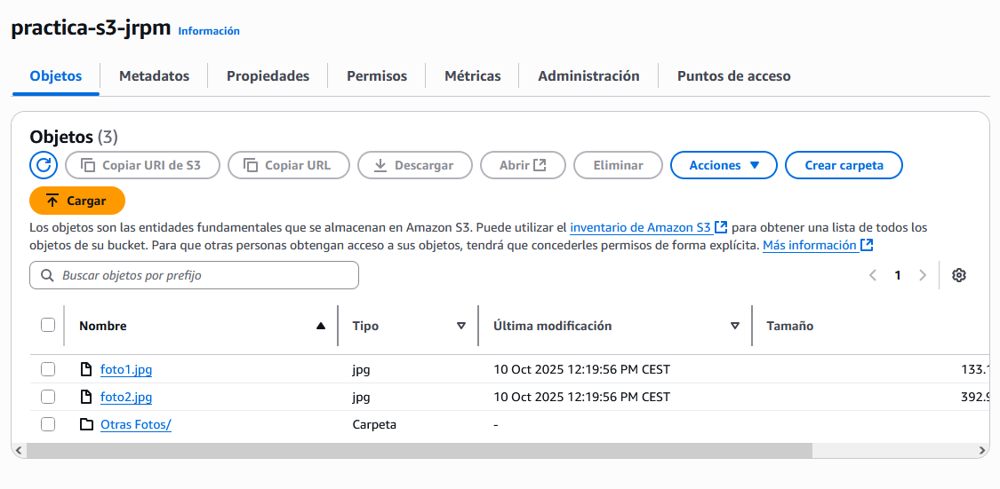
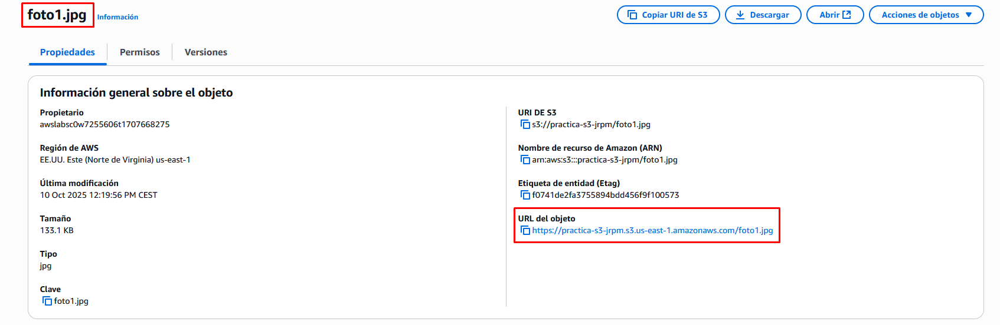
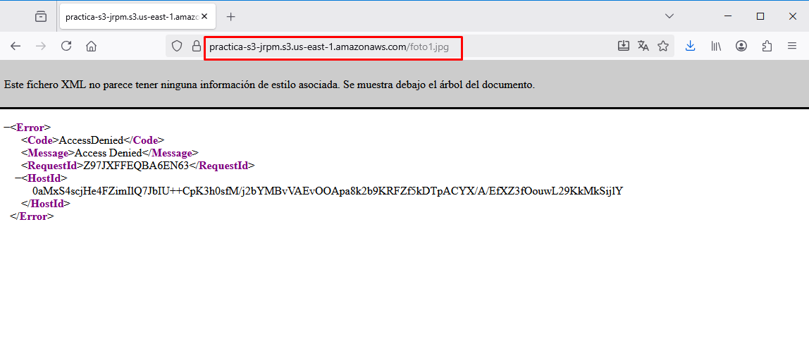
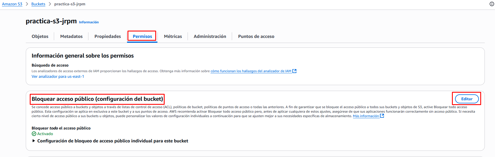
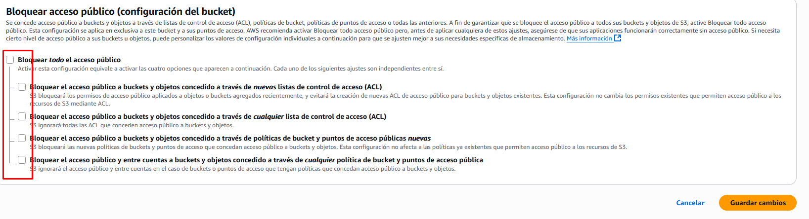
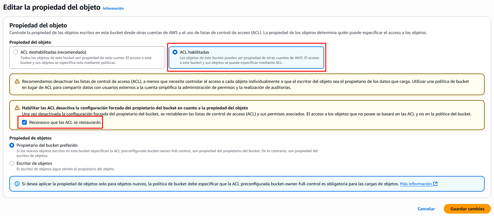
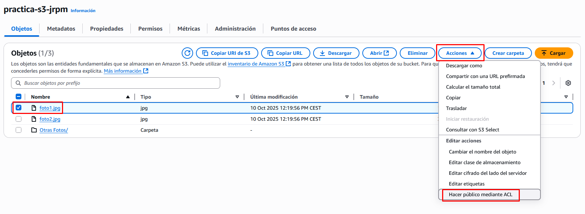
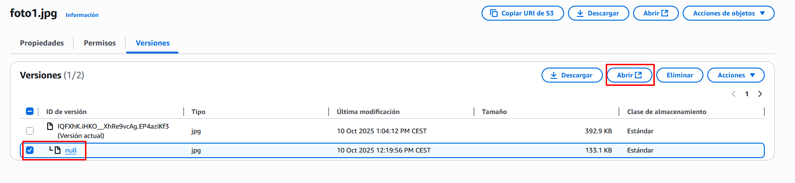

# Práctica 1. Creación de un bucket en Amazon S3

Creación y gestión de un bucket en Amazon S3: subida de objetos, control de permisos y versiones.

## Objetivo de la práctica

* Comprender el funcionamiento de Amazon S3 como servicio de almacenamiento de objetos.
* Aprender a crear y configurar un bucket en una región determinada.
* Subir archivos y gestionar su acceso mediante ACLs.
* Acceder a un objeto público a través de su URL en el navegador.
* Activar el control de versiones y comprobar cómo mantiene distintas versiones de un mismo archivo.

## Práctica a realizar

### Creación del bucket

1.- Inicia sesión en la Consola de AWS y entra en el servicio **S3**.

- Pulsa en **“Crear bucket”**.
- Especifica:
   
    - **Tipo de bucket**: Uso general.
    - **Nombre del bucket:** debe ser único en todo el mundo (por ejemplo: `practica-s3-nombrealumno`).

- Deja todos los demás campos por defecto.
- Crea el bucket pulsando **“Crear bucket”**.

---

### Subida de objetos

2.- Entra en el bucket recién creado para añadir contenidos:

- Pulsa **“Cargar”** → **“Añadir archivos”** y selecciona 2 o 3 imágenes en formato jpg de tu equipo. Por ejemplo `foto1.jpg` y `foto2.jpg`
- Haz clic en **“Cargar”** para subirlas.
- Prueba a cargar también una carpeta con archivos dentro.
- Comprueba que aparecen en la lista de objetos.

---

### Acceso mediante URL

3.- Vamos a acceder a uno de los objetos recién subidos, por ejemplo `foto1.jpg`, desde un navegador especificicando su url:

- Ve a la pestaña **“Propiedades”** del objeto `foto1.jpg`
- Copia la **URL del objeto** (por ejemplo:
   `https://practica-s3-nombrealumno.s3.us-east-1.amazonaws.com/foto1.jpg`)

---

- Abre un **navegador web** y pega la URL.
- Comprueba que la imagen no se muestra correctamente al no disponer de permisos.

### Desbloquear el acceso público

4.- Vamos ahora a desbloquear la restricción de acceso público al bucket. Lo podríamos haber hecho en el momento de creación. Para ello, en la pantalla del bucket accedemos a la pestaña **Permisos** y editamos la opción de **Bloquear acceso público**.

Desmarcamos todas las opciones. Nos pide que confirmemos.

!!! danger "Atención"
    En entornos reales **no se deben dejar objetos públicos**.

Si accedemos de nuevo desde un navegador a la url del objeto veremos que continuamos sin poder acceder al objeto, a pesar de haber hecho público el bucket. Aún nos falta un paso más.

---

### Cambio de permisos mediante ACL

5.- Las políticas de acceso a los objetos se pueden controlar de varias maneras (ACLs, Políticas, Roles). Vamos a hacerlo por una opción más sencilla pero que AWS no recomienda: mediante ACLs (*listas de control de acceso*). Para ello el primer paso será habilitar las ACLs que por defecto aparecen deshabilitadas. **Este paso también podríamos haberlo hecho al crear el bucket**.

- Vuelve a seleccionar el bucket en S3.
- En la pestaña **“Permisos”**, busca la sección **“Propiedades de los objetos”**.
- Pulsa en **“Editar”** y **habilita las ACLs**.

---

6.- Una vez habilitadas las ACL, vamoa a hacer público el objeto en particular:

- Seleccionam el objeto `foto1.jpg` 
- En el menú **Acciones** selecciona **Hacer público mediante ACL**.
- Comprueba que ya puedes acceder desde el navegador a la url pública del objeto.

!!! success "Captura la pantalla"
    Captura la pantalla en la que se muestre que ha funcionado el acceso desde el navegador a la imagen. Debe verse la url del objeto y la fotografía mostrada dentro del navegador.

---

### Activar el control de versiones

Amazon S3 incorpora una funcionalidad que permite mantener múltiples versiones de un objeto en el mismo bucket, protegiendo contra eliminaciones o modificaciones no deseadas. Cuando se habilita, S3 conserva una versión anterior del objeto cada vez que se modifica o elimina. Esto permite recuperar y restaurar fácilmente versiones anteriores de un objeto en cualquier momento

- Regresa a la vista principal del bucket.
- En la pestaña **“Propiedades”**, busca la sección **“Control de versiones”**.
- Pulsa **“Editar”** → activa el **control de versiones** → **Guardar cambios**.

---

### Probar el control de versiones

- Sube **de nuevo una imagen con el mismo nombre** que una ya existente (por ejemplo `foto1.jpg`).
- S3 **no reemplazará** la imagen anterior, sino que guardará una nueva versión.
- Ve al objeto y selecciona la pestaña **“Versiones”** para ver las distintas versiones almacenadas.
- Prueba a **descargar o restaurar** la versión anterior.

!!! success "Captura la pantalla"
    Captura la pantalla en la que se muestren las distintas versiones del archivo.
