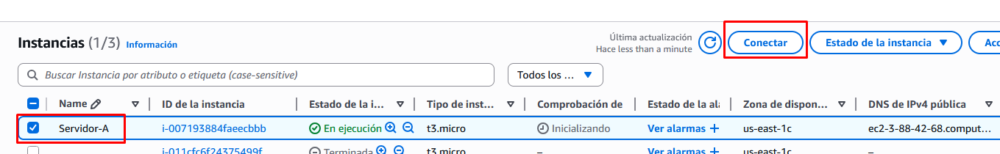
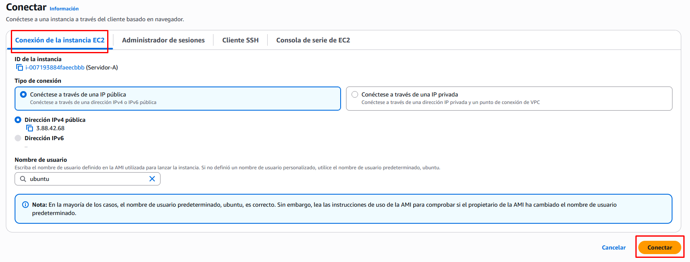

# Práctica 3. Gestión de volúmenes EBS

Creación de un volumen EBS y montaje en varias instancias EC2.

## Objetivo de la práctica

* Comprender el funcionamiento del almacenamiento **EBS (Elastic Block Store)**.
* Crear y asociar un volumen EBS a una instancia EC2.
* Formatear, montar y usar un volumen EBS desde Linux.
* Desasociar y reutilizar un volumen en otra instancia.
* Crear y restaurar una instantánea (snapshot) de un volumen.


---

## Creación de una instancia EC2

1.- Vamos a crear una instancia EC2 sobre la que montaremos el volumen EBS. Configura:

* **Nombre:** `Servidor-A`
* **AMI:** Ubuntu
* **Instance type:** `t2.micro`
* **Key pair:** selecciona o crea uno nuevo
* **Network settings:** deja la VPC y subred por defecto
* **Storage:** deja el volumen raíz predeterminado (8 GB)

2.- Lanza la instancia y espera a que el estado sea **Running**.

3.- Podemos conectarnos por ssh, pero esta vez lo vamos a hacer desde el propio navegador:

- Selecciona la instancia `Servidor-A` y pulsa sobre el botón **Conectar**
- En la pestaña **Conexión de la instancia EC2** pulsa **Conectar**
- Nos aparecerá una consola de terminal en el navegador conectada a la instancia `Servidor-A`.



---




---

## Crear y adjuntar un volumen EBS

1. En el panel **Elastic Block Store → Volumes**, selecciona:

   * **Create volume**
   * **Type:** gp3
   * **Size:** 2 GiB
   * **Availability Zone:** *la misma que tu EC2 (por ejemplo eu-west-1a)*
2. Una vez creado, selecciona el volumen → **Actions → Attach volume**

   * **Instance:** elige tu instancia `Servidor-A`
   * **Device name:** `/dev/sdf`
3. Verifica desde la instancia que se haya detectado:

   ```bash
   lsblk
   ```

---

## Formatear y montar el volumen

1. Formatea el volumen (solo la primera vez):

   ```bash
   sudo mkfs -t ext4 /dev/xvdf
   ```
2. Crea un punto de montaje:

   ```bash
   sudo mkdir /datos
   ```
3. Monta el volumen:

   ```bash
   sudo mount /dev/xvdf /datos
   ```
4. Comprueba:

   ```bash
   df -h
   ```
5. Crea un archivo de prueba:

   ```bash
   echo "Prueba EBS" | sudo tee /datos/info.txt
   ```

---

## Desmontar y conectar el volumen a otra EC2

1. Desmonta el volumen en `Servidor-A`:

   ```bash
   sudo umount /datos
   ```
2. En la consola AWS:

   * Detén la instancia o simplemente **Detach volume** desde el menú de acciones.
3. Crea una **segunda instancia EC2**:

   * **Name:** `Servidor-B`
   * Misma AZ (*eu-west-1a*)
4. Una vez en ejecución, **Attach volume** → selecciona el mismo volumen.
5. Conéctate a `Servidor-B` por SSH y monta el volumen:

   ```bash
   sudo mkdir /datos
   sudo mount /dev/xvdf /datos
   cat /datos/info.txt
   ```

   Verás el contenido creado en la otra máquina:

   ```
   Prueba EBS
   ```

---

## Crear y restaurar una instantánea (snapshot)

1. Desde la consola **EBS → Volumes**, selecciona tu volumen y pulsa **Create snapshot**.

   * **Description:** “Snapshot de prueba del volumen EBS”
2. Espera a que el estado del snapshot sea **Completed**.
3. Ahora, crea un nuevo volumen **a partir del snapshot**:

   * **Actions → Create volume from snapshot**
   * Mismo tipo y AZ (*eu-west-1a*)
4. Conéctalo a cualquiera de las instancias y verifica que el archivo `/datos/info.txt` sigue existiendo.


Práctica 1 --> Crear bucket, subir contenido y acceder a él (Con ACLs). Control de versiones.

Práctica 2 --> Crear web estática en bucket S3 (Con políticas)

Práctica 3 --> Práctica guiada EBS. Creación de un volumen e instantánea y montaje en otra instancia. Última parte creación de un volumen en otra instancia, formateo y montaje manual.

Práctica 4 --> Práctica guiada EFS.

Práctica 5 (Opcional) --> CI/CD Web estática en S3 desde Github

https://aitor-medrano.github.io/bigdata2122/apuntes/nube04almacenamiento.html

https://aitor-medrano.github.io/iabd/cloud/s3.html
