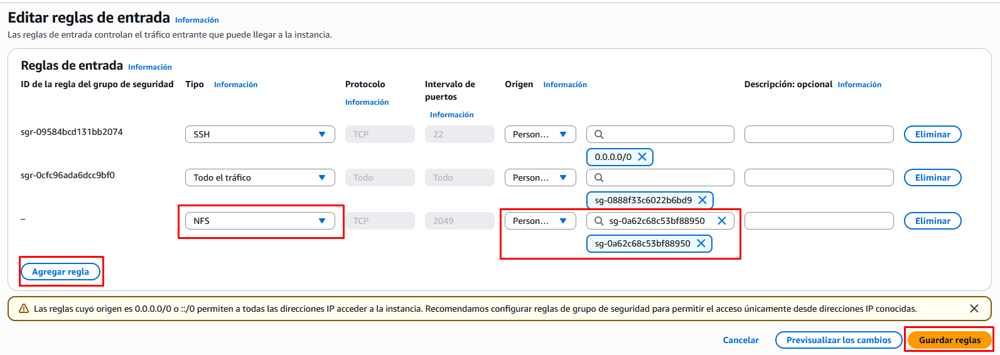

# Práctica 4. Uso compartido de almacenamiento con Amazon EFS

!!! tip "Recuerda"
    - Amazon EFS equivale a montar sistemas de ficheros compatibles con NFS.
	- Se comporta como si fuera un NAS.
	- Múltiples instancias EC2 **pueden montar un mismo EFS** simultáneamente.

## Objetivos de la práctica

* Comprender el funcionamiento del servicio **Amazon EFS (Elastic File System)**.
* Crear un **sistema de archivos compartido** entre varias instancias EC2.
* Montar el sistema de archivos en Linux mediante el cliente NFS.
* Verificar que los cambios realizados desde una instancia se reflejan en la otra.


!!! warning "Atención"
    Para poder montar el sistema de archivos EFS en una máquina EC2 necesitamos instalar unas utilidades en dicha máquina. Tenemos 2 opciones:

    - **Instalar el paquete `amazon-efs-utils`**, pero los binarios sólo están disponiblen para las AMI de Amazon-Linux
    - **Instalar las utilidades de NFS** (en Ubuntu son las `nfs-common`), pero es necesario abrir el puerto 2049 (NFS) en el grupo de seguridad correspondiente.
    
    Elegiremos la segunda opción en esta práctica.

## Crear el sistema de archivos EFS

1.- En la consola de AWS, ve a **EFS → Crear un sistema de archivos**. Configura:

   * **Nombre:** `efs-practica`
   * **VPC:** selecciona la misma VPC donde están tus instancias EC2.
   * No hace falta personalizar el resto de parámetros. Los dejaremos todos con los valores por defecto.
   
2.-Una vez creado el sistema de archivos efs, accede a él y entra para ver sus propiedades. En la pestaña de **red**:

   * Asegúrate de que **exista un destino de montaje (mount target)** en la misma subred o AZ de tus instancias. Por defecto se crea uno en cada subred.
   * Fíjate bien en el grupo de seguridad asociado a cada destino de montaje porque habrá que modificar las reglas de ese grupo de seguridad.

   >**Apunta el grupo de seguridad** asociado al destino de montaje. Nos hará falta saberlo más adelante.

3.- Copia el nombre de DNS asignado al sistema de ficheros. Debe ser algo así: `fs-0a5162c49f76a0c1e.efs.us-east-1.amazonaws.com`

---

## Crea las instancias de EC2

4.- Crea 2 máquinas EC2 o reutiliza las de la práctica anterior si aún las conservas (`Servidor-A` y `Servidor-B`).

5.- Puesto que vamos a utilizar las máquinas Ubuntu y no podemos descargar de los repositorios el paquete `amazon-efs-utils` vamos a optar por utilizar la opción de conectarnos con los paquetes NFS edtándar (`nfs-common`) y por tanto será necesario abrir el puerto. Lo haremos más adelante.

> Para ello **Apunta el grupo de seguridad** asociado a las instancias EC2. Nos hará falta saberlo en el siguiente punto.

## Abrir el puerto 2049 en el grupo de seguridad

6.- Accede al **grupo de seguridad asociado al EFS** y crea una nueva regla de entrada para permitir el tráfico por el puerto NFS (2049) desde **el grupo de seguridad de las instancias EC2**.



## Configurar las instancias EC2

7.- Conéctate a la primera instancia EC2 (`Servidor-A`) e instala el cliente NFS:

   ```bash
   sudo apt update
   sudo apt install -y nfs-common
   ```
8.- Crea un punto de montaje local:

   ```bash
   sudo mkdir /efs
   ```
9.- Monta el sistema de archivos EFS (pega el ID copiado desde la consola en el paso 3, por ejemplo `fs-0a5162c49f76a0c1e.efs.us-east-1.amazonaws.com`):

   ```bash
   sudo mount -t nfs4 -o nfsvers=4.1 fs-0a5162c49f76a0c1e.efs.us-east-1.amazonaws.com:/ /mnt/efs
   ```
10.- Verifica que el montaje fue correcto:

   ```bash
   df -h
   ```
11.- Crea un archivo de prueba:

   ```bash
   echo "Archivo creado desde Servidor-A" | sudo tee /mnt/efs/prueba.txt
   ```

---

## Montar el mismo EFS en otra instancia

12.- Conéctate a la primera instancia EC2 (`Servidor-A`) e instala también el cliente NFS:

   ```bash
   sudo apt update
   sudo apt install -y nfs-common
   ```
13.- Crea el mismo punto de montaje local:

   ```bash
   sudo mkdir /efs
   ```
14.- Monta el sistema de archivos EFS (pega el ID copiado desde la consola en el paso 3, por ejemplo `fs-0a5162c49f76a0c1e.efs.us-east-1.amazonaws.com`):

   ```bash
   sudo mount -t nfs4 -o nfsvers=4.1 fs-0a5162c49f76a0c1e.efs.us-east-1.amazonaws.com:/ /mnt/efs
   ```

15.- Comprueba que puedes ver el archivo creado desde el otro servidor:

   ```bash
   cat /mnt/efs/prueba.txt
   ```

   Deberías ver:

   ```
   Archivo creado desde Servidor-A
   ```

!!! success "Captura la pantalla"
    Captura la pantalla en la que se muestre que han funcionado todos los comandos ejecutados en `Servidor-B`
    
16.- Ahora crea otro archivo desde el `Servidor-B`:

   ```bash
   echo "Creado desde Servidor-B" | sudo tee mnt/efs/otro.txt
   ```

17.- Comprueba desde el `Servidor-A` que aparece el nuevo archivo:

   ```bash
   ls /mnt/efs
   cat /mnt/efs/otro.txt
   ```

---

## Liberación de recursos

Una vez finalizada la práctica hay que eliminar los recursos creados para que no nos consuman crédito:

- Finaliza y elimina las instancias.
- Elimina el sistema de archivos EFS creado.
