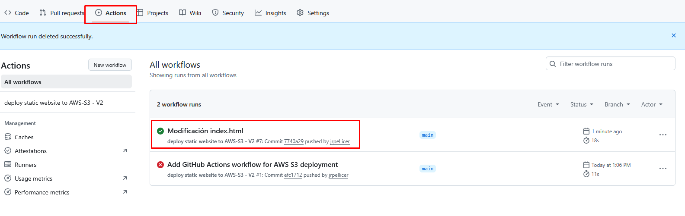

# Práctica 5. CI/CD de una web estática en S3 mediante GitHub Actions

Implementación Continua/Despliegue Continuo de un sitio web estático en Amazon S3 mediante GitHub Actions.


## Objetivo de la práctica

CI/CD significa **Integración Continua (Continuous Integration)** y **Entrega/Despliegue Continuo (Continuous Delivery/Deployment)**.

Es un conjunto de prácticas que automatizan la integración de código, las pruebas y el despliegue de aplicaciones para entregar software de forma rápida y fiable.

**GitHub Actions** es una herramienta de automatización integrada en GitHub que permite ejecutar flujos de trabajo en respuesta a eventos del repositorio, como *push*, *pull request* o *merge*.

Se utiliza para implementar CI/CD dentro de GitHub, ya que permite automatizar la integración, las pruebas y el despliegue del código directamente desde el repositorio, sin necesidad de usar servicios externos.

---

En esta práctica utilizaremos GitHub Actions para automatizar la copia del repositorio a un Bucket S3 cada vez que se haga un commit en dicho repositorio. Esto implicará que cada vez que se haga un cambio de código, se suba automáticamente a AWS para estar disponible en la web.

## Preparación del material

1.- En primer lugar vamos a hacer un *fork* a nuestra cuenta de GitHub del repositorio que utilizamos en la práctica 2 que contiene una web de muestra. Lo haremos pulsanso sobre el botón `Fork` del repositorio.

- Valídate con tus credenciales en GitHub.
- Accede al repositorio de GitHub que contiene la web de muestra:
   [`https://github.com/ies-camp-de-morvedre/hello-cloud`](https://github.com/IES-CAMP-DE-MORVEDRE/hello-cloud).
- Pulsa en el botón **Fork**.
- Ya tienes en tu cuenta un repositorio con el mismo contenido.

---

## Creación del Bucket

2.- Crea un bucket en Amazon S3:

- Servirá para **Alojar un sitio web estático**.
- Por tanto deberás hacerlo público y asignar los permisos correspondientes mediante ACLs o políticas (tú decides, pero se recomienda hacerlo por políticas).
- Recuerda poner que la página de inicio del sitio web será `index.html`.
- No cargues ningún dato.
- Copia la url del bucket y ábrela en un navegador (te dará error 404 de fichero no encontrado).
- Copia el nombre del bucket. Debe ser algo así: `s3://demo-bucket-jrpm`


## Creación del GitHub Action

3.- Volvemos a nuestro repositorio de GitHub y vamos a crear una Action para que cada vez que se haga un commit en el repositorio, se copie todo el contenido al bucket que acabamos de crear.

- Para ello, en el repositorio, ve a la opción **Actions**
- Pulsa sobre `set up a workflow yourself`
- En el editor de texto pega el siguiente código yaml **sustituyendo el nombre del bucket de la última línea por el nuestro que hemos copiado**:

``` yaml
name: deploy static website to AWS-S3 - V2

on:
  push:
  
env:
  AWS_REGION: us-east-1
  
jobs:
  deploy:
    runs-on: ubuntu-latest

    steps:
      - name: Checkout repository
        uses: actions/checkout@v2

      - name: Configure AWS credentials
        uses: aws-actions/configure-aws-credentials@v1
        with:
          aws-access-key-id: ${{ secrets.AWS_ACCESS_KEY_ID }}
          aws-secret-access-key: ${{ secrets.AWS_SECRET_ACCESS_KEY }}
          aws-session-token: ${{ secrets.AWS_SESSION_TOKEN }}
          aws-region: ${{env.AWS_REGION}}

      - name: Deploy to AWS S3
        run: aws s3 sync . s3://demo-bucket-jrpm --delete

```

Hacemos commit y comprobamos que se nos ha creado un nuevo directorio en el repositorio con el fichero yaml, el cual describe la acción a ralizar cuando hay un commit.

## Configuración de los secretos

4.- Si analizamos el código yaml que hemos copiado veremos que, para que GitHub se conecte al bucket, es necesario pasarle las credenciales de conexión que usamos para la CLI.

Estas credenciales no se ponen directamente en el código pues estarían visibles para todo el público. En su lugar se hace uso de los *secretos*:

``` yaml
aws-access-key-id: ${{ secrets.AWS_ACCESS_KEY_ID }}
aws-secret-access-key: ${{ secrets.AWS_SECRET_ACCESS_KEY }}
aws-session-token: ${{ secrets.AWS_SESSION_TOKEN }}
aws-region: ${{env.AWS_REGION}}
```

Para configurar los secretos nos vamos a la opción de configuración del repositorio y creamos los 4 secretos que nos hacen falta: 

- **Settings --> Secrets and Variables --> Actions**
- **New repository secret**
- Hay que hacer el proceso para 4 secretos, cuyos nombres y contenidos serán:

| Name                  | Secret                                                             |
| --------------------- | ------------------------------------------------------------------ |
| AWS_ACCESS_KEY_ID     | El campo `aws_access_key_id` de los detalles del laboratorio AWS CLI |
| AWS_SECRET_ACCESS_KEY | El campo `aws_secret_access_key_id` del mismo lugar                  |
| AWS_SESSION_TOKEN     | El campo `aws_session_token` del mismo lugar                         |
| AWS_REGION            | La región que estemos utilizando, en nuestro caso `us-east-1`      |

## Commit y prueba de despliegue automático

5.- Si todo ha ido bien, podemos entrar en el repositorio y modificar el fichero `index.html` para que automáticamente se haga el despliegue en el bucket S3 y así poder acceder a la url pública:

- Estando en el código del repositorio (`<> Code`) pulsa la tecla `.` (punto) para que se abra el editor web de GitHub.
- Modifica el fichero `index.html` para que donde ponga **IES Camp de Morvedre** ponga tu nombre.
- En la barra de tareas de la izquierda pulsa sobre el botón de **Control de Código Fuente** (el tercero) y haz un commit indicando un mensaje.
- Al cabo de unos minutos se habrá actualizado el bucket.
- Accede con un navegador a la url del bucket. Debe verse la web con el cambio realizado.

!!! success "Captura la pantalla"
    Captura la pantalla **Actions** del repositorio en la que se muestre que ha funcionado el workflow.

