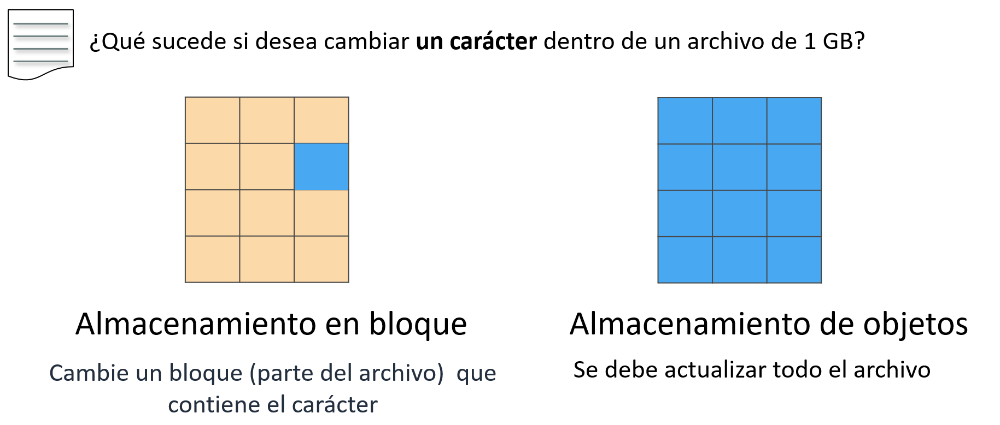
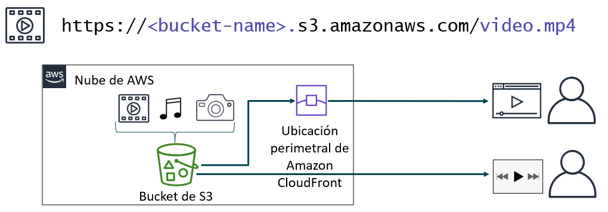
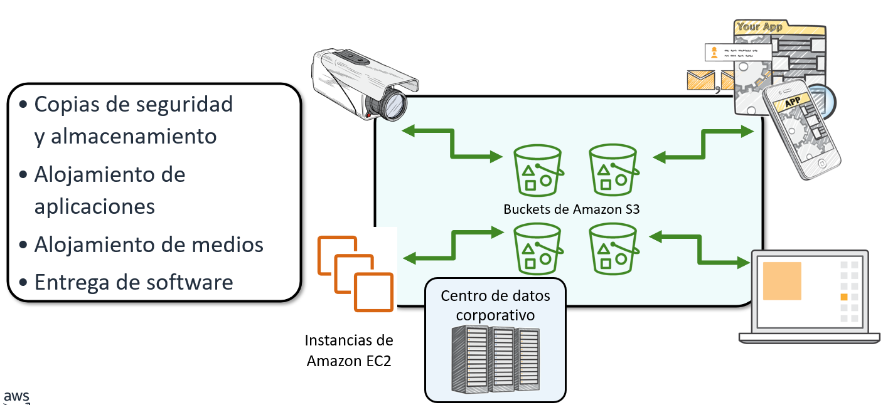
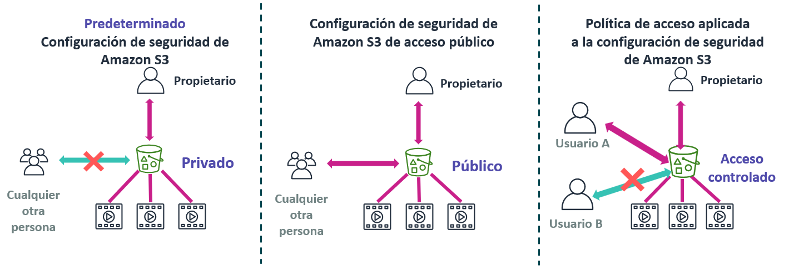
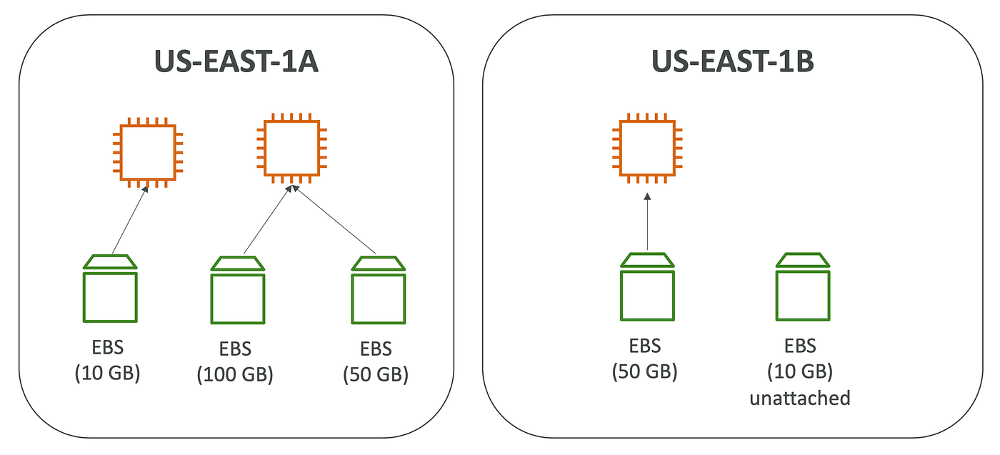
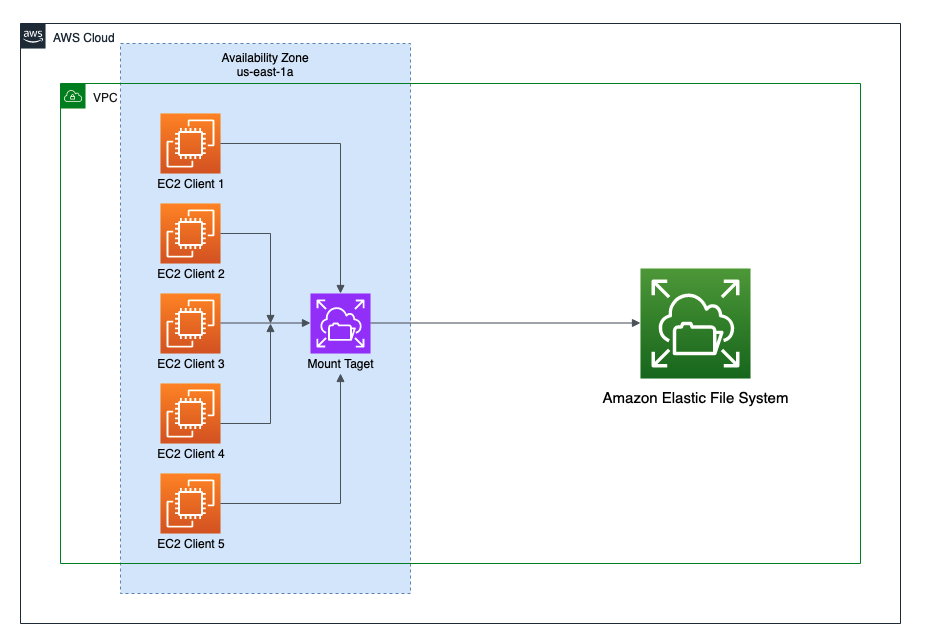

# Tema 4. Almacenamiento en AWS

## Almacenamiento en la nube

El almacenamiento en la nube suele ser más fiable, escalable y seguro que los tradicionales sistemas de almacenamiento en las instalaciones. El almacenamiento en la nube es un componente fundamental del cómputo en la nube, pues contiene la información que utilizan las aplicaciones. El análisis de big data, los almacenes de datos, el Internet de las cosas (IoT), las bases de datos y las aplicaciones de copias de seguridad y archivado dependen de algún tipo de arquitectura de almacenamiento de datos. 

## Almacenamiento a nivel de Bloque, Fichero y Objeto
Una diferencia clave entre algunos tipos de almacenamiento es saber si ofrecen almacenamiento en el nivel de bloque, a nivel de fichero o a nivel de objeto. 

Esta diferencia tiene un gran impacto en el rendimiento, la latencia y el costo de la solución de almacenamiento. Las soluciones de almacenamiento en bloque suelen ser más rápidas y utilizan menos ancho de banda, pero pueden costar más que el almacenamiento en el nivel de objeto. Pero muchas veces la elección vendrá condicionada por el tipo de uso que deseamos hacer.

**Almacenamiento en bloque (Block Storage)**

- Los datos se dividen en bloques de tamaño fijo (por ejemplo, 512 B o 4 KB).
- Cada bloque tiene una dirección, pero no contiene metadatos.
- El sistema operativo o la aplicación se encarga de organizar los bloques (por ejemplo, mediante un sistema de archivos).
- Ejemplo típico: Discos duros, SSD, volúmenes de máquinas virtuales (como los archivos *.vdi* de VirtualBox o como *Amazon EBS*).

**Almacenamiento de ficheros (File Storage)**

- Los datos se organizan en un sistema de archivos jerárquico (carpetas y subcarpetas).
- Los usuarios acceden a los archivos mediante rutas (por ejemplo, `/documentos/informe.pdf`).
- Se usa un protocolo de red como NFS (Linux/Unix) o SMB/CIFS (Windows) o *Amazon EFS*.
- Ejemplo típico: Servidores NAS, carpetas compartidas en red.

**Almacenamiento de objetos (Object Storage)**

- Los datos se almacenan como objetos completos, cada uno con:
    - El dato (contenido del archivo),
    - Un identificador único (ID o hash),
    - Y metadatos personalizados.
- No hay estructura jerárquica: los objetos se guardan en “buckets” (contenedores).
- Se accede normalmente mediante API HTTP/HTTPS (REST).
- Ejemplo típico: Amazon S3, Azure Blob Storage, Google Cloud Storage.

 

| Característica      | Bloques                   | Ficheros                       | Objetos                       |
| ------------------- | ------------------------- | ------------------------------ | ----------------------------- |
| **Organización**        | Bloques con dirección     | Árbol de carpetas y archivos   | Objetos con metadatos         |
| **Acceso**              | Bajo nivel (E/S directa)  | Ruta de archivo                | API o URL                     |
| **Protocolos comunes**  | iSCSI, Fibre Channel      | NFS, SMB/CIFS                  | HTTP/HTTPS (REST, S3 API)     |
| **Usos típicos**        | Bases de datos, discos VM | Servidores NAS, uso compartido | Backups, multimedia, big data |
| **Ejemplos en AWS**     | Amazon EBS                | Amazon EFS                     | Amazon S3                     |

En este tema veremos los siguientes servicios de AWS:

- Amazon Simple Storage Service (**Amazon S3**) --> Almacenamiento a nivel de Objetos
- Amazon Elastic Block Store (**Amazon EBS**) --> Almacenamiento a nivel de Bloques
- Amazon Elastic File System (**Amazon EFS**) --> Almacenamiento a nivel de Ficheros
- Amazon Simple Storage Service **Glacier** --> Almacenamiento a nivel de Objetos

---

## Amazon S3

**Amazon S3 (Simple Storage Service)** es un servicio administrado de almacenamiento a nivel de objetos en la nube de AWS.

Está diseñado para ofrecer una **alta durabilidad** (11 nueves: 99,999999999%), **escalabilidad automática** y **baja latencia** en el acceso a los datos.

Sus características principales son:

* Permite almacenar y gestionar objetos (archivos) de hasta 5 TB.
* Los objetos se guardan dentro de **buckets**, cuyos **nombres deben ser únicos** en todo Amazon S3.
* Por defecto, los datos se almacenan **de forma redundante** en múltiples instalaciones y dispositivos, sin que el usuario tenga que administrar servidores.

Se puede almacenar cualquier tipo de archivo: imágenes, vídeos, registros, copias de seguridad o instantáneas de bases de datos.

### Conceptos básicos de Amazon S3

Para utilizar Amazon S3, es importante entender algunos conceptos fundamentales:

**Buckets**:

* Son **contenedores lógicos** donde se almacenan los objetos (archivos).
* Cada bucket debe tener un **nombre único a nivel mundial**.
* Se puede elegir la región de AWS donde se almacenará el bucket (por ejemplo `us-east-1`).
* Se puede **controlar el acceso** a cada bucket (quién puede crear, eliminar o listar objetos).
* Permiten ver registros de acceso al bucket y a los objetos que contiene.

**Objetos**:

* Los archivos almacenados en S3 se llaman **objetos**.
* Un objeto está formado por:

    - **Datos** (el contenido del archivo).
    - **Metadatos** (información que lo describe, como permisos o URL).

* Se puede almacenar cualquier cantidad de objetos dentro de un bucket.
* Al cargar un archivo, se pueden definir permisos y metadatos personalizados.

 

Cada bucket y objeto tiene una **URL única**, aunque hay **dos estilos de URL** que pueden usarse para acceder a los objetos.

Ejemplo: un archivo `video.mp4` dentro de un bucket tendrá una URL con el nombre del bucket y del objeto.

### Situaciones típicas de uso de S3
Aunque se puede almacenar cualquier tipo de dato, los casos de uso típico de S3 suelen ser:

- **Copia de seguridad y almacenamiento:** Se utiliza para guardar copias de seguridad y ofrecer servicios de almacenamiento de datos a terceros.

- **Alojamiento de aplicaciones:** Permite implementar, instalar y administrar aplicaciones web directamente desde la nube.

- **Alojamiento multimedia:** Ideal para crear infraestructuras redundantes, escalables y de alta disponibilidad que gestionen la carga y descarga de vídeos, imágenes o música.

- **Entrega de software:** Facilita el alojamiento de aplicaciones o instaladores para que los usuarios puedan descargarlos fácilmente.

### Control de acceso en Amazon S3

Por defecto, **todos los buckets de Amazon S3 son privados**, y solo los usuarios con permisos explícitos pueden acceder a ellos.

Es fundamental gestionar correctamente los permisos y la seguridad de los datos almacenados. Para ello disponemos de varias herramientas de control de acceso. Las más importantes que utilizaremos serán:

**1. Bloqueo del acceso público:**

   - Impide que los buckets o los objetos sean accesibles públicamente.
   - Tiene prioridad sobre otras políticas o permisos.
   - Recomendado para evitar exposiciones accidentales de datos.

**2. Políticas de IAM (Identity and Access Management):**

   * Permiten definir qué **usuarios o roles** pueden acceder a determinados buckets u objetos.

**3. Políticas de bucket:**

   * Definen permisos específicos sobre un bucket o sus objetos.
   * Útiles cuando no se usa autenticación mediante IAM.
   * Pueden permitir acceso **entre cuentas** o incluso **público/anónimo**, por lo que deben configurarse con cuidado.
   * Pueden incluir **enunciados de denegación** para restringir el acceso incluso si otros permisos lo permiten.

**4. Listas de control de acceso (ACL):**

   * Método antiguo, anterior a IAM.
   * Se recomienda usarlo solo cuando sea necesario y evitando configuraciones demasiado permisivas.

La situación del medio muestra una ocasión en que se ha desactivado la configuración de seguridad de S3 y cualquiera puede acceder públicamente a los objetos almacenados en el bucket, por ejemplo cuando alojamos un sitio web estático en un bucket S3. 

!!! danger "Atención"
    Usar un bucket de Amazon S3 para alojar un sitio web estático es una forma rápida de configurar una arquitectura en AWS, pero en la mayoría de los casos no se recomienda otorgar acceso público. Normalmente, S3 se utiliza para almacenar datos que son accedidos por aplicaciones externas o para guardar información confidencial y copias de seguridad, por lo que los buckets deben mantenerse privados para garantizar la seguridad de los datos.

---

## Amazon EBS

Amazon EBS ofrece volúmenes de almacenamiento persistente en bloque para instancias de Amazon EC2, lo que significa que los datos se conservan incluso después de apagar el sistema. 

Cada volumen se **replica automáticamente dentro de una zona de disponibilidad**, garantizando alta disponibilidad y durabilidad. Permite ajustar la capacidad rápidamente (aumentar o reducir el tamaño en cuestión de minutos) y pagar solo por el almacenamiento aprovisionado.

Los beneficios adicionales de EBS son la replicación en la misma zona de disponibilidad, el cifrado fácil y transparente, los volúmenes elásticos y las copias de seguridad mediante instantáneas.

!!! tip "Importante"
    - Los volúmenes EBS equivalen a los **discos duros virtuales** que utilizan las instancias EC2.
	- Un volumen sólo puede estar **conectado a una instancia** simultáneamente.
	- Pero una instancia puede **conectar varios volúmes EBS** simultáneamente.

 Amazon EBS ofrece tres tipos de volúmenes: 
 
 - **SSD de uso general**: Son unidades de estado sólido (SSD) optimizadas para cargas de trabajo de transacciones que implican operaciones de lectura/escritura frecuentes de pequeño tamaño de E/S. Proporciona un equilibrio entre precio y rendimiento, y es el tipo recomendado para la mayoría de las cargas de trabajo. Los tipos existentes son *gp3* (1.000 MiB/s) y *gp2* (128-250 MiB/s) ambas con un máximo de 16.000 IOPS.
 - **SSD de IOPS provisionadas**: proporciona un rendimiento elevado con cargas de trabajo críticas, baja latencia o alto rendimiento. Los tipos existentes con *io2 Block Express* (4.000 MiB/s con un máximo 246.000 IOPS) e *io2* (1.000 MiB/s con 64.000 IOPS).
 - **Magnéticos (HDD)**: Son unidades de disco duro (HDD) optimizadas para grandes cargas de trabajo de streaming. Los tipos existentes con *st1* (con 500 MiB/s y 500 IOPS) y *sc1* (con 250 MiB/s y 250 IOPS).

!!! info "IOPS"
	El término IOPS (operaciones de entrada y salida por segundo) representa una medida de rendimiento frecuente que se utiliza para comparar dispositivos de almacenamiento.  Cuantas más IOPS, mayor velocidad de acceso a los datos. En términos habituales, un disco HDD ofrece entre 100 y 200 IOPS, un SSD SATA entre 5.000 y 100.000 IOPS, y un SSD NVMe puede superar el millón de IOPS. Estas cifras varían según el tipo de carga (lectura/escritura y secuencial/aleatoria).

### Instantáneas

Para proporcionar un nivel aún mayor de durabilidad de los datos, Amazon EBS permite crear **instantáneas** a un momento dado de nuestros volúmenes y volver a crear un volumen nuevo a partir de una instantánea en cualquier momento.

La primera instantánea se denomina instantánea de referencia. Cualquier otra instantánea posterior a la de referencia captura solo lo que sea diferente de la instantánea anterior.

Las instantáneas se almacenan como objetos de Amazon S3.

---

## Amazon EFS

Amazon EFS (Elastic File System) es un servicio de almacenamiento de archivos compartido y elástico ofrecido por AWS que funciona de manera similar a un NAS (Network Area Storage).

Proporciona un sistema de archivos NFS (Network File System) **accesible de forma simultánea por múltiples instancias EC2** u otros servicios.

Sus características principales son:

- **Escalado automático**: ajusta su capacidad de almacenamiento automáticamente al añadir o eliminar archivos.
- **Alta disponibilidad y durabilidad**: los datos se replican en varias zonas de disponibilidad (AZ) dentro de una región.
- **Acceso concurrente**: permite que muchas instancias EC2 monten el mismo sistema de archivos al mismo tiempo.
- **Compatibilidad con NFS** v4/v4.1, lo que facilita la integración con sistemas Linux.
- **Pago por uso**: se factura solo por la cantidad de datos almacenados (coste mayor por GB que EBS en algunos casos).

!!! warning "Atención"
	EFS no se puede montar directamente en Windows (solo es compatible con NFS).

### Ejemplos de uso de Amazon EFS

**Servidores web con contenido compartido:**

Varios servidores Apache o Nginx montan el mismo EFS para compartir los archivos del sitio web:

- Ideal para configuraciones con balanceadores de carga (Elastic Load Balancer).
- Garantiza que todos los servidores sirvan el mismo contenido actualizado.

 

**Almacenamiento de copias de seguridad:**

Centralizar copias de seguridad de varias instancias EC2 o contenedores.

Permite mantener las copias accesibles desde cualquier servidor de la VPC.

 

**Directorio de usuarios o home compartido:**

Los usuarios del sistema pueden tener sus directorios personales en EFS, accesibles desde varias máquinas Linux.

 

**Aplicaciones distribuidas:**

Aplicaciones que necesitan acceso simultáneo a los mismos archivos, por ejemplo:

- Procesamiento de imágenes o vídeos.
- Generación de informes o resultados de cálculo.
- Sistemas de gestión documental.

 

**Almacenamiento para análisis o procesamiento de datos:**

Conjuntos de datos grandes que son procesados por múltiples nodos (Hadoop, Spark, etc.).

EFS sirve como repositorio central para datos de entrada o resultados temporales.

 

**Logs centralizados:**

Varias instancias EC2 pueden escribir sus archivos de logs en un mismo EFS.

Facilita el análisis centralizado sin necesidad de configurar un servidor de logs.
Ejemplo: `/mnt/efs/logs/app1/`, `/mnt/efs/logs/app2/`

 

**Compartir scripts, configuraciones o paquetes:**

Carpeta EFS con scripts comunes (bash, python, etc.) accesible por todos los servidores.

Permite mantener entornos de despliegue uniformes.

---

## Amazon S3 Glacier

Amazon S3 Glacier es un servicio de almacenamiento en la nube de **bajo coste** diseñado para archivar datos y realizar copias de seguridad a largo plazo. Forma parte de Amazon S3 y está pensado para información que **no se necesita consultar con frecuencia**, pero que debe conservarse de forma segura y duradera.

Las caracteríticas principales de este servicio son:

* **Bajo coste:** es mucho más económico que las clases de almacenamiento estándar de S3, ideal para datos que se acceden rara vez.
* **Alta durabilidad:** ofrece los mismos *once nueves* (99,999999999%) de durabilidad que el resto de S3.
* **Seguridad:** admite cifrado automático y control de acceso mediante políticas de IAM y de bucket.
* **Recuperación flexible:** los datos pueden recuperarse en diferentes velocidades según la urgencia:

    * **Expedited (rápida):** segundos o minutos.
    * **Standard:** unas pocas horas.
    * **Bulk (masiva):** varias horas, más económica.

### Versiones o clases de S3 Glacier

Amazon S3 incluye tres clases de almacenamiento Glacier, adaptadas a distintos usos:

1. **S3 Glacier Instant Retrieval:** acceso casi inmediato (segundos), útil para archivos que se consultan ocasionalmente pero requieren un acceso instantáneo. Por ejemplo, historias médicas, archivos multimedia o documentos que se consultan esporádicamente.
2. **S3 Glacier Flexible Retrieval (antes S3 Glacier):** equilibrio entre coste y tiempo de recuperación (minutos u horas). Útil para copias de seguridad, versiones antiguas de proyectos, o datos empresariales que se consultan solo en auditorías o revisiones anuales.
3. **S3 Glacier Deep Archive:** la opción **más barata**, pensada para conservación de datos a largo plazo (años), con tiempos de recuperación de **12 a 48 horas**. Útil en, por ejemplo, almacenamiento de facturas antiguas, archivos legales que han de guardarse durante años, copias de seguridad históricas o registros que rara vez se necesitan.

