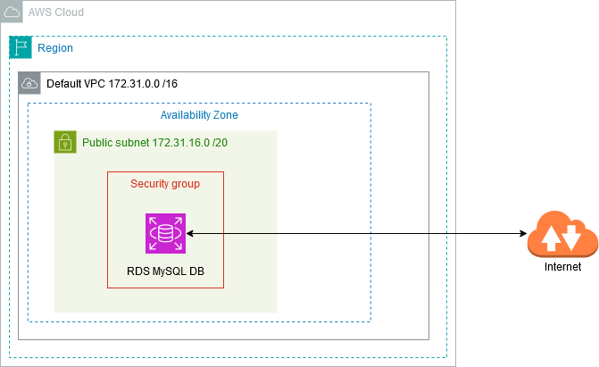
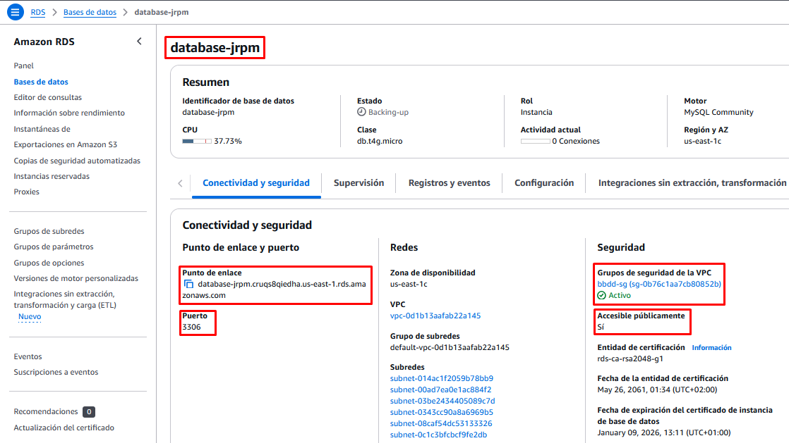

# Bases de Datos Gestionadas (con acceso público)

## Objetivo de la práctica


!!! note "Nota"

    En esta práctica, el servicio gestionado de BBDD que vamos a utilizar es **RDS basado en MySQL**, que permite ejecutar bases de datos MySQL.

## Esquema en AWS



## Práctica a Realizar

1.-  Accedemos a la consola, dentro de la categoría Bases de Datos, seleccionamos el recurso **Aurora and RDS**.

<br>
___

2.-	Creamos una Base de Datos:

- Seleccionamos el método de *creación estándar*.
- Como motor de base de datos elegimos **MySQL**.
- La plantilla sobre la que se va a basar será **Entorno de pruebas** (las demás no son aptas para el laboratorio).
- Disponibilidad Implementación de una instanciade base de datos de zona de disponibilidad única (1 instancia)
- Ponemos un nombre de servidor que debe ser único en nuestra cuenta de AWS. Introduce uno que lleve tu nombre o iniciales.
- Asignamos nombre de usuario administrador y su contraseña.
- Dejamos las opciones por defecto del tamaño de la instancia y el almacenamiento.
- No vamos a conectar nuestra BBDD a ninguna instancia EC2, y dejamos la BBDD en la VPC por defecto (*Default VPC*).
- **Importante**: Permitimos el *Acceso Público* a nuestra BBDD. Esto generará una IP Pública para poder conectarnos desde Internet.
- Creamos un nuevo *grupo de seguridad*, por ejemplo *bbdd-sg*
- Los demás campos los dejamos por defecto.

<br>

!!! note "Nota"

    Podríamos haber seleccionado el **método de creación rápida**, que nos pide muchos menos parámetros para crear la BBDD, pero nos habría dejado la opción de **Permitir Acceso Público** como **NO**. Ello implica que nos tocaría acceder a modificar los parámetros una vez creada la BBDD para permitir ese acceso público, y además deberíamos permitir la regla de entrada correspondiente en el grupo de seguridad.  
    Cuando hemos creado el grupo de seguridad, si no modificamos nada, por defecto aws permite el acceso a la BBDD desde una **única IP**. Esto es importante, si luego intentamos acceder desde otro equipo o desde el mismo pero en otra red **(cambia nuestra IP Pública)** no podremos.

<br>
___

3.-	Una vez creado el recurso accedemos a él y en el apartado **Conectividad y seguridad** comprobamos el endpoint y el puerto por al cual accederemos. **Copiamos el punto de enlace en el portapapeles.**

Comprobamos también que se nos ha asociado el nuevo grupo de seguridad que hemos creado.

<br>


<br>
___

4.-	En el apartado de *Configuración* nos aparecen los datos de la configuración de la máquina virtual sobre la que está corriendo nuestro SGBD, así como la versión de MySQL instalada y el nombre del usuario administrador.

<br>
___

5.-	Volvemos al apartado de *Conectividad y seguridad* y accedemos al grupo de seguridad *bbdd-sg* que se nos ha creado para ver las reglas de firewall que nos ha puesto por defecto. En las reglas de entrada comprobamos que se ha creado la regla para permitir conexiones desde nuestra IP local a la BBDD por el puerto de MySQL (3306).

<br>


<br>
___

6.-	En nuestra máquina local establacemos una conexión mediante un cliente de MySQL de línea de comandos, indicando la cadena de conexión y el usuario que hemos definido como administrador. En el parámetro host `-h` ponemos el nombre del servidor (endpoint que hemos copiado en el portapapeles) y en el parámetro de usuario `-u` el nombre del usuario. Para que nos solicite el password indicamos el parámetro `-p`.

`mysql -h database-jrpm.cruqs8qiedha.us-east-1.rds.amazonaws.com -u admin -p`

Una vez comprobada la conexión, cerramos la sesión:

`exit;`

!!! warning "Atención"

    Si hemos dejado la opción de **Permitir Acceso Público** como **NO** o no aparece la regla de seguridad del firewall (grupo de seguridad) no podremos conectarnos.

<br>
___

7.- Vamos a crear una base de datos con una tabla. Lo vamos a hacer mediante un script de sentencias sql. Para ello comenzamos con la descarga del fichero de creación de la base de datos.

    [Descarga fichero sql](./asir.sql)

8.- Ejecutamos las instrucciones SQL que hay en el contenido del fichero descargado. Basta con redireccionar la entrada del comando `mysql` con el fichero descargado de nombre `asir.sql`.

```
mysql -h database-jrpm.cruqs8qiedha.us-east-1.rds.amazonaws.com -u admin -p < asir.sql
```

<br>
___

9.- Comprobamos que se ha ejecutado correctamente y se ha creado la base de datos y la tabla correspondiente. Para ello volvemos a iniciar una conexión en el servidor MySQL y ejecutamos la consulta correspondiente:

```bash
mysql -h database-jrpm.cruqs8qiedha.us-east-1.rds.amazonaws.com -u admin -p
```

```sql
use webasir;
select * from clientes;
exit;
```

<br>

!!! success "Captura las pantallas"
    Captura la pantalla de establecimiento de conexión a la base de datos  
    Captura la pantalla resultado de hacer la select de clientes

---

10.- Podemos establacer conexión remota también mediante clientes GUI como *DBeaver*, *HeidiSQL*, *MySQL Workbench*, ...

<br>
___

11.- Desde la consola de AWS, **elimina el servidor de BBDD creado para asegurarnos que no dejamos ningún recurso consumiendo crédito**. No crees ninguna instantánea final ni conserves las copias de seguridad.

!!! warning "Atención"
    Si detenemos un servidor de BBDD (sin eliminarlo), AWS lo iniciará automáticamente a los 7 días (si no lo hemos levantado nosotros de manera manual antes). Esto es peligroso, pues si olvidamos eliminar un recurso de BBDD que no utilizamos, se pondrá en marcha automáticamente a los 7 días de haberlo detenido, con el consiguiente consumo de crédito.


