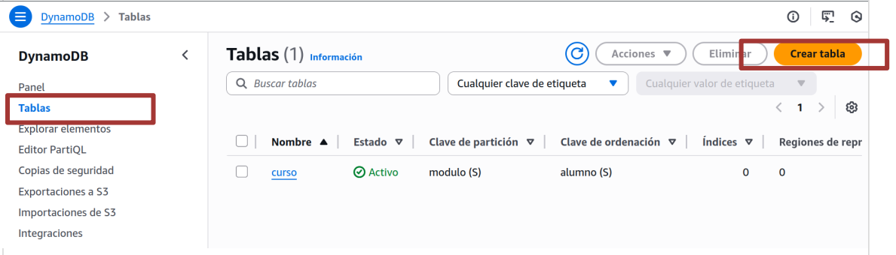
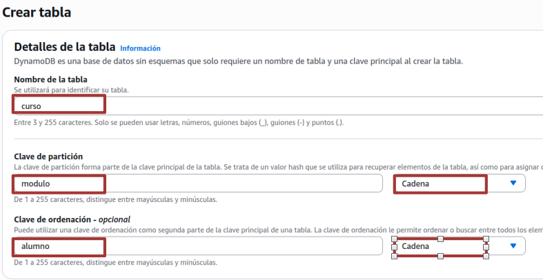

# Bases de Datos NoSQL

## Objetivo de la práctica

En este ejercicio trabajarás con una base de datos **NoSQL**

### PREPARACIÓN CLI

Para comenzar esta práctica, previamente es necesario tener instalada y configurada la interfaz de línea de comandos de AWS

A continuación, se debe configurar la AWS CLI con las credenciales del AWS Academy Learner Lab. Para ello, desde la  consola del laboratorio, seleccionamos la opción AWS Details y a continuación presionamos el botón Show en el apartado correspondiente a la AWS CLI.

Como ya sabemos copiamos las credenciales al archivo credentials de aws

### INSTALACION herramienta NoSQL Workbench

Una vez configuradas las credenciales, procederemos a instalar la herramienta NoSQL Workbench, que es una herramienta para escritorio que permite operar gráficamente con bases de datos en Amazon DynamoDB y Amazon Keyspaces. Para ello, seguiremos las indicaciones del siguiente enlace, desde donde se puede descargar e instalar el software de manera gratuita:

https://docs.aws.amazon.com/amazondynamodb/latest/developerguide/workbench.settingup.html

En mi caso he descargado el paquete para ubuntu que es una archivo `.appimage`. Para instalar un paquete .appimage recuerda que primero debes darle permios de ejecución

```
 chmod +x nombre_del_archivo.appimage
```

y después ejecutas desde la terminal

```
./nombre_del_archivo.appimage
```

### CREACIÓN DE LA TABLA DE AMAZON DYNAMO DB

Para crear la tabla de Amazon DynamoDB de esta práctica, accederemos a la consola de Amazon DynamoDB y, desde la opción Tables del menú lateral, presionamos el botón Create table:



(Mediante la consola de Administración de AWS) En el asistente que aparece a continuación, introduciremos el nombre de la tabla y los atributos que componen la clave primaria y sus correspondientes descriptores de tipos de datos, tal y como se indica a continuación:

* Table name: curso
* Partition key: modulo (String)
* Sort key: alumno (String)

El resto de las opciones las dejamos en sus valores por defecto y presionamos el botón **Create table**



Tras el proceso de creación, podremos comprobar en la Consola de Administración del servicio Amazon DynamoDB que nuestra tabla se ha creado correctamente

Por último, vamos a poblar nuestra tabla de Amazon DynamoDB. Para ello ejecutamos el script que realizará tal función:

Descarga el scrip cargar-datos.sh y el arvhivo .json los los datos

```
[Descargar cargar datos](../ud05/dynamodb/cargar-datos.sh)  

[Descargar items](../ud05/dynamodb/elementos/items1.json)

```

Ahora ejecuta el script que poblará la base de datos de aws con la información que tiene en el archivo items-1.json

`./cargar-datos.sh`

Tras esta operación, podremos volver a la Consola de Administración del servicio Amazon DynamoDB y, entrando en la tabla curso podremos acceder al enlace del menú lateral Explore ítems, seleccionar la tabla curso. Aparecerán todos los elementos añadidos por el script lanzado:


La tabla creada contiene información simulada de calificaciones de alumnos en diferentes asignaturas.

### MANIPULACIÓN DE AMAZON DYNAMO DB

Amazon DynamoDB dispone de las siguientes operaciones para manipular los datos de una tabla:

* **GetItem**. Permite recuperar un único elemento en una tabla de Amazon DynamoDB, identificado por los atributos clave.
* **PutItem**. Permite introducir un único elemento en una tabla de Amazon DynamoDB, identificado por los atributos clave, o su sobreescritura si ya existía.
* **DeleteItem**. Permite eliminar un único elemento de una tabla de Amazon DynamoDB, identificado por los atributos clave.
* **UpdateItem**. Permite actualizar un único elemento de una tabla de Amazon DynamoDB, identificado por los atributos clave.
* **Query**. Permite recuperar un conjunto de elementos que tengan el mismo valor en su campo clave de partición (o clave hash) de una tabla de Amazon DynamoDB
* **Scan**. Permite recuperar un conjunto de elementos de todas las particiones de una tabla de
  Amazon DynamoDB

Ahora vamos a realizar algún ejemplo de manipulación de datos sobre esta base de datos mediante aws cli

#### Operación 1: Obtener las calificaciones del alumno Paco Pandereta en el módulo de Historia

Para saber el dato correspondiente al alumno, es necesario indicar en un documento JSON la información con los datos de la clave del alumno que se desea obtener, crearemos un documento json de nombre operacion1.json e insertaremos en él el siguiente código:

```
{
"modulo": { "S": "Historia" },
"alumno": { "S": "Paco Pandereta" }
}
```

Para ejecutar la consulta desde la AWS CLI introducimos el siguiente comando:

```
aws dynamodb get-item --table-name curso --key file://operacion1.json --projection-expression "nota"
```

En el comando anterior, se ejecuta una orden GetItem, indicándose los siguientes parámetros:
--table-name: Nombre de nuestra tabla, en este caso curso
--key: Fichero donde se encuentra el documento JSON con la información de los atributos clave del elemento que se obtendrá
--projection-expression: Indica los atributos del elemento obtenido que se proyectarán en el resultado de la consulta

Como resultado, se obtendrá un documento JSON con los datos solicitados:


#### Operación 2: Introducir un nuevo elemento en la tabla para un alumno llamado Miguel Cervantes Saavedra, que cursa el módulo de Programación y ha obtenido un 10 de nota

Para introducir el elemento correspondiente al alumno, es necesario indicar en un documento JSON que llamaremos operacion2 la siguiente información

```
{
  "modulo": { "S": "Programación" },
  "alumno": { "S": "Miguel Cervantes Saavedra" },
  "nota": { "N": "10" }
}
```

y después ejecutar el comando

```
aws dynamodb put-item --table-name curso --item file://operacion2.json
```


#### Las siguientes operaciones realizalas tú:

**Operación** 3: Eliminar el elemento correspondiente al alumno de nombre Rosa Mosqueta Lledo que cursa el módulo de Historia
**Operación** 4: Actualiza el elemento correspondiente de la tabla, asumiendo que el alumno Rafa Raqueta hay que cambiarle la nota vamos a ponerle un 9
**Operación** 5: Obtener las notas y nombres de los alumnos que cursan el módulo de Deportes
`<br>`

---

!!! success "Entrega"
    Contenido del .json y comando ejecutado para realizar las operaciones 3, 4 y 5
    Captura las pantallas con el resultado de realizar cada una de las operaciones

---
