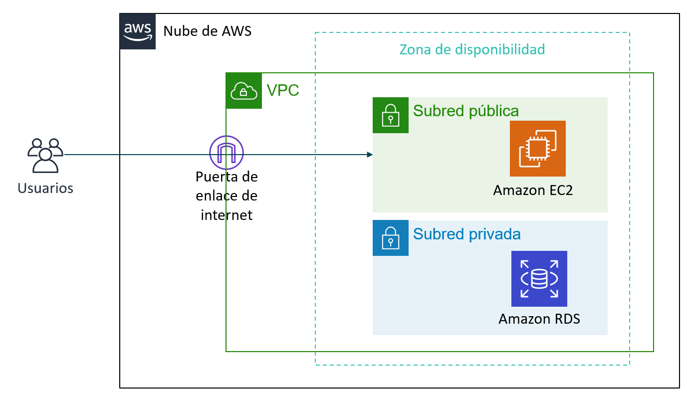
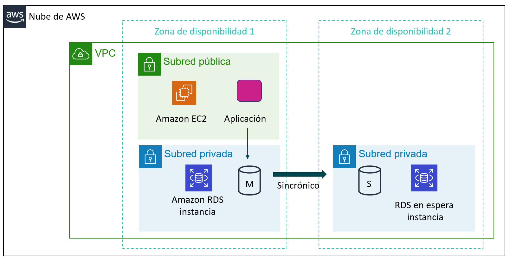
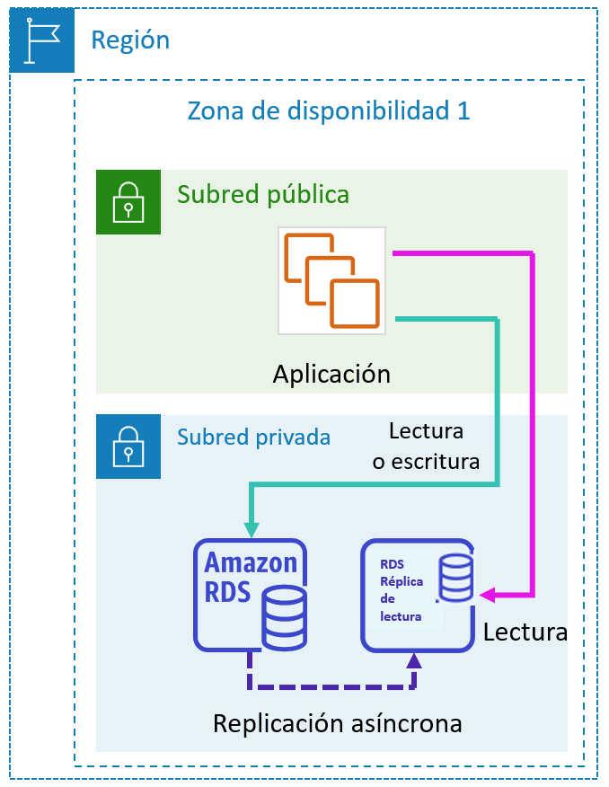
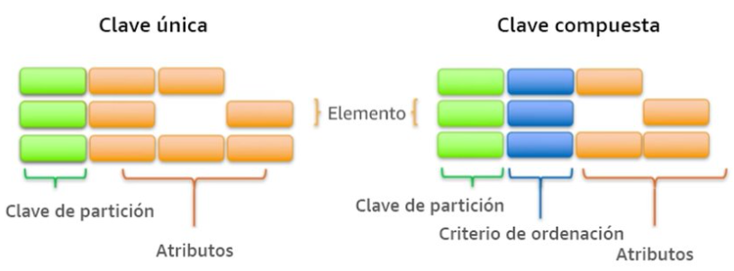

# Tema 5. Bases de Datos en AWS

## Introducción

Las **bases de datos** son el corazón de casi cualquier aplicación moderna. Permiten almacenar, organizar y recuperar información de forma estructurada y segura, y serán por tanto un elemento importante de cualquier infraestructura informática.

Para trabajar con una base de datos en AWS podemos optar por 2 modelos diferenciados según sean *IaaS* o *PaaS*:

- En el primer caso, en un modelo de **Infraestructura como Servicio**, contrataríamos la máquina virtual, en una red virtual e instalaríamos el SGBD que consideráramos oportuno (MySQL, SQL Server, PostgrsSQL, …). En este modelo gestionaríamos nosotros toda la infraestructura.
- En el caso de optar por un modelo de **Plataforma como Servicio**, contrataríamos directamente el servicio de base de datos, sin preocuparnos por gestionar la infraestructura que hay por debajo (máquina, red, sistema operativo y sistema gestor de base de datos). Es lo que se conoce como un **servicio gestionado**. Las bases de datos gestionadas son servicios de base de datos en la nube en los que el proveedor se encarga de toda la administración y mantenimiento, desde la instalación y configuración inicial hasta la escalabilidad, seguridad, copias de seguridad y actualizaciones.

!!! abstract "Servicios BBDD en AWS"
    AWS ofrece varios servicios gestionados de Bases de Datos. Los más populares son:

    - **RDS**: Es una base de datos **relacional** gestionada basada en MySQL, PostrgreSQL, MariaDB, Oracle, Aurora o Microsoft SQL Server.
    - **Amazon Aurora**: Es un SGBD propio de AWS compatible con MySQL y PostgrSQL que ofrece **mejores prestaciones que *RDS***.
    - **Amazon DynamoDB**: En este caso se trata de una base de datos **NoSQL** que soporta modelos de datos clave-valor y documentos.
    - **Amazon Neptune**: Base de datos de grafos.
    - **Amazon Redshift**: Base de datos relacional para almacenes de datos de Big Data.

En este tema nos vamos a centrar en los 3 primeros: **RDS**, **Aurora** y **DynamoDB**.

---

## Tipos de bases de datos

### Bases de datos relacionales (SQL)

Las bases de datos relacionales organizan la información en **tablas** compuestas por filas y columnas, donde los datos se relacionan entre sí mediante **claves primarias y externa**. Ejemplos de bases de datos relacionales son MySQL, PostgreSQL, MariaDB, Oracle o SQL Server.

En AWS, el servicio que gestiona este tipo de bases de datos es **Amazon RDS (Relational Database Service)**.


### Bases de datos NoSQL

Cuando los datos no siguen un esquema fijo (por ejemplo, registros de usuarios, logs o catálogos de productos con diferentes atributos), las bases de datos **NoSQL** ofrecen mayor flexibilidad y rendimiento.

Una base de datos NoSQL es un sistema de almacenamiento de datos que no utiliza el modelo relacional tradicional. En lugar de tablas con filas y columnas, organiza la información en estructuras más flexibles como documentos, pares clave-valor, grafos o columnas. Está pensada para manejar grandes volúmenes de datos, alta velocidad de acceso y escalabilidad horizontal, lo que la hace ideal para aplicaciones web, big data y tiempo real.

En el caso concreto de **DynamoDB**, la base de datos NoSQL de AWS, se utiliza un esquema de par **clave-valor**. 

---

## RDS

Amazon RDS (**Relational Database Service**) es un servicio administrado que configura y opera una **base de datos relacional** en la nube.

El componente de creación básico de Amazon RDS es la instancia de base de datos. Una instancia de base de datos es un entorno de base de datos aislado que puede contener varias bases de datos creadas por el usuario. Se puede acceder a ella mediante las mismas herramientas y aplicaciones que se utilizan con una instancia de base de datos independiente.

Las instancias de base de datos y el almacenamiento difieren en cuanto a características de rendimiento y precio, lo que le permite personalizar el rendimiento y el costo según las necesidades de la base de datos. Al crear una instancia de base de datos, primero se debe especificar qué motor de base de datos se va a ejecutar. 

Amazon RDS admite actualmente seis bases de datos: 

| Motor                                | Características                                                      | Casos de uso                                             |
| ------------------------------------ | --------------------------------------------------------------------- | -------------------------------------------------------- |
| **MariaDB**                    | Open source, compatible con MySQL, alto rendimiento                   | Aplicaciones web, CMS como WordPress                     |
| **MySQL**                      | Amplio soporte y comunidad, ideal para proyectos pequeños y medianos | Aplicaciones de comercio electrónico o SaaS             |
| **PostgreSQL**                 | Robusto, con soporte para JSON, funciones avanzadas                   | Aplicaciones empresariales y analíticas                 |
| **Amazon Aurora**              | Compatible con MySQL y PostgreSQL, optimizado por AWS                 | Aplicaciones críticas que requieren alta disponibilidad |
| **Otros (Oracle, SQL Server)** | Integración empresarial, soporte para procedimientos almacenados     | ERP, CRM, entornos corporativos  


### Caso típico de RDS en una VPC

Un caso sencillo de uso de una instancia RDS es el ubicarla en una subred de nuestra VPC para que sea accesible únicamente por servicios de nuestra propia VPC (por ejemplo, una instancia EC2 con un servidor web) y no accesible directamente desde el exterior.



### Alta disponibilidad

Una de las funciones más potentes de Amazon RDS es la posibilidad de configurar la instancia de base de datos para una alta disponibilidad con un **despliegue Multi-AZ**. Amazon RDS genera automáticamente una copia en espera de la instancia de base de datos en otra zona de disponibilidad de la misma VPC. Tras propagar la copia de la base de datos, las transacciones se replican de forma **síncrona** en la copia en espera.

!!! abstract "Replicación síncrona y asíncrona"
    Replicación **síncrona**:

    - La escritura se confirma solo cuando los datos se guardan en todas las zonas.
    - Garantiza que todas las réplicas estén actualizadas al instante.
    - Ventaja: máxima consistencia de datos.
    - Inconveniente: puede tener más latencia porque espera la confirmación de la réplica.

    Replicación **asíncrona**: 

    - La escritura se confirma solo en la zona principal, y las réplicas se actualizan después.
    - Ventaja: mejor rendimiento y menor latencia.
    - Inconveniente: si falla la zona principal, las réplicas pueden quedar ligeramente desactualizadas.


Esta configuración protege las bases de datos contra errores de la instancia de base de datos e interrupciones de la zona de disponibilidad. 



Si la instancia de base de datos principal falla en un despliegue Multi-AZ, Amazon RDS pone en línea automáticamente la instancia de base de datos en espera como nueva instancia principal. Dado que las aplicaciones hacen referencia a la base de datos por su nombre mediante el punto de enlace del sistema de nombres de dominio (DNS), no es necesario cambiar nada en el código de la aplicación para utilizar la copia en espera para la conmutación por error.

### Réplicas de lectura

Amazon RDS también soporta la creación de réplicas de lectura. Las actualizaciones realizadas en la instancia de base de datos fuente se copian de **forma asíncrona** en la instancia de réplica de lectura. 

Se puede reducir la carga sobre la instancia de base de datos de origen por medio del enrutamiento de las consultas de lectura desde las aplicaciones a la réplica de lectura. 

Las réplicas de lectura permiten escalar horizontalmente y también por encima de las restricciones de capacidad de una instancia de base de datos única para las cargas de trabajo de las bases de datos con operaciones intensivas de lectura. 

Las réplicas de lectura también pueden promoverse para convertirse en la instancia de base de datos primaria, pero esto requiere una acción manual debido a la replicación asíncrona.



---

## Aurora

**Amazon Aurora** es un motor de base de datos relacional administrado, totalmente compatible con **MySQL** y **PostgreSQL**. Ofrece el rendimiento y la disponibilidad de las bases de datos comerciales (como Oracle o SQL Server), pero con un coste más reducido y la simplicidad de las bases de datos de código abierto.

Al estar desarrollado de forma nativa por Amazon, está diseñado específicamente para la nube y se adapta mejor en coste, rendimiento y alta disponibilidad. Está pensado como un subsistema de almacenamiento **distribuido de alto rendimiento** y **tolerante a fallos**:

* Los datos se replican automáticamente en tres zonas de disponibilidad (Multi-AZ), con hasta seis copias de cada bloque de datos.
* Esta replicación es **síncrona** entre las zonas, garantizando alta consistencia y recuperación automática ante fallos.
* Además, permite **réplicas de lectura** (hasta 15) para escalar el rendimiento en aplicaciones con muchas consultas.

Ofrece dos modelos, el clásico basado en instancias y un modelo serverless. 

**Aurora Serverless** es una modalidad muy interesante, ya que elimina la necesidad de aprovisionar capacidad de forma fija:

* **Escala automáticamente** el número de recursos de cómputo (CPU y memoria) según la carga de trabajo.
* Si no hay actividad, puede **detenerse por completo**, lo que reduce costes.
* Cuando vuelve a recibir peticiones, **se reactiva automáticamente** en pocos segundos.
* Es ideal para **aplicaciones con uso intermitente**, entornos de desarrollo o pruebas, y cargas variables o impredecibles.

Aurora también realiza **copias de seguridad continuas en Amazon S3**, sin impacto en el rendimiento, y permite restaurar la base de datos a cualquier punto en el tiempo.

---

## DynamoDB

**DynamoDB** es un servicio administrado de base de datos NoSQL muy rápido y flexible:

- Base de datos **NoSQL totalmente gestionada**.
- Almacena datos en formato **clave-valor** o **documento**.
- Escala automáticamente en función de la carga.
- Latencia baja (milisegundos) ideal para aplicaciones móviles o IoT.
- Es muy flexible y sin estructura fija (los elementos pueden tener atributos diferentes).

!!! example "Ejemplo de uso"
    Una aplicación de videojuegos que almacena estadísticas de jugadores en tiempo real. DynamoDB gestiona millones de solicitudes sin necesidad de administrar servidores.

En el caso concreto de **DynamoDB**, se utiliza un esquema de par **clave-valor**. Las bases de datos clave-valor funcionan como un gran diccionario o mapa asociativo, cada dato se guarda con una clave única que sirve para identificarlo y recuperarlo:

- La clave actúa como un identificador (por ejemplo, un número o un nombre).
- El valor es el dato asociado (que puede ser texto, un objeto, un JSON, etc.).

El acceso es muy rápido porque el sistema busca directamente la clave sin recorrer estructuras complejas.

Los componentes principales son:

- las **tablas**: son conjuntos de datos, formada por los elementos.
- los **elementos**: grupo de atributos que pueden identificar de forma exclusiva a un registro.
- los **atributos**: elementos de datos fundamental que no es preciso seguir dividiendo.

DynamoDB soporta dos tipos de claves principales:

    La clave de partición es una clave principal simple.
    La clave de partición y de ordenamiento, también conocidas como clave principal compuesta, ya que está formada por dos atributos.



Ejemplo de una tabla denominada **usuario**:

| **Partition Key (clave primaria)** | **Valor (atributos)**                                                                             |
| ---------------------------------- | ------------------------------------------------------------------------------------------------- |
| `user_001`                         | `{ "nombre": "Ana", "email": "ana@example.com", "puntos": 150 }`                                  |
| `user_002`                         | `{ "nombre": "Luis", "puntos": 80 }`                                                              |
| `user_003`                         | `{ "nombre": "María", "email": "maria@example.com", "pais": "España", "suscripcion": "premium" }` |
| `user_004`                         | `{ "nombre": "Carlos" }`                                                                          |

En este ejemplo todos los ítems tienen una clave primaria única (`user_001`, `user_002`, etc.).

No todos los ítems tienen los mismos campos. DynamoDB permite esto porque no requiere un esquema fijo, a diferencia de las bases de datos relacionales.

Si hiciéramos una consulta sobre un item, se nos devolvería la siguiente información en formato **json**:

``` json
{
  "Item": {
    "user_id": {"S": "user_003"},
    "nombre": {"S": "María"},
    "email": {"S": "maria@example.com"},
    "pais": {"S": "España"},
    "suscripcion": {"S": "premium"}
  }
}
```


---

## Selección de tecnologías de almacenamiento

La elección del servicio adecuado depende de varios factores:

| Requisito                    | Servicio recomendado         | Motivo                                    |
| ---------------------------- | ---------------------------- | ----------------------------------------- |
| Aplicación web tradicional  | RDS (MySQL o Aurora)         | Relacional, consistente, soporta SQL      |
| Aplicación de IoT o juegos  | DynamoDB                     | Escalabilidad y baja latencia             |
| Alta disponibilidad crítica | Aurora Multi-AZ              | Réplicas automáticas, resiliencia       |
| Coste bajo y simplicidad     | RDS con instancias pequeñas | Configuración rápida y gestión mínima |

