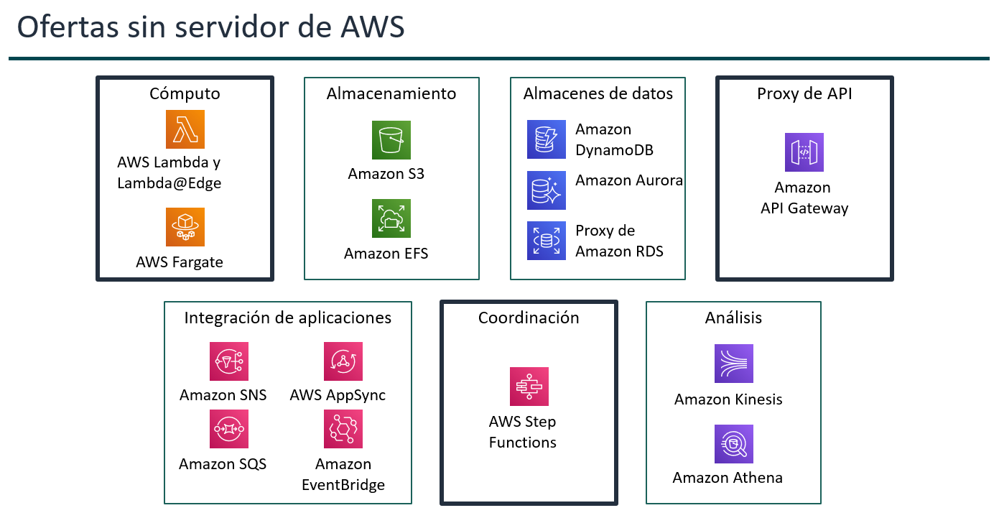

# Tema 6. Microservicios y arquitecturas sin servidor

## Arquitectura de Microservicios

Los **microservicios** son un enfoque de arquitectura y organización para el desarrollo de software en el que las aplicaciones se componen de servicios independientes que se comunican mediante interfaces de programación de aplicaciones (API) bien definidas. 

Se podría decir que un *microservicio* es una pequeña aplicación independiente, especializada en una única función del sistema (por ejemplo: autenticación, pagos, notificaciones…).

Cada microservicio puede desarrollarse, desplegarse y escalarse de manera autónoma.


### Características de los microservicios

* **Desacoplamiento:** Cada servicio funciona y evoluciona por separado.
* **Especialización:** Cada uno cumple un propósito concreto.
* **Mensajería:** Se comunican por APIs normalmente REST, WebSockets o colas.
* **Escalabilidad independiente:** Si un servicio recibe más carga, solo ese escala.
* **Fallas aisladas:** Un fallo en un servicio no debe tumbar a toda la aplicación.

### Cómo implementar microservicios en AWS

AWS ofrece varias herramientas para crear microservicios:

| Servicio AWS              | Función                                                      |
| ------------------------- | ------------------------------------------------------------ |
| **AWS Lambda**            | Ejecuta código *sin servidor*.                               |
| **Amazon ECS**            | Ejecuta microservicios en contenedores (Docker).             |
| **Amazon EKS**            | Kubernetes gestionado para orquestación compleja.            |
| **AWS Fargate**           | Ejecuta contenedores sin gestionar servidores.               |
| **Amazon API Gateway**    | Exponer APIs REST/HTTP/WS para los microservicios.           |


!!! note "Nota"
    En este tema nos vamos a centrar en el servicio **AWS Lambda** y veremos cómo enlazarlo con **API Gateway** para crear mircroservicios.

---

## Arquitectura Serverless

Aunque se conoce como arquitectura sin servidor, *Serverless* no significa que no haya servidores, sino que **el desarrollador no gestiona la infraestructura**.

AWS se encarga de escalar, mantener y ejecutar el servicio bajo demanda.Por ejemplo, en *AWS Lambda*, el usuario sólo debe subir el código y paga **únicamente por ejecución**, no por servidores encendidos.

### Componentes típicos en AWS

Entre los servicios *serverless* más utilizados en AWS se encuentran:

| Servicio AWS           | Uso                                                   |
| ---------------------- | ----------------------------------------------------- |
| **AWS Lambda**         | Ejecuta funciones bajo demanda sin servidores.        |
| **Amazon API Gateway** | Exponer endpoints HTTP/REST/WS para ejecutar Lambdas. |
| **Amazon DynamoDB**    | Base de datos NoSQL totalmente serverless.            |
| **AWS S3**             | Almacenamiento serverless de objetos.                 |

Pero no son los únicos, AWS tiene una gran cantidad de componentes que funcionan o pueden funcionar en modo *serverless*:



### Ventajas y desventajas del serverless

Entre las ventajas que encontramos al contratar servicios serverless tenemos:

* **Cero administración de servidores**.
* Escalabilidad automática.
* Pago por uso real (milisegundos).
* Alta disponibilidad por defecto.
* Despliegues más rápidos y sencillos.

Y como desventajas:

* **Cold start** en algunos lenguajes (tiempo para “despertar” la función).
* Sin control total sobre la infraestructura.
* Dependencia del proveedor.
* Límites en tiempo de ejecución y memoria.

---

## AWS Lambda

AWS Lambda es un servicio serverless que permite ejecutar código sin tener que gestionar servidores.

Solo pagamos **por el tiempo de ejecución** de nuestro código, no por tener servidores encendidos y es ideal para **tareas activadas por eventos**.


### Características principales

* **Compatible con varios lenguajes**: Python, Node.js, Java, C#, Go, etc.
* **Escalado automático:** Si se reciben muchas solicitudes, Lambda crea instancias automáticamente.
* **Basado en eventos:** Puede ejecutarse al ocurrir eventos (S3, API Gateway, DynamoDB…).
* **Stateless:** Cada ejecución es independiente.

### Funcionamiento típico

1. **Evento disparador:** Algo sucede (subida a S3, petición a API, cambio en DynamoDB…).
2. **Lambda se ejecuta:** Procesa el evento según el código subido.
3. **Resultado:** Puede guardar datos en DynamoDB, enviar un email, generar un archivo, un log …


### Ejemplos de uso

| Ejemplo                       | Disparador                     | Acción de Lambda                                 |
| ----------------------------- | ------------------------------ | ------------------------------------------------ |
| **Procesar imágenes**         | Archivo subido a S3            | Redimensionar imagen y guardar versión miniatura |
| **API RESTful**               | Petición POST a API Gateway    | Guardar datos en DynamoDB                        |
| **Notificaciones**            | Evento de DynamoDB             | Enviar email con SNS                             |
| **Automatización de backups** | Evento programado (CloudWatch) | Copiar archivos de un bucket a otro              |
| **Logs en tiempo real**       | Streams de CloudWatch          | Filtrar y enviar logs críticos a Slack o S3      |


---

## Amazon API Gateway

**Amazon API Gateway** y **AWS Lambda** forman uno de los tándems más usados en AWS, especialmente en arquitecturas serverless.

Se complementan para ofrecer **APIs** sin servidores, con escalado automático y muy bajo coste.

Pero, ¿qué es una API?

Una API es un conjunto de reglas y protocolos que permite que diferentes aplicaciones o sistemas se comuniquen entre sí. Permite intercambiar datos o ejecutar funciones de otra aplicación sin conocer su código interno.

Actúa como un puente entre sistemas, ocultando la complejidad interna.

Dependiendo de su uso, las APIs pueden ser:

* **Pública / Abierta**: Disponible para cualquier desarrollador. Ejemplos: API de Twitter, Google Maps
* **Privada / Interna**: Solo para uso interno de la empresa. Ejemplos: API interna de gestión de inventario

Ejemplos de uso de APIs:

* Programamos una páqina web en la que queremos mostrar información de películas  → llama a la API de OMDB pasándole el título de la película→ recibe datos en JSON → muestra la información al usuario.
* App de móvil quiere mostrar el clima → llama a la API de OpenWeather pasándole la ubicación → recibe datos en JSON → muestra la información al usuario.
* App de móvil quieresaber la latitud/longitud de una dirección → llama a la API de Google Maps pasándole la dirección → recibe datos en JSON → muestra las coordenadas al usuario.

### Amazon API Gateway

**Amazon API Gateway** es un servicio gestionado que permite crear y publicar y mantener APIs a gran escala. Actúa como punto de entrada para que las aplicaciones accedan a datos o lógica del backend y permite crear **APIs REST** y **WebSocket**. 

No tiene coste inicial: se paga solo por las llamadas y los datos transferidos, con precios que bajan al aumentar el uso.

Se puede utilizar API Gateway con otros servicios administrados de AWS para crear backends sin servidor para las aplicaciones. Por ejemplo, API Gateway puede enviar solicitudes a funciones de Lambda que ejecutan nuestro código y generan respuestas. Incluso se pueden crear APIs que envíen solicitudes a otros servicios de AWS, como Amazon S3, sin tener que escribir código.

### Tipos de API en AWS

AWS ofrece tres tipos de APIs según la forma en que necesitemos comunicar clientes y servicios.
Cada una está diseñada para un uso diferente.

**REST APIs**

* APIs basadas en la arquitectura RESTful.
* Funcionan con métodos HTTP estándar: GET, POST, PUT, DELETE.
* Diseñadas para recursos: /usuarios, /productos, /pedidos.


**HTTP APIs**

Son APIs más simples y más baratas que REST APIs, pero no tiene todas las funcionalidades avanzadas de REST API.

Están pensadas para:

* Apps modernas basadas en Lambda o ECS/Fargate.
* Casos donde solo necesitamos endpoints HTTP rápidos, sin reglas complejas.

**WebSocket APIs**

Son APIs diseñadas para comunicación bidireccional en tiempo real.

A diferencia de HTTP:

* La conexión permanece abierta.
* El servidor puede enviar mensajes al cliente cuando quiera.
* Ejemplos de uso: Chats, Notificaciones en tiempo real, juegos online...

Funcionamiento:

* El cliente se conecta a la URL WebSocket.
* Mantiene la conexión abierta.
* Mensajes pueden ir cliente → servidor y servidor → cliente.
* Lambda suele procesar los mensajes entrantes y salientes.

### Ejemplo: Microservicio con RESTful

Supongamos una arquitectura en la que los clientes pueden utilizar nuestro microservicio realizando llamadas HTTP API para, por ejemplo, guardar datos meteorológicos. 


El siguiente ejemplo sería una llamada típica a una API (cuyo endpoint sería `https://api.midominio.com/lecturas`) que desencadenaría una función lambda para escribir los datos recibidos (*sensor*, *timestamp*, *temperatura* y *humedad*) en una base de datos (por ejemplo en *DynamoDB*).

``` bash
curl -X POST "https://api.midominio.com/lecturas" \
  -H "Content-Type: application/json" \
  -d '{
        "sensor": "sensor-01",
        "timestamp": "2025-12-04T10:23:00Z",
        "temperatura": 22.5,
        "humedad": 48
      }'
```
