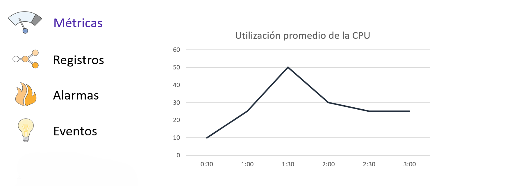

# Tema 8. Monitorización en AWS

## Monitoreo en la Nube

El monitoreo es un componente esencial de cualquier arquitectura moderna y reactiva en la nube. Permite obtener visibilidad sobre el estado de los sistemas, comprender cómo se comportan las aplicaciones y tomar decisiones informadas para optimizar tanto el rendimiento como los costos. Implementar una estrategia de monitoreo sólida ayuda a abordar cuatro áreas principales:

* Estado operativo: Permite hacer un seguimiento continuo del funcionamiento y el rendimiento de todos los recursos en la nube, asegurando que todo funcione como se espera.
* Rendimiento de la aplicación: Ayuda a verificar que la infraestructura esté satisfaciendo la demanda de los usuarios, identificando cuellos de botella o degradaciones en el servicio antes de que afecten la experiencia del cliente.
* Utilización de los recursos: Ofrece datos precisos sobre cómo se están usando los recursos (como la capacidad de cómputo o el almacenamiento), lo que permite optimizar su uso y reducir costos al detener instancias infrautilizadas.
* Auditoría de la seguridad: Proporciona un rastro de auditoría de quién accede a qué recursos, información crucial para definir y verificar los permisos de acceso y cumplir con los objetivos de gobernanza.

Para centralizar y gestionar estas actividades, AWS ofrece un servicio principal de monitoreo y observación conocido como** Amazon CloudWatch**.

## Amazon CloudWatch

Amazon CloudWatch es el servicio central de monitorización de AWS. Permite recopilar y visualizar métricas, logs y eventos de los recursos AWS y de aplicaciones personalizadas. Su propósito es proporcionar datos e información procesable para monitorear aplicaciones, responder a cambios de rendimiento en todo el sistema, optimizar el uso de recursos y obtener una visión unificada del estado operativo general.

El valor fundamental de CloudWatch es su capacidad para recopilar y rastrear variables (métricas), crear alarmas para responder a cambios en esas métricas e incluso automatizar acciones basadas en esas alarmas.

Los componentes principales de CloudWatch se pueden resumir de la siguiente manera:

| Componente | Función Principal |
| ---------- | ----------------- |
| Métricas | Recopila puntos de datos a lo largo del tiempo sobre el rendimiento de los sistemas y las aplicaciones. |
| Registros (Logs) | Centraliza, monitorea y almacena archivos de registro (logs) de diversas fuentes para su análisis y solución de problemas. |
| Alarmas | Vigila una métrica específica y ejecuta acciones automáticas cuando se cruza un umbral predefinido. |
| Eventos (EventBridge) | Entrega un flujo de eventos del sistema en tiempo real que describen cambios en los recursos de AWS. |

### Métricas

Las métricas son el fundamento del monitoreo en CloudWatch. Son esencialmente puntos de datos sobre el rendimiento de nuestros sistemas, recopilados a lo largo del tiempo. Por ejemplo, una métrica común es el uso de la CPU de una instancia EC2.

Es importante conocer tres características clave de las métricas de CloudWatch:

1. Métricas por Defecto: Muchos servicios de AWS, como Amazon EC2, Amazon EBS y Amazon RDS, envían automáticamente métricas de rendimiento a CloudWatch sin necesidad de configuración adicional.
2. Retención de Datos: Los datos de las métricas se conservan durante 15 meses. Esto es útil para analizar tanto las tendencias de rendimiento recientes como los patrones históricos a largo plazo.
3. Métricas Personalizadas: Además de las métricas que AWS proporciona de forma predeterminada, tenemos la flexibilidad de publicar nuestras propias métricas personalizadas desde nuestras aplicaciones.

### Registros (Logs)

Amazon CloudWatch Logs es un servicio que nos permite monitorear, almacenar y acceder a nuestros archivos de registro desde una variedad de fuentes. En lugar de tener que conectarnos a cada servidor para ver sus logs, podemos centralizarlos todos en un solo lugar.

Algunos ejemplos de fuentes de registro incluyen:

* Instancias Amazon EC2
* AWS CloudTrail (registros de llamadas a la API)
* Amazon Route 53

Un caso de uso práctico es monitorear los registros de una aplicación para contar el número de errores que ocurren. Si la cantidad de errores supera un límite que se ha definido, CloudWatch Logs puede enviar una notificación para que se investigue el problema.

Adicionalmente, el servicio incluye **CloudWatch Logs Insights**, una potente herramienta que permite ejecutar consultas interactivas para analizar grandes volúmenes de datos de registro en segundos.

### Alarmas

Una alarma de CloudWatch es una herramienta que vigila una única métrica durante un período de tiempo que se puede especificar. Sin embargo, su propósito no es solo notificar; su verdadera capacidad reside en la automatización. El objetivo principal de una alarma es iniciar una o más acciones automáticamente cuando una métrica cruza un umbral definido.

Una alarma puede desencadenar principalmente dos tipos de acciones:

* **Enviar una notificación** a un tema de Amazon Simple Notification Service (SNS).
* **Ejecutar una política de Amazon Auto Scaling** para añadir o eliminar recursos.

Esta última acción es especialmente interesante para realizar un escalado horizontal de manera automática. Por ejemplo, podemos configurar una alarma que se active si la métrica *CPUUtilization* de una instancia EC2 es superior al 50% durante 5 minutos. Esta alarma podría entonces activar una política de Auto Scaling para lanzar una instancia EC2 adicional y así manejar el aumento de la carga.

### Eventos (Amazon EventBridge)

Amazon EventBridge (anteriormente conocido como CloudWatch Events) es un servicio que ofrece un flujo de eventos del sistema en tiempo real. Un evento es simplemente una señal de que algo ha cambiado en el entorno de AWS.

Ejemplos de eventos incluyen:

* Un cambio en el estado de una instancia EC2 (por ejemplo, de pending a running).
* Una llamada a la API de AWS registrada por CloudTrail.
* Un evento programado que se genera a intervalos regulares (por ejemplo, cada hora).

EventBridge funciona con dos conceptos clave:

* **Reglas**: Una regla se encarga de buscar y coincidir con los eventos entrantes según un patrón que definamos. Por ejemplo, una regla puede coincidir con cualquier evento que indique la terminación de una instancia EC2.
* **Objetivos**: Un objetivo es el recurso que procesa el evento una vez que una regla lo ha identificado. Los objetivos pueden ser muy variados, como una función de AWS Lambda, una instancia EC2 o una cola de Amazon SQS.

---

## AWS CloudTrail

AWS CloudTrail es el servicio de AWS encargado de **registrar y auditar toda la actividad que ocurre dentro de una cuenta**. Su función principal es dejar constancia de **quién realiza una acción, cuándo la realiza, desde dónde y con qué resultado**.

CloudTrail no está pensado para medir rendimiento ni consumo de recursos, sino para **seguridad, auditoría y cumplimiento normativo**. Gracias a este servicio es posible reconstruir exactamente qué ha ocurrido en una cuenta AWS ante un incidente o una auditoría.

En la práctica, CloudTrail registra las **llamadas a la API de AWS**, independientemente de que se hayan hecho desde la consola web, la AWS CLI, un SDK o desde otro servicio de AWS.

### Acciones registradas por CloudTrail

CloudTrail registra prácticamente cualquier acción relevante en AWS. Esto incluye:

* Acciones realizadas desde la **consola de administración**, como crear una instancia EC2 o modificar un grupo de seguridad.
* Acciones realizadas mediante **AWS CLI o SDKs**, muy comunes en entornos automatizados.
* Acciones realizadas por **servicios de AWS entre sí**, por ejemplo cuando Auto Scaling lanza nuevas instancias o una función Lambda accede a un bucket S3.

La idea clave es que **todo lo que sea una llamada a la API queda reflejado en CloudTrail**.

### Tipos de eventos registrados por CloudTrail

#### Eventos de administración (Management Events)

Son los eventos más importantes y están **activados por defecto**. Registran operaciones relacionadas con la **gestión y configuración de los recursos**.

Incluyen, entre otros:

* Creación, modificación y eliminación de recursos
* Cambios de configuración
* Gestión de usuarios, roles y políticas IAM

Ejemplos típicos serían crear una instancia EC2, borrar un bucket S3 o asignar una política a un rol.

#### Eventos de datos (Data Events)

Los eventos de datos registran el **acceso al contenido de los recursos**, no su configuración. Debido al enorme volumen que pueden generar, **no están activados por defecto**.

Ejemplos claros:

* Accesos a objetos en S3 (`GetObject`, `PutObject`)
* Invocaciones de funciones Lambda

Se configuran de forma explícita y por recurso, y se usan cuando es necesario un control muy detallado de accesos.

#### Eventos de análisis (Insight Events)

Este tipo de eventos permite a CloudTrail **detectar comportamientos anómalos**, como un aumento inusual de determinadas acciones.

Por ejemplo:

* Un número anormalmente alto de eliminaciones de recursos
* Cambios inesperados en el uso de IAM

Son muy útiles como sistema de alerta temprana ante posibles incidentes de seguridad.

### Almacenamiento y consulta de los logs

Los eventos de CloudTrail se almacenan en **formato JSON**, lo que permite su análisis automático.

También pueden enviarse a **CloudWatch Logs**, lo que permite crear métricas y alarmas casi en tiempo real, por ejemplo para detectar la eliminación de recursos críticos.

De forma predeterminada, AWS ofrece el **Event History**, que permite consultar los eventos de los últimos 90 días directamente desde la consola. Este historial no es configurable y solo sirve para consultas rápidas.

Para un uso real y profesional se utilizan los **Trails**, que permiten enviar los eventos a un bucket S3 y opcionalmente a CloudWatch Logs. Esto posibilita:

* Retener los logs durante años
* Analizarlos con otras herramientas
* Integrarlos con sistemas de alerta

---

## Monitoreo de Costos y Uso en AWS

Además de monitorear el rendimiento técnico de la infraestructura, es vital monitorear los costos para gestionar eficazmente nuestro gasto en AWS. La plataforma ofrece varias herramientas diseñadas específicamente para este propósito.

* AWS Cost Explorer: Es una herramienta que ayuda a visualizar, comprender y administrar los costos y uso de AWS a lo largo del tiempo, con datos de hasta 13 meses que permiten identificar patrones de gasto.
* AWS Budgets: Permite definir presupuestos personalizados. Si los costos o el uso superan (o se prevé que superen) el monto presupuestado, se envía una alerta.
* Informe de uso y costo de AWS: Ofrece el conjunto de datos de costos y uso más completo disponible, incluyendo metadatos detallados sobre servicios, precios y reservas.
* Cost Optimization Monitor: Una solución que procesa automáticamente los informes de facturación para ofrecer métricas detalladas que se pueden analizar y visualizar en un panel personalizado.