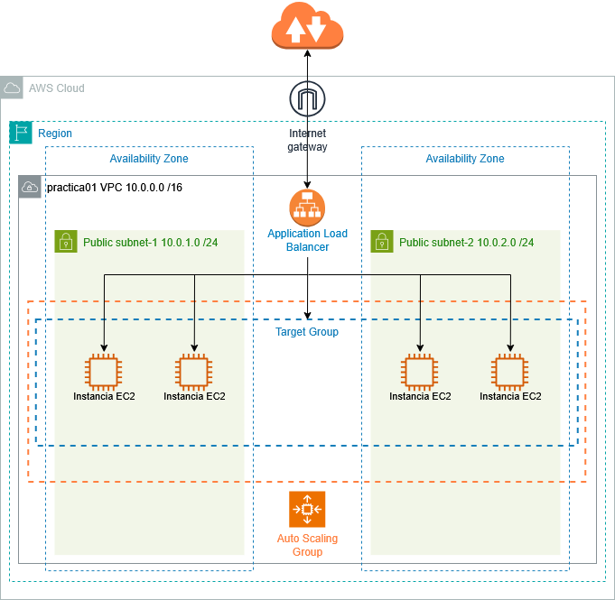

# Práctica 1. Autoescalado de EC2

Diseño e implementación de una infraestructura web altamente disponible y escalable, utilizando balanceo de carga y autoescalado.

## Objetivo de la práctica

* Desplegar instancias EC2 automáticamente usando un Launch Template y scripts de inicialización.
* Configurar un Application Load Balancer (ALB) para distribuir tráfico HTTP entre varias instancias.
* Implementar un Auto Scaling Group, definiendo tamaños mínimo, deseado y máximo.
* Configurar políticas de escalado automático basadas en métricas.
* Verificar el funcionamiento del balanceo y el autoescalado mediante pruebas de carga.

## Esquema en AWS



## Práctica a realizar

### Creación de la red

1.- Inicia sesión en la Consola de AWS y entra en el servicio **VPC**. Procedemos a crear una nueva VPC:

-	Le decimos que queremos crear **la VPC y más**.
-	Asignamos un nombre a la VPC, por ejemplo *practica01*
-	Como dirección de red (Bloque de CIDR IPv4) dejamos la 10.0.0.0/16
-	Seleccionamos **dos zonas de disponibilidad** (AZ).
-	Le decimos que nos cree dos subredes públicas y ninguna subred privada.
-	Personalizamos los bloques de direcciones de modo que las subredes tengan las siguientes direcciones:
    - Subred pública 1: 10.0.1.0/24
    - Subred pública 2: 10.0.2.0/24
-	No necesitamos ningún **Gateway NAT**.
-	No vamos a conectar ningún bucket de S3, por tanto **no seleccionamos** ningún *Gateway de S3* en el apartado de *Puntos de enlace de la VPC*.

<br>

___


### Creación de los grupos de seguridad

2.- Accede al panel de EC2 y en el menú lateral pulsa **grupos de seguridad** y crea 2 grupos de seguridad:

- Primer grupo de seguridad: *gs-web*
    - Descripción: *Permitir trafico entrante HTTP desde Internet*
    - VPC: *practica01*
    - Permitir tráfico de entrada por el puerto HTTP(80) desde cualquier lugar de internet: 0.0.0.0/0
    - El tráfico de salida lo dejamos con los valores por defecto.
- Segundo grupo de seguridad: *gs-alb*
    - Descripción: *Permitir trafico entrante HTTP desde Balanceador de Carga*
    - VPC: *practica01*
    - Permitir tráfico de entrada por el puerto HTTP(80) desde el grupo de seguridad *gs-web*
    - El tráfico de salida lo dejamos con los valores por defecto.

<br>

___

### Creación de una instancia EC2

3.- Accede al servicio **EC2**. Lanza una nueva instancia:

- Llámala *Servidor-Web*
- La imagen será la AMI de Ubuntu.
- El tamaño será un tipo de instancia *t3.micro*.
- El par de claves utilizaremos el del laboratorio (*vockey*).
- Edita la configuración de red para utilizar la VPC creada en el apartado anterior y ubica la máquina en una de las 2 subredes públicas.
- Nos aseguramos que se asigna una **IP Pública** para poder conectarnos desde Internet.
- Usa el **grupo de seguridad** llamado *gs-web* que contiene la regla de firewall para permitir las conexiones por el puerto HTTP(80).
- Para hacer que durante el primer lanzamiento de la instancia se instale el **servidor HTTP** y se copie el repositorio [hello-cloud](https://github.com/IES-CAMP-DE-MORVEDRE/hello-cloud) ponemos las siguientes líneas en el apartado de **Datos de usuario**:

```bash
#!/bin/bash
apt update
apt install -y apache2
git clone https://github.com/IES-CAMP-DE-MORVEDRE/hello-cloud.git
cp hello-cloud/* /var/www/html -R
```
<br>

4.- Inicia la máquina y comprueba mediante un navegador que la web está disponible.
<br>

---

### Creación de una Plantilla de Lanzamiento (Launch Template)

El siguiente paso será crear, a partir de la instancia que tenemos creada, una plantilla de lanzamiento para crear máquinas EC2 automáticamente en el grupo de auto escalado.

5.- Selecciona la instancia que está corriendo, y en el menú **Acciones** pulsa sobre **Imagen y Plantillas --> Crear plantilla a partir de una instancia**.

- Deja unos segundos a que se carguen los datos recuperados de la instancia que está corriendo.
- Pon un nombre a la plantilla: p. ej *ServidorWeb*
- Debe haber recuperado los valores de AMI, tamaño de la instancia, par de claves, red y datos de usuario que configuramos en el apartado de la creación de la instancia EC2.
- **Atención**: en grupo de seguridad ponemos el **gs-alb**, para permitir únicamente tráfico entrante proveniente del balanceador de carga que crearemos más tarde, y eliminamos el que ha recuperado **gs-web*. Por seguridad no vamos a querer que se acceda a las nuevas instancias directamente desde Internet, sino únicamente desde el balanceador de carga.
- Pulsamos sobre **Crear plantilla de lanzamiento**.

!!! warning "Atención"
    En este momento la instancia EC2 que estábamos corriendo ya no nos es necesaria y **podemos eliminarla**, puesto que la habíamos creado para crear una plantilla a partir de ella.
<br>

---

### Creación del Balanceador de Carga

Vamos a crear un balanceador de carga (**Amazon ELB)** que utilizaremos más tarde para balancear el tráfico entre todas las instancias del grupo de autoescalado. Puesto que al crear el grupo de autoescalado nos preguntará si tenemos un balanceador de carga, es necesario que lo creemos primero.

6.- En el panel lateral de EC2 accede al menú **Equilibrio de carga --> Balanceadores de carga** y pulsa sobre **Crear balanceador de carga**:

- Seleccionamos un balanceador de carga de Aplicaciones (**ALB**). Pulsamos Crear.
- Le damos un nombre: *alb-web*
- Seleccionamos el tipo **Expuesto a Internet**, pues queremos que se utilice para balancear el tráfico de las peticiones de Internet a nuestra web.
- Seleccionamos la red *practica01*
- Marcamos **las 2 subredes**, pues queremos balancear entre las instancias que se alojen en ambas subredes (AZs).
- Como grupo de seguridad marcamo **gs-web**, que permite el tráfico de entrada desde Internet por el puerto 80.
- El puerto por el que escuchará el balanceador será el 80 (http).
- Pulsamos sobre **Crear un grupo de destino**. Nos abrirá una nueva ventana para crear el *Target Group*:
    - Tipo de destino: *Instancias*
    - Nombre: *tgt-web*
    - Todos los demás valores por defecto.
    - Pulsamos **Siguiente** y **Crear** sin tocar más valores. No hay que añadir instancias de destino, las instancias serán las del grupo de auto escalado que aún no hemos creado.
- Una vez creado el grupo de destino, lo seleccionamos y dejamos el resto de valores por defecto y le damos a crear el balanceador de carga.


<br>

---

### Creación del Grupo de Auto Escalado.

Hemos creado un balanceador de carga que de momento no balancea entre ninguna instancia porque en el *Grupo de destino* no hemos seleccionado nada. Vamos a crear un grupo de auto escalado que contendrá instancias (entre 1 y 4) que se van a crear automáticamente a partir de la plantilla.

7.- En el panel lateral de EC2 accedemos a **Grupos de Auto Scaling** y pulsamos sobre **Crear grupo de Auto Scaling**:

- Nombre: *asc-web*
- Plantilla de lanzamiento: *ServidorWeb*
- Red: *practica01*
- Seleccionamos las 2 zonas de disponiblidad, para que las instancias EC2 se creen repartidas entre ambas.
- Asociamos a un balanceador de carga existente: *tgt-web*
- En el tamaño de grupo configuramos:
    - Capacidad deseada: 2
    - Capacidad mínima: 1
    - Capacidad máxima: 4
- En Escaldo configuramos:
    - Política de escalado de seguimiento de destino.
    - Métrica: Utilización promedio de la CPU
    - Valor 50 (es el %de utilización)
    - Dejamos los 300 segundos como tiempo necesario para que se arranquen las nuevas instancias y empiece la métrica a estabilizarse.


<br>

---

### Comprobación

8.- Accede al grupo de autoescalado, y en la pestaña administración de instancias comprueba que se han lanzado 2 instancias automáticamente (capacidad deseada). Cada una de ellas debe estar corriendo en una AZ distinta.

!!! success "Captura la pantalla"
    Captura la pantalla en la que se vea las 2 instancias corriendo dentro del Grupo de autoescalado.

9.- Accede al panel del Balanceador de Carga y en la pestaña de Detalles copia el nombre DNS. Pega ese nombre de DNS en un navegador y comprueba que devuelve la página web que está corriendo en una de las 2 instancias del grupo de autoescalado.

!!! success "Captura la pantalla"
    Captura la pantalla en la que se vea el navegador con la dirección web DNS y que devuelve la página.


---

### Desescalado

10.- Deja pasar entre 5 y 10 minutos y vuelve a comprobar la pestaña de administración de instancias del grupo de autoescalado y verás como debido a la nula actividad, el grupo se ha desescalado a una instancia que es el número mínimo que le hemos puesto. De esta forma conseguimos un ahorro de costes ajustando nuestra capacidad a la demanda del momento.

!!! success "Captura la pantalla"
    Captura la pantalla en la que se vea la única instancia corriendo dentro del Grupo de autoescalado.

    <br>

---

### Eliminación de recursos

11.- Elimina los recursos creados: Balanceador de carga, Grupo de autoescalado e instancias. Son recursos que consumen mucho crédito.

!!! danger "Atención"
    Aunqqe terminemos las instancias, si no eliminamos el grupo de autoescalado, este volverá a crear instancias automáticamente.