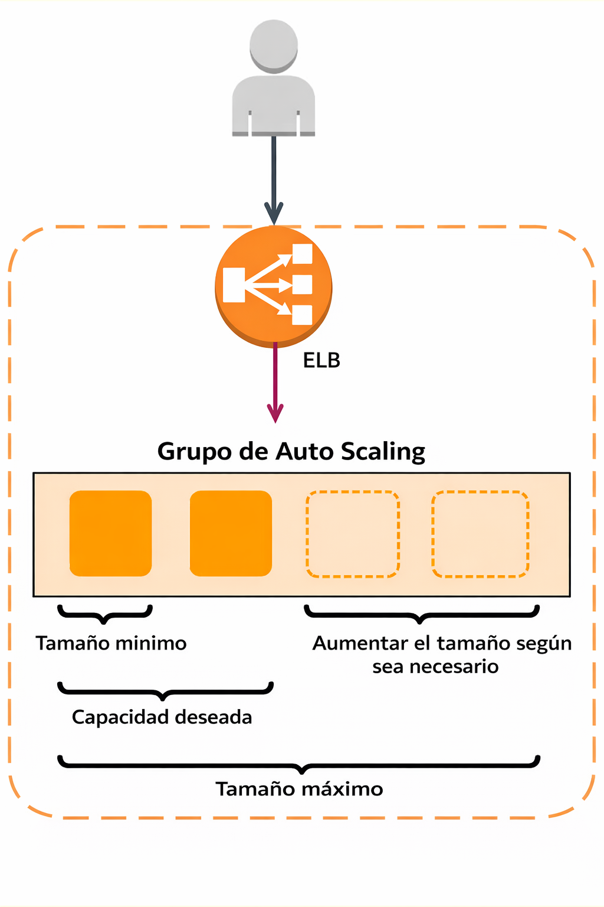

# Tema 9. Escalabilidad y Alta Disponibilidad en AWS

## Introducción a las Arquitecturas Reactivas en la Nube

Las aplicaciones modernas deben ser capaces de gestionar cantidades masivas de datos y picos de tráfico sin experimentar tiempos de inactividad y manteniendo tiempos de respuesta inferiores al segundo. 

!!! example "Caso práctico"
    Tomemos el ejemplo de una empresa cuyo sitio web está a punto de aparecer en un famoso programa de televisión. Anticipan un aumento masivo de tráfico, con decenas de miles de nuevos usuarios. Su arquitectura actual, basada en un único servidor en una sola Zona de Disponibilidad, no está preparada para gestionar este pico. Para garantizar una experiencia de cliente excelente, sin retrasos ni caídas, necesitan una arquitectura avanzada que pueda reaccionar dinámicamente a la demanda.

Para cumplir con estos exigentes requisitos, los arquitectos de la nube implementan sistemas basados en los principios de las **arquitecturas reactivas**. Los conceptos clave de un sistema reactivo son:

* **Elasticidad**: La capacidad de la infraestructura para ampliarse o contraerse dinámicamente según cambien las necesidades de capacidad.
* **Resiliencia**: La habilidad de una carga de trabajo para recuperarse de errores de componentes o picos de estrés, garantizando la continuidad del servicio.
* **Capacidad de respuesta**: El sistema responde de manera oportuna bajo cualquier condición de carga, asegurando una interacción fluida para el usuario.
* **Basado en mensajes**: Los componentes se comunican de forma asíncrona, lo que promueve un bajo acoplamiento y mejora la escalabilidad y la resiliencia.

En este tema nos centraremos en tres conceptos fundamentales para construir arquitecturas reactivas en AWS:

* **Alta Disponibilidad**: La capacidad de un sistema para resistir fallos y permanecer operativo.
* **Tolerancia a Errores (Resiliencia)**: La habilidad de una carga de trabajo para recuperarse de errores de componentes o picos de estrés.
* **Autoescalado (Elasticidad)**: La capacidad de la infraestructura para ampliar o contraer automáticamente los recursos según la demanda.

---

## Elasticidad y Estrategias de Escalado

En el contexto de la nube, la **elasticidad** es una ventaja estratégica fundamental. Se define como la capacidad de una infraestructura para adquirir recursos cuando son necesarios y liberarlos cuando ya no lo son. Esto permite a las aplicaciones manejar fluctuaciones en la demanda —desde picos inesperados hasta patrones diarios predecibles—, garantizando tanto el rendimiento como la optimización de costos, ya que solo se paga por los recursos que se utilizan.

Para lograr esta elasticidad, la técnica principal que empleamos es el escalado. El escalado consiste en ajustar (aumentando o disminuyendo) la capacidad de los recursos de nuestra arquitectura para satisfacer la carga de trabajo en un momento dado.

### Tipos de escalado

Existen dos estrategias principales para escalar los recursos de una aplicación, cada una con sus propias características y casos de uso.

| Escalado Horizontal (Scale-out/Scale-in) | Escalado Vertical (Scale-up/Scale-down) |
| ---------------------------------------- | --------------------------------------- |
| Consiste en agregar más instancias (escalado ascendente) para distribuir la carga o eliminar instancias (escalado descendente) cuando la demanda disminuye. Es el método preferido para lograr una alta elasticidad y tolerancia a fallos en la nube. | Consiste en aumentar la potencia de una única instancia, como cambiar a un tipo de instancia con más CPU o memoria (escalado ascendente), o disminuirla (escalado descendente). Puede implicar un breve tiempo de inactividad. |

Vamos a ver cómo AWS nos permite automatizar el escalado horizontal de nuestros recursos de cómputo para construir sistemas elásticos.

---

## Autoescalado de cómputo: Amazon EC2 Auto Scaling

**Amazon EC2 Auto Scaling** es el servicio clave en AWS para implementar la elasticidad de manera automatizada en las instancias de cómputo. Su función principal es asegurar que se ejecute el número correcto de **instancias EC2** para manejar la carga de la aplicación de forma eficiente, lanzando nuevas instancias cuando la demanda aumenta y terminándolas cuando la demanda disminuye para ahorrar costos.

Este servicio opera a través de un **grupo de Auto Scaling**, que se configura con tres parámetros principales que definen su comportamiento:

* **Capacidad Mínima**: El número mínimo de instancias que el grupo debe mantener en ejecución en todo momento, garantizando una capacidad base para la aplicación.
* **Capacidad Máxima**: El número máximo de instancias al que el grupo puede escalar. Esto actúa como un límite de seguridad para controlar los costos.
* **Capacidad Deseada**: El número de instancias que el grupo intenta mantener en un momento dado. Este valor es dinámico y fluctúa entre el mínimo y el máximo en respuesta a las políticas de escalado.

El ajuste de la capacidad deseada se gestiona a través de políticas de escalado. Una de las más comunes y efectivas es la política de escalado de seguimiento de valores objetivo. Esta política ajusta el número de instancias para mantener una métrica específica, como el uso promedio de la CPU del grupo, en un valor objetivo que nosotros definimos. Por ejemplo, podemos configurar el grupo para que mantenga la utilización promedio de la CPU en un 50%, y EC2 Auto Scaling se encargará de agregar o eliminar instancias para mantenerse cerca de ese valor. Adicionalmente, EC2 Auto Scaling ofrece estrategias avanzadas como el escalado predictivo, que utiliza modelos de aprendizaje automático para predecir el tráfico futuro basándose en patrones históricos diarios y semanales, permitiendo aprovisionar la capacidad antes de que sea necesaria.

---

## Escalado en Bases de Datos Relacionales AWS

El escalado de la capa de datos es tan crucial como el de la capa de cómputo para el rendimiento y la disponibilidad de una aplicación. Una base de datos sobrecargada puede convertirse en un cuello de botella que afecte a todo el sistema. AWS ofrece diferentes estrategias y servicios para escalar tanto bases de datos relacionales como no relacionales, permitiendo que la arquitectura completa sea elástica.

En el tema de Bases de Datos ya vimos que podíamos dividir los servicios de Bases de Datos Relacionales que ofrece AWS en 2 grupos:

- **RDS**: (MySQL, PostgreSQL, MariaDB, Oracle, SQL Server)
- **Aurora RDS**

Vamos a ver qué mecanismos de escalado ofrecen estos servicios de bases de datos.

### Amazon RDS

**Escalado Vertical en Amazon RDS**

La forma más directa de escalar una base de datos RDS es cambiar su clase de instancia a una más potente (escalado ascendente) o menos potente (escalado descendente). Es importante tener en cuenta que este proceso requiere que la base de datos no esté disponible temporalmente, generalmente por unos pocos minutos, mientras se aplica el cambio.

**Escalado Horizontal con Réplicas de Lectura**

Para cargas de trabajo con un alto volumen de lecturas, Amazon RDS permite crear réplicas de lectura. Estas son copias de la base de datos principal que reciben el tráfico de lectura, liberando a la instancia principal para que se concentre en las operaciones de escritura. Amazon RDS estándar permite crear hasta cinco réplicas de lectura. Esta replicación es **asíncrona**, lo que significa que puede haber una pequeña demora entre la escritura en la instancia principal y su reflejo en las réplicas.

!!! abstract "Replicación síncrona y asíncrona"
    Replicación **síncrona**:

    - La escritura se confirma solo cuando los datos se guardan en todas las zonas.
    - Garantiza que todas las réplicas estén actualizadas al instante.
    - Ventaja: máxima consistencia de datos.
    - Inconveniente: puede tener más latencia porque espera la confirmación de la réplica.

    Replicación **asíncrona**: 

    - La escritura se confirma solo en la zona principal, y las réplicas se actualizan después.
    - Ventaja: mejor rendimiento y menor latencia.
    - Inconveniente: si falla la zona principal, las réplicas pueden quedar ligeramente desactualizadas.

En este esquema, la instancia principal actúa como **writer endpoint**, siendo la única responsable de aceptar operaciones de escritura (INSERT, UPDATE, DELETE), mientras que cada réplica dispone de su propio **reader endpoint** para atender consultas de solo lectura (SELECT). Las aplicaciones pueden configurarse para dirigir las escrituras siempre al endpoint de la instancia principal y balancear las lecturas entre los endpoints de las réplicas, ya sea de forma manual o mediante mecanismos de balanceo a nivel de aplicación. 

Dado que la replicación es asíncrona, es importante tener en cuenta la **consistencia eventual**: una lectura realizada inmediatamente después de una escritura puede no reflejar aún los cambios si se consulta una réplica. Por este motivo, las operaciones que requieran datos totalmente actualizados deben seguir consultando la instancia principal, mientras que las réplicas resultan ideales para informes, consultas intensivas o aplicaciones donde una ligera latencia en la actualización de los datos sea aceptable.

### Amazon Aurora

Este motor de base de datos, compatible con MySQL y PostgreSQL, está optimizado para la nube y mejora las capacidades de RDS. Un clúster de Aurora puede tener hasta 15 réplicas de Aurora, lo que aumenta significativamente la capacidad de escalado de lectura en comparación con RDS estándar.

Al estar desarrollado de forma nativa por Amazon, está diseñado específicamente para la nube y se adapta mejor en coste, rendimiento y alta disponibilidad. Está pensado como un subsistema de almacenamiento distribuido de alto rendimiento y tolerante a fallos.

En **Amazon Aurora**, los **endpoints del clúster** son uno de sus elementos clave, ya que abstraen la complejidad de trabajar con múltiples instancias y facilitan tanto el **balanceo de carga** como la **alta disponibilidad**. A diferencia de RDS tradicional, Aurora gestiona estos endpoints de forma automática.

**Tipos de endpoints en un clúster Aurora:**

**1. Cluster Endpoint (Writer Endpoint)**
Es el endpoint principal del clúster y **siempre apunta a la instancia escritora activa**. Todas las operaciones de **escritura** (INSERT, UPDATE, DELETE, DDL) deben dirigirse a este endpoint. En caso de **failover**, el endpoint se actualiza automáticamente para apuntar a la nueva instancia escritora, sin necesidad de cambiar la configuración de la aplicación.

**2. Reader Endpoint**
Este endpoint agrupa todas las **réplicas de lectura** del clúster y **balancea automáticamente** las consultas de solo lectura entre ellas. Es ideal para aplicaciones con alta carga de lecturas, ya que permite escalar horizontalmente sin que la aplicación tenga que conocer las instancias individuales. Si se añade o elimina una réplica, el endpoint se actualiza de forma transparente.

**3. Instance Endpoints**
Cada instancia del clúster (tanto la escritora como las lectoras) dispone de su **endpoint individual**. Estos endpoints se usan en escenarios específicos, como tareas administrativas, diagnósticos o cuando una aplicación necesita conectarse siempre a una instancia concreta, evitando el balanceo automático.

**Aurora Serverless**

Es una configuración de escalado automático bajo demanda para Amazon Aurora. Resulta ideal para cargas de trabajo intermitentes, poco frecuentes o impredecibles. Con Aurora Serverless, la base de datos se inicia, se apaga y escala su capacidad de cómputo automáticamente según las necesidades de la aplicación, sin necesidad de administrar instancias. El almacenamiento de la base de datos también escala automáticamente desde 10 Gibibytes (GiB) hasta 64 Tebibytes (TiB). El pago se basa en las Unidades de Capacidad de Aurora (ACU) utilizadas por segundo, lo que optimiza los costos para patrones de uso variables.

!!! warning "Autoescalado"
    En **Amazon RDS tradicional** (MySQL, PostgreSQL, MariaDB, Oracle, SQL Server) **no existe autoescalado nativo del número de réplicas de lectura**, por lo que su creación y eliminación debe hacerse manualmente o mediante automatizaciones personalizadas usando CloudWatch, Lambda y la API de AWS; sin embargo, **Amazon Aurora sí incorpora autoescalado automático de réplicas de lectura**, permitiendo añadir o quitar instancias en función de la carga y utilizando endpoints de lectura que distribuyen el tráfico de forma transparente, lo que supone una diferencia clave entre ambos servicios.

!!! warning "Balanceo"
    En **Amazon RDS tradicional** el **balanceo de carga de las lecturas no se realiza automáticamente**: cada **réplica de lectura tiene su propio endpoint**, y es la aplicación la que debe decidir a qué endpoint conectarse para las consultas de lectura. Esto implica que el reparto de carga debe hacerse **de forma manual**, ya sea implementando lógica en la aplicación, utilizando un proxy o apoyándose en un balanceador externo. A diferencia de esto, **Amazon Aurora sí ofrece endpoints de lectura gestionados**, que distribuyen automáticamente las consultas entre las réplicas disponibles.

---

## Diseño de Arquitecturas de Alta Disponibilidad

Un sistema de alta disponibilidad es aquel que está diseñado para resistir fallos y minimizar el tiempo de inactividad, operando sin requerir intervención humana. El principio fundamental para lograrlo es evitar los puntos únicos de fallo (single points of failure), es decir, componentes cuyo fallo provocaría la caída de todo el sistema.

### Alta Disponibilidad a nivel de Aplicación

Un servicio fundamental para construir estas arquitecturas en AWS es **Elastic Load Balancing (ELB)**. ELB es un servicio administrado que distribuye automáticamente el tráfico de las aplicaciones entrantes entre múltiples destinos, como instancias EC2, contenedores o direcciones IP.

Las funciones clave de Elastic Load Balancing incluyen:

* **Distribución de Tráfico**: Reparte las solicitudes entrantes entre múltiples destinos para evitar que un único servidor se sobrecargue.
* **Tolerancia a Fallos Multi-AZ**: Opera en múltiples Zonas de Disponibilidad (AZ) dentro de una región. Si una AZ falla, el balanceador de carga redirige el tráfico a los destinos en las AZ operativas.
* **Comprobaciones de Estado**: Realiza periódicamente comprobaciones de estado (health checks) a sus destinos registrados. Solo envía tráfico a los destinos que responden correctamente, considerándose "en buen estado".

El servicio ELB de AWS ofrece tres tipos principales de balanceadores de carga:

* Application Load Balancer (**ALB**): Opera en la capa 7 (HTTP/HTTPS) y es ideal para el balanceo de carga avanzado basado en el contenido de la solicitud (como la URL o las cabeceras). Es perfecto para arquitecturas modernas como microservicios.
* Network Load Balancer (**NLB**): Opera en la capa 4 (TCP/UDP/TLS). Está optimizado para manejar millones de solicitudes por segundo y mantener latencias muy bajas, y es ideal para gestionar patrones de tráfico de red repentinos y volátiles.
* Classic Load Balancer (**CLB**): Es la generación anterior de balanceadores de carga. Aunque opera tanto en la capa 4 como en la 7, AWS recomienda utilizar ALB o NLB para nuevas aplicaciones.

El patrón de arquitectura básico para lograr alta disponibilidad combina estos servicios. La práctica recomendada consiste en colocar las instancias EC2 dentro de un grupo de Auto Scaling configurado para operar en múltiples Zonas de Disponibilidad. Al frente de este grupo, se despliega un Elastic Load Balancer. El ELB distribuye el tráfico entre las instancias saludables repartidas en las diferentes AZ. Si una instancia falla, el ELB la detecta a través de las comprobaciones de estado y deja de enviarle tráfico. Simultáneamente, el grupo de Auto Scaling reemplazará la instancia defectuosa. Si una Zona de Disponibilidad completa falla, el ELB simplemente redirigirá todo el tráfico a las instancias en la(s) AZ restante(s), permitiendo que la aplicación continúe funcionando sin interrupciones.

### Alta Disponibilidad de Bases de Datos

Una de las funciones más potentes de Amazon RDS es la posibilidad de configurar la instancia de base de datos para una alta disponibilidad con un **despliegue Multi-AZ**. Amazon RDS genera automáticamente una copia en espera de la instancia de base de datos en otra zona de disponibilidad de la misma VPC. Tras propagar la copia de la base de datos, las transacciones se replican de forma **síncrona** en la copia en espera.

Esta configuración protege las bases de datos contra errores de la instancia de base de datos e interrupciones de la zona de disponibilidad. 

Si la instancia de base de datos principal falla en un despliegue Multi-AZ, Amazon RDS pone en línea automáticamente la instancia de base de datos en espera como nueva instancia principal. Dado que las aplicaciones hacen referencia a la base de datos por su nombre mediante el punto de enlace del sistema de nombres de dominio (DNS), no es necesario cambiar nada en el código de la aplicación para utilizar la copia en espera para la conmutación por error.

!!! note "Nota"
    Para que todas estas arquitecturas funcionen de manera óptima, es fundamental observar su estado y rendimiento, lo que nos lleva a la **importancia del monitoreo** que estudiamos en el tema anterior.

